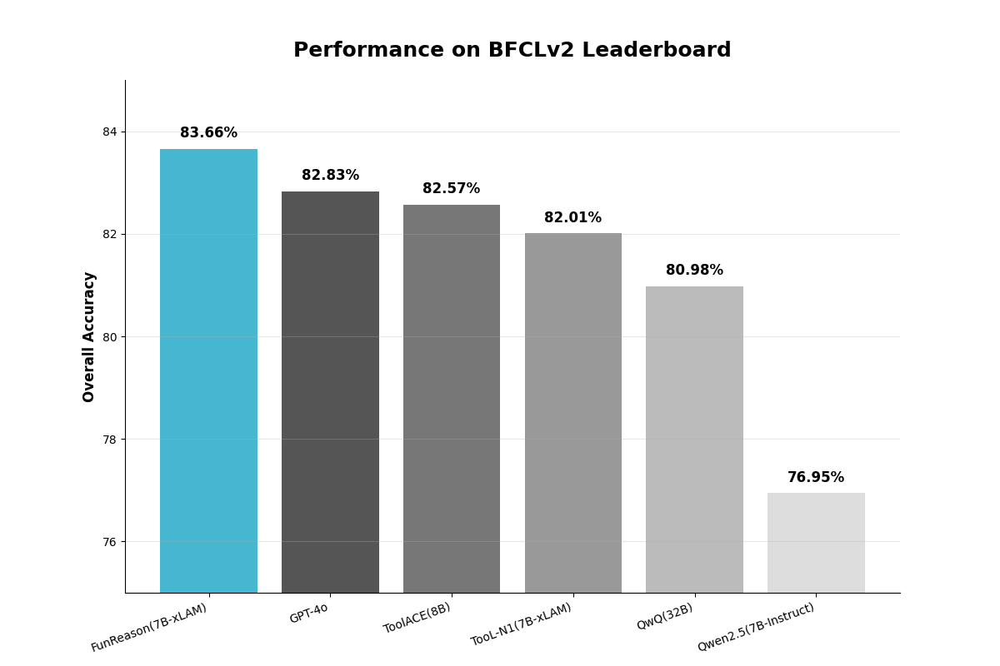
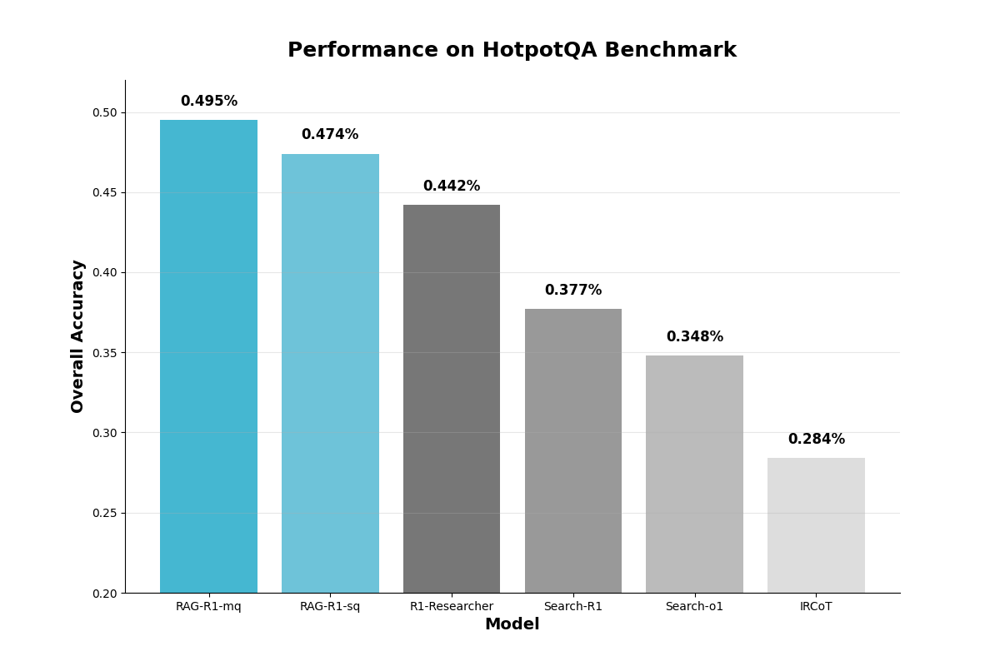

<div align="center">

# AWorld: 为智能体自我改进提供运行环境

</div>

<h4 align="center">

*"自我意识：最难的问题不是解决限制，而是发现自己的局限性"*

[![Twitter Follow][twitter-image]][twitter-url]
[![WeChat QR Code][wechat-image]][wechat-url]
[![Discord][discord-image]][discord-url]
[![License: MIT][license-image]][license-url]
[![DeepWiki][deepwiki-image]][deepwiki-url]
<!-- [![arXiv][arxiv-image]][arxiv-url] -->

</h4>

<h4 align="center">

[English](./README.md) |
[快速开始](#快速开始) |
[架构设计](#架构设计原则) |
[应用场景](#应用场景) |
[贡献指南](#贡献指南) |
[附录](#附录)

</h4>


**AWorld (Agent World)** 是为大规模智能体自我改进而设计的下一代框架。我们通过综合智能体自身的知识和经验，使AI智能体能够持续进化。这一核心能力由以下三个要素驱动：

1. **多智能体系统 (MAS)**：使用我们的即插即用协议和强大的状态管理构建复杂的、相互作用的智能体社会。

2. **超越单一模型的智能**：生成高质量反馈和多样化的合成训练数据，推动个体智能体进化。

3. **云原生支持多样性和规模**：为训练更智能的智能体和实现自我改进提供高并发性和可扩展性。

AWorld 使您能够快速构建个体工具使用智能体、编排复杂的多智能体系统、有效训练智能体，并综合持续智能体进化所需的高质量数据——所有这些都汇聚于自主自我改进。

---
**智能体成就解锁！** 🔥

🏅️ **[2025/07/25]** 即插即用数学大师！  [![][IMO]](https://www.imo-official.org/year_info.aspx?year=2025) [![][MAS]](#)  
构建了一个在数小时内解决 <span style="color: #d81b60; font-weight: bold;">IMO 2025 6道题中的5道</span> 的MAS——证明**智能体编排**胜过单一模型。 <br>
查看[幕后天才](examples/imo/README.md)！

🧩 **[2025/07/23]** 轻松构建BFCL运行时！  [![][BFCL]](https://gorilla.cs.berkeley.edu/leaderboard.html) [![][Runtime]](#)  
新的BFCL教程展示了如何在几分钟内**综合函数调用训练数据**。 <br>
立即开始[制作您自己的智能体](examples/BFCL/README.md)！

🏆 **[2025/07/07]** GAIA飙升至 <span style="color: #d81b60; font-weight: bold;">77.08</span>！ [![][GAIA]](https://huggingface.co/spaces/gaia-benchmark/leaderboard) [![][Cloud-Native]](#) [![][Leaderboard]](#)  
**云原生运行时**现在支持分布式智能体进化。 <br>
查看多样化环境如何[进化更智能的模型](#反向过程设计)。


# 快速开始
## 前置要求
> [!TIP]
> Python>=3.11
```bash
git clone https://github.com/inclusionAI/AWorld && cd AWorld

python setup.py install
```
## Hello world 示例
我们引入 `Agent` 和 `Runners` 的概念来帮助您快速上手。
```python
import os

from aworld.agents.llm_agent import Agent
from aworld.runner import Runners

summarizer = Agent(
    name="Summary Agent", 
    system_prompt="You specialize at summarizing.",
)

result = Runners.sync_run(
    input="Tell me a succint history about the universe", 
    agent=summarizer,
)
```

同时，我们引入 `Swarm` 的概念来构建智能体团队。
```python
import os

from aworld.agents.llm_agent import Agent
from aworld.runner import Runners
from aworld.core.agent.swarm import Swarm

researcher = Agent(
    name="Research Agent", 
    system_prompt="You specialize at researching.",
)
summarizer = Agent(
    name="Summary Agent", 
    system_prompt="You specialize at summarizing.",
)
# 创建具有协作工作流的智能体团队
team = Swarm(researcher, summarizer)

result = Runners.sync_run(
    input="Tell me a complete history about the universe", 
    swarm=team,
)
```

最后，运行您自己的智能体或团队
```bash
# 设置LLM凭据
export LLM_MODEL_NAME="gpt-4"
export LLM_API_KEY="your-api-key-here"
export LLM_BASE_URL="https://api.openai.com/v1"

# 运行
python /path/to/agents/or/teams
```

<details>
<summary style="font-size: 1.2em;font-weight: bold;"> 🌏 点击查看高级用法 </summary>

### 显式传递AgentConfig
```python
import os

from aworld.agents.llm_agent import Agent
from aworld.runner import Runners
from aworld.config.conf import AgentConfig
from aworld.core.agent.swarm import Swarm

gpt_conf = AgentConfig(
    llm_provider="openai",
    llm_model_name="gpt-4o",
    llm_api_key="<OPENAI_API_KEY>",
    llm_temperature=0.1,
)
openrouter_conf = AgentConfig(
    llm_provider="openai",
    llm_model_name="google/gemini-2.5-pro",
    llm_ap i_key="<OPENROUTER_API_KEY>",
    llm_base_url="https://openrouter.ai/api/v1"
    llm_temperature=0.1,
)

researcher = Agent(
    name="Research Agent", 
    conf=gpt_conf,
    system_prompt="You specialize at researching.",
)
summarizer = Agent(
    name="Summary Agent", 
    conf=openrouter_conf,
    system_prompt="You specialize at summarizing.",
)
# 创建具有协作工作流的智能体团队
team = Swarm(researcher, summarizer)

result = Runners.sync_run(
    input="Tell me a complete history about the universe", 
    swarm=team,
)
```

### 配备MCP工具的智能体
```python
import os

from aworld.agents.llm_agent import Agent
from aworld.runner import Runners

mcp_config = {
    "mcpServers": {
        "GorillaFileSystem": {
            "type": "stdio",
            "command": "python",
            "args": ["examples/BFCL/mcp_tools/gorilla_file_system.py"],
        },
    }
}

file_sys = Agent(
    name="file_sys_agent",
    system_prompt=(
        "You are a helpful agent to use "
        "the standard file system to perform file operations."
    ),
    mcp_servers=mcp_config.get("mcpServers", []).keys(),
    mcp_config=mcp_config,
)

result = Runners.sync_run(
    input=(
        "use mcp tools in the GorillaFileSystem server "
        "to perform file operations: "
        "write the content 'AWorld' into "
        "the hello_world.py file with a new line "
        "and keep the original content of the file. "
        "Make sure the new and old "
        "content are all in the file; "
        "and display the content of the file"
    ),
    agent=file_sys,
)
```

### 集成记忆的智能体
建议使用 `MemoryFactory` 来初始化和访问Memory实例。

```python
from aworld.memory.main import MemoryFactory
from aworld.core.memory import MemoryConfig, MemoryLLMConfig

# 简单初始化
memory = MemoryFactory.instance()

# 使用LLM配置进行初始化
MemoryFactory.init(
    config=MemoryConfig(
        provider="aworld",
        llm_config=MemoryLLMConfig(
            provider="openai",
            model_name=os.environ["LLM_MODEL_NAME"],
            api_key=os.environ["LLM_API_KEY"],
            base_url=os.environ["LLM_BASE_URL"]
        )
    )
)
memory = MemoryFactory.instance()
```

`MemoryConfig` 允许您集成不同的嵌入模型和向量数据库。
```python
import os

from aworld.core.memory import MemoryConfig, MemoryLLMConfig, EmbeddingsConfig, VectorDBConfig

MemoryFactory.init(
    config=MemoryConfig(
        provider="aworld",
        llm_config=MemoryLLMConfig(
            provider="openai",
            model_name=os.environ["LLM_MODEL_NAME"],
            api_key=os.environ["LLM_API_KEY"],
            base_url=os.environ["LLM_BASE_URL"]
        ),
        embedding_config=EmbeddingsConfig(
            provider="ollama", # 或 huggingface, openai 等
            base_url="http://localhost:11434",
            model_name="nomic-embed-text"
        ),
        vector_store_config=VectorDBConfig(
            provider="chroma",
            config={
                "chroma_data_path": "./chroma_db",
                "collection_name": "aworld",
            }
        )
    )
)
```

### 多智能体系统
我们展示一个经典拓扑：`Leader-Executor`。
```python
"""
Leader-Executor 拓扑：
 ┌───── plan ───┐     
exec1         exec2

每个智能体与单个监督智能体通信，
被公认为Leader-Executor拓扑，
在Aworld中也称为团队拓扑。
"""
from aworld.agents.llm_agent import Agent
from aworld.core.agent.swarm import TeamSwarm

plan = Agent(name="plan", conf=agent_conf)
exec1 = Agent(name="exec1", conf=agent_conf)
exec2 = Agent(name="exec2", conf=agent_conf)
swarm = TeamSwarm(plan, exec1, exec2)
```
可选地，您可以使用 `Handsoff` 机制来自定义您自己的拓扑。
```python
from aworld.core.agent.swarm import HandoffSwarm
swarm = HandoffSwarm((plan, exec1), (plan, exec2))
```

</details>

# 架构设计原则
<!-- AWorld is a versatile multi-agent framework designed to facilitate collaborative interactions and self-improvement among agents.  -->

AWorld 提供了一个全面的环境，支持多样化的应用，如 `产品原型验证`、`基础模型训练`，以及通过元学习设计 `多智能体系统 (MAS)`。

该框架被设计为高度适应性，使研究人员和开发人员能够在多个领域探索和创新，从而推进多智能体系统的能力和应用。

## 概念与框架
| 概念 | 描述 |
| :-------------------------------------- | ------------ |
| [`agent`](./aworld/core/agent/base.py)  | 定义基础类、描述、输出解析和多智能体协作（群体）逻辑，用于在AWorld系统中定义、管理和编排智能体。 |
| [`runner`](./aworld/runners)            | 包含管理环境中智能体执行循环的运行器类，处理情节回放和并行训练/评估工作流。   |
| [`task`](./aworld/core/task.py)         | 定义封装环境目标、必要工具和智能体交互终止条件的基础Task类。  |
| [`swarm`](./aworld/core/agent/swarm.py) | 实现管理多智能体协调和通过去中心化策略出现的群体行为的SwarmAgent类。 |
| [`sandbox`](./aworld/sandbox)           | 提供具有可配置场景的受控运行时，用于智能体行为的快速原型设计和验证。 |
| [`tools`](./aworld/tools)               | 为AWorld系统中智能体-环境交互的工具定义、适配和执行提供灵活框架。 |
| [`context`](./aworld/core/context)      | 为AWorld智能体提供全面的上下文管理系统，支持完整的状态跟踪、配置管理、提示优化、多任务状态处理和整个智能体生命周期中的动态提示模板。  |
| [`memory`](./aworld/memory)             | 为智能体实现可扩展的记忆系统，支持短期和长期记忆、总结、检索、嵌入和集成。|
| [`trace`](./aworld/trace)               | 为AWorld提供可观察的跟踪框架，支持分布式跟踪、上下文传播、跨度管理，以及与流行框架和协议的集成，以监控和分析智能体、工具和任务执行。|

> 💡 查看 [examples](./examples/) 目录以探索多样化的AWorld应用。


## 特性
| 智能体构建         | 拓扑编排      | 环境                    |
|:---------------------------|:----------------------------|:-------------------------------|
| ✅ 集成MCP服务 | ✅ 封装的运行时  | ✅ 运行时状态管理  |
| ✅ 多模型提供商   | ✅ 灵活的MAS模式 | ✅ 高并发支持  |
| ✅ 自定义选项   | ✅ 清晰的状态跟踪   | ✅ 分布式训练      |


## 正向过程


这里是收集BFCL正向轨迹的正向说明：[`教程`](./examples/BFCL/README.md)。


## 反向过程

> 训练期间，使用 **AWorld的分布式环境** 进行动作-状态回放演示。


> [!NOTE]
> 下面展示了训练代码的说明，该代码将RL学习框架（在此示例中为Swift）与AWorld作为环境无缝集成。这种集成通过分布式环境执行实现可扩展和高效的智能体训练。（要运行高并发回放，您需要部署在线分布式环境。如需帮助，请联系 [chenyi.zcy@antgroup.com](mailto:chenyi.zcy@antgroup.com)。）

<details>
<summary style="font-size: 1.2em;font-weight: bold;"> 🌏 点击查看教程示例</summary>
要应用和使用此集成：

1. 克隆AWorld的 `agent_training_server` 分支：
```bash
git clone -b agent_training_server --single-branch https://github.com/inclusionAI/AWorld.git
```

2. 克隆ms-swift的v3.5.2分支（浅克隆）：
```bash
git clone -b v3.5.2 --depth=1 https://github.com/modelscope/ms-swift.git ms-swift
```

3. 将补丁文件从AWorld复制到ms-swift：
```bash
cp -r AWorld/patches ms-swift/
```

4. 进入补丁目录并应用补丁：
```bash
cd ms-swift/patches
git apply 0001-feat-add-agent-training-support-with-aworld-server.patch
```
</details>

# 应用场景
AWorld 使您能够轻松构建 **智能体** 和 **多智能体系统**。

## 用于模型进化
AWorld 旨在达到模型的局限性，并通过构建多样化的运行时环境（如工具、智能体和模型）持续推动智能向前发展。

以下是成功提案的列表（包含开源模型、技术报告和代码）：

| 类别 | 运行时 | <div style="width:400px">性能</div> | <div style="width:100px;">关键信息</div> |
| --------------- | --------------------------------------- | ---------------------------------------------------------------------------------------- | ---------------------------------- |
| **工具使用**    | 函数调用运行时构建 [`教程`][funreason-model-url] | 在BFCL基准测试中具有竞争力  <br>  | ![Dataset][huggingface-dataset-image] <br> [![Model][huggingface-model-image]][funreason-model-url] <br> [![Paper][arxiv-image]][funreason-paper-url] <br> ![Blog][blog-image] <br> [![Code][github-code-image]][funreason-code-url] |
| **深度搜索** | 搜索运行时即将发布           | 在HotpotQA基准测试中达到SOTA  <br>     | [![Dataset][huggingface-dataset-image]][deepsearch-dataset-url] <br> [![Model][huggingface-model-image]][deepsearch-model-url] <br> [![Paper][arxiv-image]][deepsearch-paper-url] <br> [![Code][github-code-image]][deepsearch-code-url]      |


## 用于产品应用
AWorld的即插即用MAS架构支持超越智能体训练的 **真实世界Web应用开发**。

构建处理复杂任务的生产就绪系统：
- **代码生成与执行**  
- **浏览器自动化与工具使用**  
- **多模态理解与生成**  
- 还有更多即将出现！

查看 [附录：Web客户端使用](#附录-web客户端使用) 了解GAIA实现示例。


# 贡献指南
我们热烈欢迎开发者加入我们构建和改进AWorld！无论您对增强框架、修复错误还是添加新功能感兴趣，您的贡献对我们都很宝贵。

对于学术引用或希望联系我们，请使用以下BibTeX条目：

```bibtex
@software{aworld2025,
  author = {Agent Team at InclusionAI},
  title = {AWorld: Enabling Agent Self-Improvement through Interactive Experience with Dynamic Runtime},
  year = {2025},
  url = {https://github.com/inclusionAI/AWorld},
  version = {0.1.0},
  publisher = {GitHub},
  email = {chenyi.zcy at antgroup.com}
}
```

# Star历史


# 附录
Web客户端使用


您的项目结构应该如下所示：
```text
agent-project-root-dir/
    agent_deploy/
      my_first_agent/
        __init__.py
        agent.py
```

创建项目文件夹。

```shell
mkdir my-aworld-project && cd my-aworld-project # project-root-dir
mkdir -p agent_deploy/my_first_agent
```

#### 步骤1：定义您的智能体

在 `agent_deploy/my_first_agent` 中创建您的第一个智能体：

`__init__.py`：创建空的 `__init__.py` 文件。

```shell
cd agent_deploy/my_first_agent
touch __init__.py
```

`agent.py`：定义您的智能体逻辑：

```python
import logging
import os
from aworld.cmd.data_model import BaseAWorldAgent, ChatCompletionRequest
from aworld.config.conf import AgentConfig, TaskConfig
from aworld.agents.llm_agent import Agent
from aworld.core.task import Task
from aworld.runner import Runners

logger = logging.getLogger(__name__)

class AWorldAgent(BaseAWorldAgent):
    def __init__(self, *args, **kwargs):
        super().__init__(*args, **kwargs)

    def name(self):
        return "My First Agent"

    def description(self):
        return "A helpful assistant that can answer questions and help with tasks"

    async def run(self, prompt: str = None, request: ChatCompletionRequest = None):
        # Load LLM configuration from environment variables
        agent_config = AgentConfig(
            llm_provider=os.getenv("LLM_PROVIDER", "openai"),
            llm_model_name=os.getenv("LLM_MODEL_NAME", "gpt-4"),
            llm_api_key=os.getenv("LLM_API_KEY"),
            llm_base_url=os.getenv("LLM_BASE_URL"),
            llm_temperature=float(os.getenv("LLM_TEMPERATURE", "0.7"))
        )

        # Validate required configuration
        if not agent_config.llm_model_name or not agent_config.llm_api_key:
            raise ValueError("LLM_MODEL_NAME and LLM_API_KEY must be set!")

        # Optional: Configure MCP tools for enhanced capabilities
        mcp_config = {
            "mcpServers": {
                "amap-mcp": {
                    "type": "sse",
                    "url": "https://mcp.example.com/sse?key=YOUR_API_KEY", # Replace Your API Key
                    "timeout": 30,
                    "sse_read_timeout": 300
                }
            }
        }

        # Create the agent instance
        agent = Agent(
            conf=agent_config,
            name="My First Agent",
            system_prompt="""You are a helpful AI assistant. Your goal is to:
            - Answer questions accurately and helpfully
            - Provide clear, step-by-step guidance when needed
            - Be friendly and professional in your responses""",
            mcp_servers=["amap-mcp"],
            mcp_config=mcp_config
        )

        # Extract user input
        user_input = prompt or (request.messages[-1].content if request else "")
        
        # Create and execute task
        task = Task(
            input=user_input,
            agent=agent,
            conf=TaskConfig(max_steps=5),
            session_id=getattr(request, 'session_id', None)
        )

        # Stream the agent's response
        async for output in Runners.streamed_run_task(task).stream_events():
            yield output
```

#### 步骤2：运行智能体

设置环境变量：

```shell
# 导航回项目根目录
cd ${agent-project-root-dir}

# 设置您的LLM凭据
export LLM_MODEL_NAME="gpt-4"
export LLM_API_KEY="your-api-key-here"
export LLM_BASE_URL="https://api.openai.com/v1"  # Optional for OpenAI
```

启动您的智能体：
```shell
# 选项1：使用Web UI启动
aworld web
# 然后在浏览器中打开 http://localhost:8000

# 选项2：启动REST API（用于集成）
aworld api_server
# 然后访问 http://localhost:8000/docs 查看API文档
```

成功！您的智能体现在正在运行并准备聊天！

---
<!-- resource section start -->
<!-- image links -->
[arxiv-image]: https://img.shields.io/badge/Paper-arXiv-B31B1B?style=for-the-badge&logo=arxiv&logoColor=white
[blog-image]: https://img.shields.io/badge/Blog-Coming%20Soon-FF5722?style=for-the-badge&logo=blogger&logoColor=white
[deepwiki-image]: https://img.shields.io/badge/DeepWiki-Explore-blueviolet?logo=wikipedia&logoColor=white
[discord-image]: https://img.shields.io/badge/Discord-Join%20us-blue?logo=discord&logoColor=white
[github-code-image]: https://img.shields.io/badge/Code-GitHub-181717?style=for-the-badge&logo=github&logoColor=white
[huggingface-dataset-image]: https://img.shields.io/badge/Dataset-Coming%20Soon-007ACC?style=for-the-badge&logo=dataset&logoColor=white
[huggingface-model-image]: https://img.shields.io/badge/Model-Hugging%20Face-FF6B6B?style=for-the-badge&logo=huggingface&logoColor=white
[license-image]: https://img.shields.io/badge/License-MIT-yellow.svg
[twitter-image]: https://img.shields.io/twitter/follow/AWorld_AI?style=social
[wechat-image]: https://img.shields.io/badge/WeChat-Add%20us-green?logo=wechat&logoColor=white

<!-- aworld links -->
[deepwiki-url]: https://deepwiki.com/inclusionAI/AWorld
[discord-url]: https://discord.gg/b4Asj2ynMw
[license-url]: https://opensource.org/licenses/MIT
[twitter-url]: https://x.com/InclusionAI666
[wechat-url]: https://raw.githubusercontent.com/inclusionAI/AWorld/main/readme_assets/aworld_wechat.png

<!-- funreason links -->
[funreason-code-url]: https://github.com/BingguangHao/FunReason
[funreason-model-url]: https://huggingface.co/Bingguang/FunReason
[funreason-paper-url]: https://arxiv.org/pdf/2505.20192
<!-- [funreason-dataset-url]: https://github.com/BingguangHao/FunReason -->
<!-- [funreason-blog-url]: https://github.com/BingguangHao/FunReason -->

<!-- deepsearch links -->
[deepsearch-code-url]: https://github.com/inclusionAI/AgenticLearning
[deepsearch-dataset-url]: https://github.com/inclusionAI/AgenticLearning
[deepsearch-model-url]: https://huggingface.co/collections/endertzw/rag-r1-68481d7694b3fca8b809aa29
[deepsearch-paper-url]: https://arxiv.org/abs/2507.02962

<!-- badge -->
[MAS]: https://img.shields.io/badge/Mutli--Agent-System-EEE1CE
[IMO]: https://img.shields.io/badge/IMO-299D8F
[BFCL]: https://img.shields.io/badge/BFCL-8AB07D
[GAIA]: https://img.shields.io/badge/GAIA-E66F51
[Runtime]: https://img.shields.io/badge/AWorld-Runtime-287271
[Leaderboard]: https://img.shields.io/badge/Leaderboard-FFE6B7
[Benchmark]: https://img.shields.io/badge/Benchmark-FFE6B7
[Cloud-Native]: https://img.shields.io/badge/Cloud--Native-B19CD7


<!-- resource section end -->