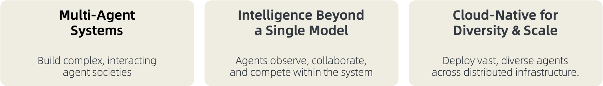

from examples.for_test import topology<div align="center">

# AWorld: 为智能体自我演进提供多样化的运行环境

</div>

<h4 align="center">

*"自我意识：最难的问题不是解决限制，而是发现自己的局限性"*

[![Twitter Follow][twitter-image]][twitter-url]
[![WeChat QR Code][wechat-image]][wechat-url]
[![Discord][discord-image]][discord-url]
[![License: MIT][license-image]][license-url]
[![DeepWiki][deepwiki-image]][deepwiki-url]
[![arXiv][arxiv-image]][arxiv-url]
[![Tutorial][tutorial-image]][tutorial-url]
<!-- [![arXiv][arxiv-image]][arxiv-url] -->

</h4>

<h4 align="center">

[English](./README.md) |
[快速开始](#快速开始) |
[架构设计](#架构设计原则) |
[应用场景](#应用场景) |
[贡献指南](#贡献指南) |
[附录](#附录)

</h4>



**AWorld (Agent World)** 是一个为大规模智能体自我改进而设计的下一代框架。通过上述功能，我们使AI智能体能够通过从各种环境中的知识和经验中学习来持续进化。使用AWorld，您可以：

1. **构建工作流**：设计和实现自动化任务序列 [文档](https://inclusionai.github.io/AWorld/Quickstart/workflow_construction/)

2. **构建智能体**：创建具有MCP工具的智能AI智能体 [文档](https://inclusionai.github.io/AWorld/Quickstart/agent_construction/)

3. **构建多智能体系统(MAS)**：编排协作智能体生态系统

4. **高效训练智能体**：让MAS在各种环境中自我演进和优化

---
**群体智能** 🚀

展示群体智能在不同领域的SOTA效果。欢迎加入我们正在进行中的项目！

| **类别** | **成就** | **性能表现** | **核心创新** | **日期** |
|:-------------|:----------------|:----------------|:-------------------|:----------|
| **🤖 智能体** | **GAIA基准测试卓越表现** [![][GAIA]](https://huggingface.co/spaces/gaia-benchmark/leaderboard) | Pass@1: **67.89**, Pass@3: **83.49** (109个任务) [![][Code]](./examples/gaia/README_GUARD.md)  | 多智能体系统稳定性与编排 [![][Paper]](https://arxiv.org/abs/2508.09889) | 2025/08/06 |
| **🧠 推理能力** | **IMO 2025问题求解** [![][IMO]](https://www.imo-official.org/year_info.aspx?year=2025) | 6小时内解决5/6道题 [![][Code]](examples/imo/README.md) | 多智能体协作超越单一模型 | 2025/07/25 |

<details>
<summary style="font-size: 1.2em;font-weight: bold;"> 🌏 查看进行中的项目 </summary>

| **类别** | **成就** | **状态** | **预期影响** |
|:-------------|:----------------|:-----------|:-------------------|
| **🖼️ 多模态** | 领先的操作系统/网页交互 | 进行中 | 视觉推理与环境理解 |
| **💻 编程** | 领先的安装、编码、测试、调试等能力 | 进行中 | 自动化软件工程能力 |
| **🔧 工具使用** | 领先的多轮函数调用 | 即将推出 | 影响现实世界 |

</details>

---

**自我改进, 超越群体智能** 🌱

`智能体`可以在各种`环境`中运行，收集正面和负面的`经验`，并通过`训练`进行学习。

<table style="width: 100%; border-collapse: collapse; table-layout: fixed;">
  <thead>
    <tr>
      <th style="width: 20%; text-align: left; border-bottom: 2px solid #ddd; padding: 8px;">智能体</th>
      <th style="width: 20%; text-align: left; border-bottom: 2px solid #ddd; padding: 8px;">环境</th>
      <th style="width: 20%; text-align: left; border-bottom: 2px solid #ddd; padding: 8px;">经验</th>
      <th style="width: 25%; text-align: left; border-bottom: 2px solid #ddd; padding: 8px;">训练</th>
      <th style="width: 15%; text-align: left; border-bottom: 2px solid #ddd; padding: 8px;">代码</th>
    </tr>
  </thead>
  <tbody>
    <tr>
      <td style="padding: 8px; vertical-align: top;">GAIA 智能体</td>
      <td style="padding: 8px; vertical-align: top;">
        终端、代码、搜索、playwright 和 4 个额外工具
      </td>
      <td style="padding: 8px; vertical-align: top;">
        从 GAIA 验证数据集的 165 个样本中收集 <br>
        <a href="https://huggingface.co/datasets/gaia-benchmark/GAIA/tree/main/2023/validation" target="_blank" style="text-decoration: none;">
          
        </a>
      </td>
      <td style="padding: 8px; vertical-align: top;">
        通过 GRPO 进行 rollout、奖励计算和梯度更新
      </td>
      <td style="padding: 8px; vertical-align: top;">
        3行代码即可
         <br>
            <a href="./train/README_zh.md" target="_blank" style="text-decoration: none;">
            
        </a>
      </td>
    </tr>
  </tbody>
</table>

---

# 快速开始
## 前置要求
> [!TIP]
> Python>=3.11
```bash
git clone https://github.com/inclusionAI/AWorld && cd AWorld

pip install .
```
## Hello world 示例
我们引入 `Agent` 和 `Runners` 的概念来帮助您快速上手。

为帮助您快速理解AWorld,我们提供了更多上手[示例](examples/tutorials)。

```python
from aworld.agents.llm_agent import Agent
from aworld.runner import Runners

summarizer = Agent(
    name="Summary Agent", 
    system_prompt="You specialize at summarizing.",
)

result = Runners.sync_run(
    input="Tell me a succint history about the universe", 
    agent=summarizer,
)
```

同时，我们引入 `Swarm` 的概念来构建智能体团队。
```python
from aworld.agents.llm_agent import Agent
from aworld.runner import Runners
from aworld.core.agent.swarm import Swarm

researcher = Agent(
    name="Research Agent", 
    system_prompt="You specialize at researching.",
)
summarizer = Agent(
    name="Summary Agent", 
    system_prompt="You specialize at summarizing.",
)
# 创建具有协作工作流的智能体组 (multi-agent)
group = Swarm(topology=[(researcher, summarizer)])

result = Runners.sync_run(
    input="Tell me a complete history about the universe", 
    swarm=group,
)
```

最后，运行您自己的智能体或团队
```bash
# 设置LLM凭据
export LLM_MODEL_NAME="gpt-4"
export LLM_API_KEY="your-api-key-here"
export LLM_BASE_URL="https://api.openai.com/v1"

# 运行
python /path/to/agents/or/teams
```

<details>
<summary style="font-size: 1.2em;font-weight: bold;"> 🌏 点击查看高级用法 </summary>

### 显式传递AgentConfig
```python
from aworld.agents.llm_agent import Agent
from aworld.runner import Runners
from aworld.config.conf import AgentConfig
from aworld.core.agent.swarm import Swarm

gpt_conf = AgentConfig(
    llm_provider="openai",
    llm_model_name="gpt-4o",
    llm_api_key="<OPENAI_API_KEY>",
    llm_temperature=0.1,
)
openrouter_conf = AgentConfig(
    llm_provider="openai",
    llm_model_name="google/gemini-2.5-pro",
    llm_api_key="<OPENROUTER_API_KEY>",
    llm_base_url="https://openrouter.ai/api/v1"
    llm_temperature=0.1,
)

researcher = Agent(
    name="Research Agent", 
    conf=gpt_conf,
    system_prompt="You specialize at researching.",
)
summarizer = Agent(
    name="Summary Agent", 
    conf=openrouter_conf,
    system_prompt="You specialize at summarizing.",
)
# 创建具有协作工作流的智能体组 (multi-agent)
group = Swarm(topology=[(researcher, summarizer)])

result = Runners.sync_run(
    input="Tell me a complete history about the universe", 
    swarm=group,
)
```

### 配备MCP工具的智能体
```python
from aworld.agents.llm_agent import Agent
from aworld.runner import Runners

mcp_config = {
    "mcpServers": {
        "GorillaFileSystem": {
            "type": "stdio",
            "command": "python",
            "args": ["examples/BFCL/mcp_tools/gorilla_file_system.py"],
        },
    }
}

file_sys = Agent(
    name="file_sys_agent",
    system_prompt=(
        "You are a helpful agent to use "
        "the standard file system to perform file operations."
    ),
    mcp_servers=mcp_config.get("mcpServers", []).keys(),
    mcp_config=mcp_config,
)

result = Runners.sync_run(
    input=(
        "use mcp tools in the GorillaFileSystem server "
        "to perform file operations: "
        "write the content 'AWorld' into "
        "the hello_world.py file with a new line "
        "and keep the original content of the file. "
        "Make sure the new and old "
        "content are all in the file; "
        "and display the content of the file"
    ),
    agent=file_sys,
)
```

### 集成记忆的智能体
建议使用 `MemoryFactory` 来初始化和访问Memory实例。

```python
from aworld.memory.main import MemoryFactory
from aworld.core.memory import MemoryConfig, MemoryLLMConfig

# 简单初始化
memory = MemoryFactory.instance()

# 使用LLM配置进行初始化
MemoryFactory.init(
    config=MemoryConfig(
        provider="aworld",
        llm_config=MemoryLLMConfig(
            provider="openai",
            model_name=os.environ["LLM_MODEL_NAME"],
            api_key=os.environ["LLM_API_KEY"],
            base_url=os.environ["LLM_BASE_URL"]
        )
    )
)
memory = MemoryFactory.instance()
```

`MemoryConfig` 允许您集成不同的嵌入模型和向量数据库。
```python
import os

from aworld.core.memory import MemoryConfig, MemoryLLMConfig, EmbeddingsConfig, VectorDBConfig

MemoryFactory.init(
    config=MemoryConfig(
        provider="aworld",
        llm_config=MemoryLLMConfig(
            provider="openai",
            model_name=os.environ["LLM_MODEL_NAME"],
            api_key=os.environ["LLM_API_KEY"],
            base_url=os.environ["LLM_BASE_URL"]
        ),
        embedding_config=EmbeddingsConfig(
            provider="ollama", # 或 huggingface, openai 等
            base_url="http://localhost:11434",
            model_name="nomic-embed-text"
        ),
        vector_store_config=VectorDBConfig(
            provider="chroma",
            config={
                "chroma_data_path": "./chroma_db",
                "collection_name": "aworld",
            }
        )
    )
)
```

### 多智能体系统
我们展示一个经典拓扑：`Leader-Executor`。
```python
"""
Leader-Executor 拓扑：
 ┌───── plan ───┐     
exec1         exec2

每个智能体与单个监督智能体通信，
被公认为Leader-Executor拓扑，
在Aworld中也称为团队(Team)拓扑。
我们可以使用该拓扑实现ReAct和Plan-Execute范式。
"""
from aworld.agents.llm_agent import Agent
from aworld.core.agent.swarm import Swarm, GraphBuildType

plan = Agent(name="plan", conf=agent_conf)
exec1 = Agent(name="exec1", conf=agent_conf)
exec2 = Agent(name="exec2", conf=agent_conf)
swarm = Swarm(topology=[(plan, exec1), (plan, exec2)], build_type=GraphBuildType.TEAM)
```

</details>

# 架构设计原则
<!-- AWorld is a versatile multi-agent framework designed to facilitate collaborative interactions and self-improvement among agents.  -->

AWorld 提供了一个全面的环境，支持多样化的应用，如 `产品原型验证`、`基础模型训练`，以及通过元学习设计 `多智能体系统 (MAS)`。

该框架被设计为高度适应性，使研究人员和开发人员能够在多个领域探索和创新，从而推进多智能体系统的能力和应用。

## 概念与框架
| 概念 | 描述 |
| :-------------------------------------- | ------------ |
| [`agent`](./aworld/core/agent/base.py)  | 定义基础类、描述、输出解析和多智能体协作（群体）逻辑，用于在AWorld系统中定义、管理和编排智能体。 |
| [`runner`](./aworld/runners)            | 包含管理环境中智能体执行循环的运行器类，处理情节回放和并行训练/评估工作流。   |
| [`task`](./aworld/core/task.py)         | 定义封装环境目标、必要工具和智能体交互终止条件的基础Task类。  |
| [`swarm`](./aworld/core/agent/swarm.py) | 实现管理多智能体协调和通过去中心化策略出现的群体行为的SwarmAgent类。 |
| [`sandbox`](./aworld/sandbox)           | 提供具有可配置场景的受控运行时，用于智能体行为的快速原型设计和验证。 |
| [`tools`](./aworld/tools)               | 为AWorld系统中智能体-环境交互的工具定义、适配和执行提供灵活框架。 |
| [`context`](./aworld/core/context)      | 为AWorld智能体提供全面的上下文管理系统，支持完整的状态跟踪、配置管理、提示优化、多任务状态处理和整个智能体生命周期中的动态提示模板。  |
| [`memory`](./aworld/memory)             | 为智能体实现可扩展的记忆系统，支持短期和长期记忆、总结、检索、嵌入和集成。|
| [`trace`](./aworld/trace)               | 为AWorld提供可观察的跟踪框架，支持分布式跟踪、上下文传播、跨度管理，以及与流行框架和协议的集成，以监控和分析智能体、工具和任务执行。|

> 💡 查看 [examples](./examples/) 目录以探索多样化的AWorld应用。


## 特性
| 智能体构建         | 拓扑编排      | 环境                    |
|:---------------------------|:----------------------------|:-------------------------------|
| ✅ 集成MCP服务 | ✅ 封装的运行时  | ✅ 运行时状态管理  |
| ✅ 多模型提供商   | ✅ 灵活的MAS模式 | ✅ 高并发支持  |
| ✅ 自定义选项   | ✅ 清晰的状态跟踪   | ✅ 分布式训练      |


## 正向过程


这里是收集BFCL正向轨迹的正向说明：[`教程`](./examples/BFCL/README.md)。


## 反向过程

> 训练期间，使用 **AWorld的分布式环境** 进行动作-状态回放演示。


这边有使用AWorld结合各种框架（如 AReal、Verl 和 Swift）进行训练的说明。[`教程`](./train/README.md)。

# 🧩 技术报告
本节展示了使用 AWorld 研发的研究论文，展示了其孵化前沿多智能体系统的能力，这些系统推动着向通用人工智能（AGI）的发展。

#### 多智能体系统（MAS）元学习

1. **Profile-Aware Maneuvering: A Dynamic Multi-Agent System for Robust GAIA Problem Solving by AWorld.** arxiv, 2025. [论文](https://arxiv.org/abs/2508.09889), [代码](https://github.com/inclusionAI/AWorld/blob/main/examples/gaia/README_GUARD.md)

    *Zhitian Xie, Qintong Wu, Chengyue Yu, Chenyi Zhuang, Jinjie Gu*

#### 模型训练

1. **AWorld: Orchestrating the Training Recipe for Agentic AI.** arxiv, 2025. [论文](https://arxiv.org/abs/2508.20404), [代码](https://github.com/inclusionAI/AWorld/tree/main/train), [模型](https://huggingface.co/inclusionAI/Qwen3-32B-AWorld)

    *Chengyue Yu, Siyuan Lu, Chenyi Zhuang, Dong Wang, Qintong Wu, etc.*

2. **FunReason: Enhancing Large Language Models' Function Calling via Self-Refinement Multiscale Loss and Automated Data Refinement.** arxiv, 2025. [论文](https://arxiv.org/abs/2505.20192), [模型](https://huggingface.co/Bingguang/FunReason)

    *Bingguang Hao, Maolin Wang, Zengzhuang Xu, Cunyin Peng, etc.*

3. **Exploring Superior Function Calls via Reinforcement Learning.** arxiv, 2025. [论文](https://arxiv.org/abs/2508.05118), [代码](https://github.com/BingguangHao/RLFC)

    *Bingguang Hao, Maolin Wang, Zengzhuang Xu, Yicheng Chen, etc.*

4. **RAG-R1 : Incentivize the Search and Reasoning Capabilities of LLMs through Multi-query Parallelism.** arxiv, 2025. [论文](https://arxiv.org/abs/2507.02962), [代码](https://github.com/inclusionAI/AgenticLearning), [模型](https://huggingface.co/collections/endertzw/rag-r1-68481d7694b3fca8b809aa29)

    *Zhiwen Tan, Jiaming Huang, Qintong Wu, Hongxuan Zhang, Chenyi Zhuang, Jinjie Gu*

5. **V2P: From Background Suppression to Center Peaking for Robust GUI Grounding Task.** arxiv, 2025. [论文](https://arxiv.org/abs/2508.13634), [代码](https://github.com/inclusionAI/AgenticLearning/tree/main/V2P)

    *Jikai Chen, Long Chen, Dong Wang, Leilei Gan, Chenyi Zhuang, Jinjie Gu*

# 贡献指南
我们热烈欢迎开发者加入我们构建和改进AWorld！无论您对增强框架、修复错误还是添加新功能感兴趣，您的贡献对我们都很宝贵。

对于学术引用或希望联系我们，请使用以下BibTeX条目：

```bibtex
@misc{yu2025aworldorchestratingtrainingrecipe,
      title={AWorld: Orchestrating the Training Recipe for Agentic AI}, 
      author={Chengyue Yu and Siyuan Lu and Chenyi Zhuang and Dong Wang and Qintong Wu and Zongyue Li and Runsheng Gan and Chunfeng Wang and Siqi Hou and Gaochi Huang and Wenlong Yan and Lifeng Hong and Aohui Xue and Yanfeng Wang and Jinjie Gu and David Tsai and Tao Lin},
      year={2025},
      eprint={2508.20404},
      archivePrefix={arXiv},
      primaryClass={cs.AI},
      url={https://arxiv.org/abs/2508.20404}, 
}
```

# Star历史


# 附录
Web客户端使用


您的项目结构应该如下所示：
```text
agent-project-root-dir/
    agent_deploy/
      my_first_agent/
        __init__.py
        agent.py
```

创建项目文件夹。

```shell
mkdir my-aworld-project && cd my-aworld-project # project-root-dir
mkdir -p agent_deploy/my_first_agent
```

#### 步骤1：定义您的智能体

在 `agent_deploy/my_first_agent` 中创建您的第一个智能体：

`__init__.py`：创建空的 `__init__.py` 文件。

```shell
cd agent_deploy/my_first_agent
touch __init__.py
```

`agent.py`：定义您的智能体逻辑：

```python
import logging
import os
from aworld.cmd.data_model import BaseAWorldAgent, ChatCompletionRequest
from aworld.config.conf import AgentConfig, TaskConfig
from aworld.agents.llm_agent import Agent
from aworld.core.task import Task
from aworld.runner import Runners

logger = logging.getLogger(__name__)

class AWorldAgent(BaseAWorldAgent):
    def __init__(self, *args, **kwargs):
        super().__init__(*args, **kwargs)

    def name(self):
        return "My First Agent"

    def description(self):
        return "A helpful assistant that can answer questions and help with tasks"

    async def run(self, prompt: str = None, request: ChatCompletionRequest = None):
        # Load LLM configuration from environment variables
        agent_config = AgentConfig(
            llm_provider=os.getenv("LLM_PROVIDER", "openai"),
            llm_model_name=os.getenv("LLM_MODEL_NAME", "gpt-4"),
            llm_api_key=os.getenv("LLM_API_KEY"),
            llm_base_url=os.getenv("LLM_BASE_URL"),
            llm_temperature=float(os.getenv("LLM_TEMPERATURE", "0.7"))
        )

        # Validate required configuration
        if not agent_config.llm_model_name or not agent_config.llm_api_key:
            raise ValueError("LLM_MODEL_NAME and LLM_API_KEY must be set!")

        # Optional: Configure MCP tools for enhanced capabilities
        mcp_config = {
            "mcpServers": {
                "amap-mcp": {
                    "type": "sse",
                    "url": "https://mcp.example.com/sse?key=YOUR_API_KEY", # Replace Your API Key
                    "timeout": 30,
                    "sse_read_timeout": 300
                }
            }
        }

        # Create the agent instance
        agent = Agent(
            conf=agent_config,
            name="My First Agent",
            system_prompt="""You are a helpful AI assistant. Your goal is to:
            - Answer questions accurately and helpfully
            - Provide clear, step-by-step guidance when needed
            - Be friendly and professional in your responses""",
            mcp_servers=["amap-mcp"],
            mcp_config=mcp_config
        )

        # Extract user input
        user_input = prompt or (request.messages[-1].content if request else "")
        
        # Create and execute task
        task = Task(
            input=user_input,
            agent=agent,
            conf=TaskConfig(max_steps=5),
            session_id=getattr(request, 'session_id', None)
        )

        # Stream the agent's response
        async for output in Runners.streamed_run_task(task).stream_events():
            yield output
```

#### 步骤2：运行智能体

设置环境变量：

```shell
# 导航回项目根目录
cd ${agent-project-root-dir}

# 设置您的LLM凭据
export LLM_MODEL_NAME="gpt-4"
export LLM_API_KEY="your-api-key-here"
export LLM_BASE_URL="https://api.openai.com/v1"  # Optional for OpenAI
```

启动您的智能体：
```shell
# 选项1：使用Web UI启动
aworld web
# 然后在浏览器中打开 http://localhost:8000

# 选项2：启动REST API（用于集成）
aworld api
# 然后访问 http://localhost:8000/docs 查看API文档
```

成功！您的智能体现在正在运行并准备聊天！

---
<!-- resource section start -->
<!-- image links -->
[arxiv-image]: https://img.shields.io/badge/Paper-arXiv-B31B1B?style=for-the-badge&logo=arxiv&logoColor=white
[blog-image]: https://img.shields.io/badge/Blog-Coming%20Soon-FF5722?style=for-the-badge&logo=blogger&logoColor=white
[deepwiki-image]: https://img.shields.io/badge/DeepWiki-Explore-blueviolet?style=for-the-badge&logo=wikipedia&logoColor=white
[discord-image]: https://img.shields.io/badge/Discord-Join%20us-blue?style=for-the-badge&logo=discord&logoColor=white
[github-code-image]: https://img.shields.io/badge/Code-GitHub-181717?style=for-the-badge&logo=github&logoColor=white
[huggingface-dataset-image]: https://img.shields.io/badge/Dataset-Coming%20Soon-007ACC?style=for-the-badge&logo=dataset&logoColor=white
[huggingface-model-image]: https://img.shields.io/badge/Model-Hugging%20Face-FF6B6B?style=for-the-badge&logo=huggingface&logoColor=white
[license-image]: https://img.shields.io/badge/License-MIT-yellow?style=for-the-badge
[twitter-image]: https://img.shields.io/badge/Twitter-Follow%20us-1DA1F2?style=for-the-badge&logo=twitter&logoColor=white
[wechat-image]: https://img.shields.io/badge/WeChat-Add%20us-green?style=for-the-badge&logo=wechat&logoColor=white
[tutorial-image]: https://img.shields.io/badge/Tutorial-Get%20Started-FF6B35?style=for-the-badge&logo=book&logoColor=white


<!-- aworld links -->
[deepwiki-url]: https://deepwiki.com/inclusionAI/AWorld
[discord-url]: https://discord.gg/b4Asj2ynMw
[license-url]: https://opensource.org/licenses/MIT
[twitter-url]: https://x.com/InclusionAI666
[wechat-url]: https://raw.githubusercontent.com/inclusionAI/AWorld/main/readme_assets/aworld_wechat.png
[arxiv-url]: https://arxiv.org/abs/2508.20404
[tutorial-url]: https://inclusionai.github.io/AWorld/

<!-- funreason links -->
[funreason-code-url]: https://github.com/BingguangHao/FunReason
[funreason-model-url]: https://huggingface.co/Bingguang/FunReason
[funreason-paper-url]: https://arxiv.org/pdf/2505.20192
<!-- [funreason-dataset-url]: https://github.com/BingguangHao/FunReason -->
<!-- [funreason-blog-url]: https://github.com/BingguangHao/FunReason -->

<!-- deepsearch links -->
[deepsearch-code-url]: https://github.com/inclusionAI/AgenticLearning
[deepsearch-dataset-url]: https://github.com/inclusionAI/AgenticLearning
[deepsearch-model-url]: https://huggingface.co/collections/endertzw/rag-r1-68481d7694b3fca8b809aa29
[deepsearch-paper-url]: https://arxiv.org/abs/2507.02962

<!-- badge -->
[MAS]: https://img.shields.io/badge/Mutli--Agent-System-EEE1CE
[IMO]: https://img.shields.io/badge/IMO-299D8F
[BFCL]: https://img.shields.io/badge/BFCL-8AB07D
[GAIA]: https://img.shields.io/badge/GAIA-E66F51
[Runtime]: https://img.shields.io/badge/AWorld-Runtime-287271
[Leaderboard]: https://img.shields.io/badge/Leaderboard-FFE6B7
[Benchmark]: https://img.shields.io/badge/Benchmark-FFE6B7
[Cloud-Native]: https://img.shields.io/badge/Cloud--Native-B19CD7
[Code]: https://img.shields.io/badge/Code-FF6B6B
[Paper]: https://img.shields.io/badge/Paper-4ECDC4


<!-- resource section end -->
