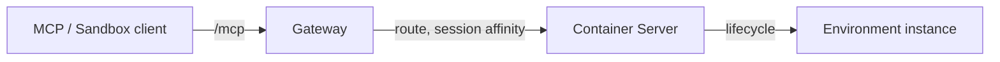
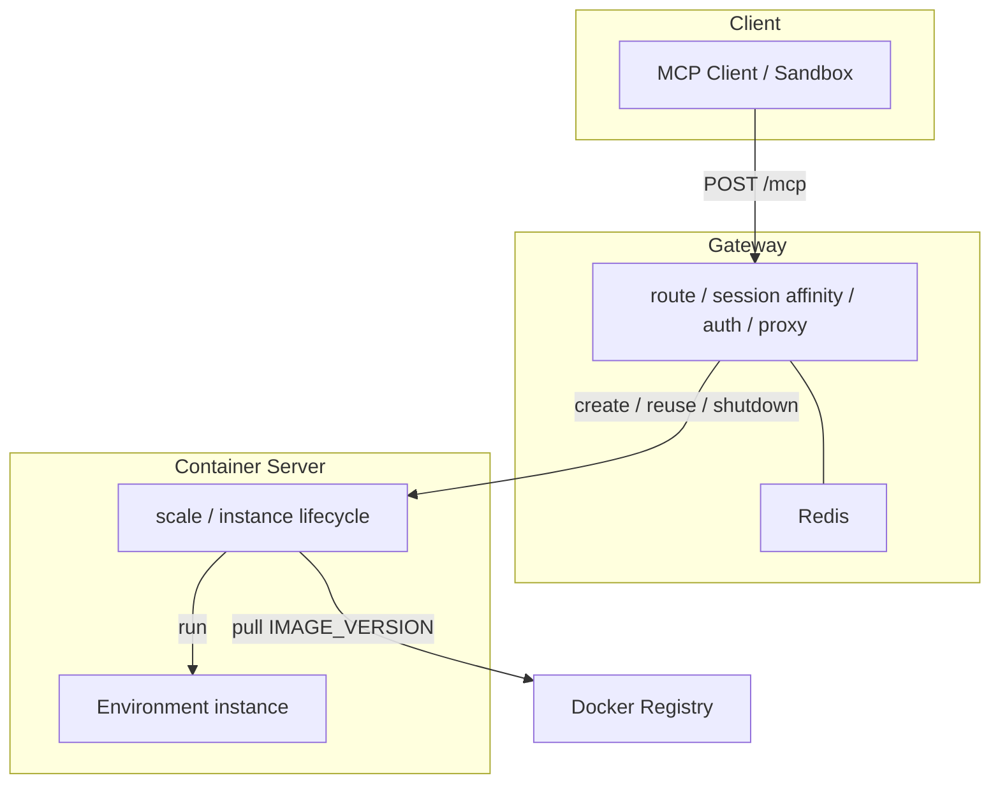
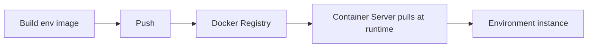
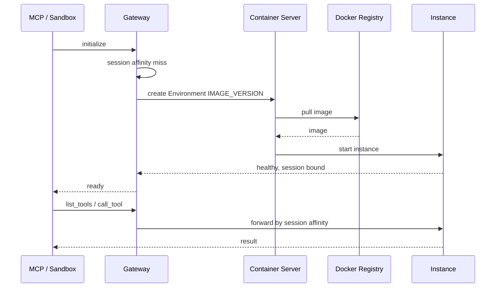

# AWorld Env

## Overview

AWorld Env is the **Environment runtime** behind AWorld.

In AWorld, an [Environment](https://www.inclusion-ai.org/AWorld/Environment/Overview/) is the isolated place an agent uses tools. Agents never talk to containers. They talk to Environment through `Sandbox`. This repository is the other side of that call: it starts a private computer, keeps it sticky across turns, and tears it down when the work is done.

Try a hosted Environment on [aworldagents.com/environments](https://www.aworldagents.com/environments). Use this repo to run the same model on your own machines.



---

## Features

- **One URL for the agent** — MCP / Sandbox client calls `/mcp`. Routing, affinity, and lifecycle stay behind the gateway.
- **Isolated computer per task** — each Environment gets its own desktop, browser, files, and MCP tools. State does not leak across tasks.
- **Sticky multi-turn session** — `SESSION_ID` sends later steps back to the same machine (cookies, tabs, files stay).
- **Watchable desktop** — VNC view of what the agent is clicking, plus HTTP / stream proxies into the instance.
- **Image from registry** — build an env image, push it to a Docker registry, select it with `IMAGE_VERSION`. Container Server pulls at runtime; it does not build on the request path.
- **Scale out hosts** — container servers register themselves; the gateway picks a healthy one when a new Environment is needed.
- **Auto reclaim** — idle 3 hours, max 24 hours, or failed health checks → instance is shut down.

Same client for hosted and self-hosted ([Using API](https://www.inclusion-ai.org/AWorld/Environment/Using%20API/)): change the URL and headers, keep `list_tools` / `call_tool`.

---

## Architecture

Three layers: **Client → Gateway → Container Server**. The client never talks to a container. Env images are built once, pushed to a Docker registry, and pulled when an instance starts.





### Layers

| Layer | Responsibility |
| --- | --- |
| **Client** | MCP Client / Sandbox. Discover tools, call tools, keep `SESSION_ID`. |
| **Gateway** | Single public door. Routing, session affinity, auth, MCP / VNC / HTTP / stream proxy. Redis stores the session → instance map. |
| **Container Server** | Scale and instance lifecycle. Registers to the gateway, pulls `IMAGE_VERSION` from the registry, starts / health-checks / stops instances. |

### Components

| Component | Layer | What it does |
| --- | --- | --- |
| **MCP / Sandbox client** | Client | The only caller the agent knows. |
| **MCP Gateway** | Gateway | Route by session, bind `SESSION_ID`, proxy `/mcp`, `/novnc`, `/stream`, `/http`. |
| **Redis** | Gateway | Session map and container-server registry. |
| **Container Server** | Container Server | Scale hosts, pull image, create / stop instances. |
| **Docker Registry** | Image supply | Stores env images after build. Runtime only pulls. |
| **Environment instance** | Container Server | Disposable computer: tool proxy + MCP servers + desktop. |

Gateway paths: `POST /mcp` (tools), `/novnc/{session}` (desktop), `/stream/{session}` (live channel), `/http/{session}` (HTTP in the instance).

### Request chain



---

## How to use

### 1. Connect an agent

Install AWorld and point `Sandbox` at a gateway. Hosted playground or this runtime use the same client ([Env Client](https://www.inclusion-ai.org/AWorld/Environment/Env%20Client/)).

```python
from aworld.sandbox import Sandbox

sandbox = Sandbox(mcp_config={
    "mcpServers": {
        "env": {
            "type": "streamable-http",
            "url": "http://localhost:8000/mcp",  # or playground URL
            "headers": {
                "Authorization": f"Bearer {TOKEN}",
                "SESSION_ID": "task-123",
                "IMAGE_VERSION": "demo-20260818",
                "MCP_SERVERS": "ms-playwright",
            },
            "timeout": 6000,
            "sse_read_timeout": 6000,
        }
    }
}).build()

tools = await sandbox.list_tools()
await sandbox.cleanup()
```

| Header | Meaning |
| --- | --- |
| `Authorization` | `Bearer` JWT |
| `SESSION_ID` | Stick this task to one instance |
| `IMAGE_VERSION` | Which env image tag to pull |
| `MCP_SERVERS` | Which tool servers to expose |
| `IMAGE_ENV` / `SANDBOX_ENV` | JSON env vars into the computer |
| `ENV_MODE=QUERY_INSTANT` | Destroy instance when the MCP session ends |

Watch the desktop: `http://<gateway>/novnc/<SESSION_ID>/vnc_lite.html?scale=true`

Pass the same `sandbox` into `Agent(...)` to run an agent against this Environment.

### 2. Run the platform

```bash
docker compose up --build
```

| Service | Role |
| --- | --- |
| `mcp-gateway` | Public URL, port 8000 |
| `container-server` | Scale and instance lifecycle |
| `redis-server` | Session and host registry |

| Variable | Where | Meaning |
| --- | --- | --- |
| `MCP_GATEWAY_TOKEN_SECRET` | gateway | JWT secret |
| `MCP_GATEWAY_REDIS_URL` | gateway | Redis URL |
| `GATEWAY_SERVER_ADDR` | container-server | Gateway address |
| `MCP_SERVER_IMAGE_NAME` | container-server | Registry image to pull |
| `DEFAULT_MCP_SERVER_IMAGE_VERSION` | container-server | Default tag |
| `DOCKER_REGISTRY_*` | container-server | Registry login for pull |

Health: `GET /health`. Hosts: `GET /dashboard/container_server`. Sessions: `GET /dashboard/session`.

### 3. Build, push, and select an env image

Images are not built on the request path. Build locally, **push to the Docker registry**, then Container Server **pulls** `IMAGE_VERSION` when creating an instance.

```text
env-images/mcp-server-base     # desktop + VNC + tool proxy
env-images/demo-mcp-server     # example tools on the base
```

```bash
# register tools in mcp_config.py, then:
cd env-images/demo-mcp-server/mcp_servers && uv run python build_mcp_tool_schema.py
cd ../mcp-server-base && ./build-image.sh
cd ../demo-mcp-server && ./build-image.sh   # tags and pushes to the registry
```

Set `MCP_SERVER_IMAGE_NAME` (and `DOCKER_REGISTRY_*` if the registry is private) on Container Server. Agents pick a tag with `IMAGE_VERSION`.
)
