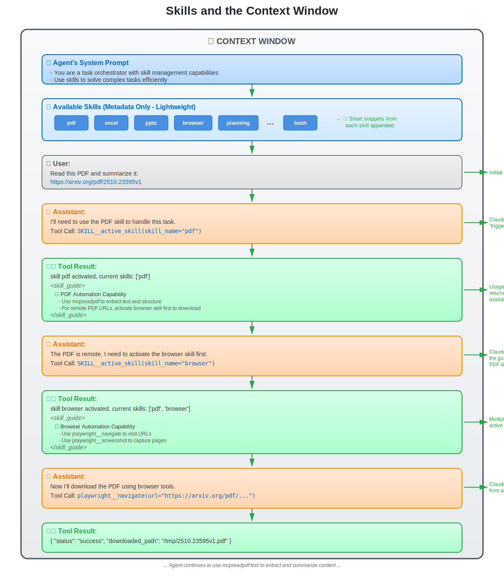

# Agent Skills in AWorld Framework

## Overview

This example demonstrates how to build specialized AI agents using **Agent Skills** in the AWorld Framework. Inspired by [Anthropic's Agent Skills](https://www.anthropic.com/engineering/equipping-agents-for-the-real-world-with-agent-skills), this implementation shows how to equip general-purpose agents with domain-specific expertise through composable, modular capabilities.

Agent Skills transform general-purpose agents into specialized agents by packaging procedural knowledge, tools, and resources into discoverable, activatable units.


## Table of Contents

- [Core Concepts](#core-concepts)
- [Architecture](#architecture)
- [Quick Start](#quick-start)
- [How It Works](#how-it-works)
- [Implementation Details](#implementation-details)
- [Best Practices](#best-practices)
- [Core Implementation Logic](./IMPLEMENTATION.md) 📄

## Core Concepts

### What is an Agent Skill?

An **Agent Skill** is a composable capability unit that contains:

1. **Metadata**: Name, description, and usage guidelines
2. **Tool Mapping**: Specific MCP tools the skill provides access to
3. **Active State**: Optional auto-activation flag


### Skills and the Context Window

The diagram below illustrates how skills are progressively loaded and activated within the agent's context window:



**Key Flow:**
1. 📋 **System Prompt**: Agent initialized with task orchestration capabilities
2. 🔧 **Skill Metadata**: Lightweight skill snippets (pdf, excel, browser, etc.) loaded into prompt
3. 👤 **User Request**: User provides task requiring PDF processing
4. 🧠 **Agent Decision**: Agent identifies need for PDF skill and calls `SKILL__active_skill("pdf")`
5. 📖 **Skill Activation**: Detailed usage guide returned, instructing to use browser for remote URLs
6. 🎯 **Skill Chaining**: Agent activates browser skill based on PDF skill's guidance
7. ✅ **Multi-Skill Active**: Both `['pdf', 'browser']` skills now available simultaneously
8. 🚀 **Tool Usage**: Agent uses `playwright__navigate` and `mcpreadpdf` to complete task

## Architecture

```
examples/skill_agent/
├── quick_start.py              # Entry point demonstrating skill-based agent
├── agents/
│   ├── swarm.py                # Swarm configuration with skill definitions
│   └── orchestrator_agent/     # Orchestrator agent implementation
│       ├── agent.py            # Agent logic
│       ├── config.py           # Agent configuration
│       └── prompt.py           # System prompt
├── mcp_tools/
│   ├── mcp_config.py           # MCP server configurations
│   ├── contextserver.py        # Context management MCP server
│   ├── terminal_server.py      # Terminal operations MCP server
│   ├── document_server.py      # Document handling MCP server
│   └── image_server.py         # Image processing MCP server
└── data/                       # Session data and workspace
```

## Quick Start

### 1. Installation

```bash
# Install AWorld Framework
cd /path/to/AWorld
pip install -e .

# Install dependencies
pip install -r requirements.txt
```

### 2. Environment Setup

Create a `.env` file with the following configuration:

```bash
# LLM Configuration
LLM_MODEL_NAME=gpt5
LLM_PROVIDER=openai
LLM_API_KEY=your_api_key
LLM_BASE_URL=https://api.openai.com/v1
```

### 3. Run the Example

```bash
cd examples/skill_agent
python quick_start.py
```

### 4. Example Output

When you run the example with a PDF reading task, you'll see the agent's skill activation:

```
📨 Message #1  🔧 SYSTEM     📏 Length: 2130
📨 Message #2  👤 USER       📏 Length: 58
Task: "read https://arxiv.org/pdf/2510.23595v1 and tell me the abstract"

📨 Message #3  🤖 ASSISTANT  📏 Length: 93
🛠️  Tool Calls: 1 found
  🔧 Tool #1: SKILL__active_skill
  📋 Args: {"skill_name": "pdf"}     # ← Activates PDF skill first

📨 Message #4  🛠️ TOOL       📏 Length: 150
Response: "skill pdf activated, current skills: ['pdf']
          <skill_guide>Automate PDF tasks... if remote PDF URL, 
          use browser skill first to download it</skill_guide>"

📨 Message #5  🤖 ASSISTANT  📏 Length: 120
🛠️  Tool Calls: 1 found
  🔧 Tool #1: SKILL__active_skill
  📋 Args: {"skill_name": "browser"}  # ← Activates browser based on guidance

📨 Message #6  🛠️ TOOL       📏 Length: 150
Response: "skill browser activated, current skills: ['pdf', 'browser']..."

📨 Message #7  🤖 ASSISTANT  📏 Length: 120
🛠️  Tool Calls: 1 found
  🔧 Tool #1: playwright__navigate    # ← Uses browser tools
  📋 Args: {"url": "https://arxiv.org/pdf/2510.23595v1"}
```

**Key Observations**:
1. Agent intelligently activates skills in sequence
2. PDF skill's usage guide instructs to use browser for remote URLs
3. Multiple skills can be active simultaneously (`['pdf', 'browser']`)
4. Agent accesses tools only from activated skills

> **Note**: Skill names are case-sensitive. Use lowercase names like `"pdf"`, `"browser"`, `"planning"` when activating.

## How It Works

### Step 1: Define Skills

AWorld supports two types of skills:

#### Type A: Text-Based Skills (Pure Knowledge)

These skills provide domain expertise and workflows **without requiring MCP servers**. The agent receives guidance through the `usage` field when the skill is activated.

```python
TEXT_SKILLS = {
    "arxiv_research": {
        "name": "ArXiv Research Guide",
        "desc": "Best practices for searching and analyzing academic papers",
        "usage": """
1. Use specific search terms from the paper's abstract or title
2. Navigate to https://arxiv.org/search/?query=<keywords>&searchtype=all
3. Filter by category (cs.AI, cs.CL, etc.) and date range
4. Access PDF directly via https://arxiv.org/pdf/<paper_id>.pdf
5. Check citations and related work for additional papers
        """
    },
    
    "github_navigation": {
        "name": "GitHub Navigation Guide", 
        "desc": "Efficient strategies for analyzing repositories",
        "usage": """
1. Start with README.md for project overview
2. Check /docs or /documentation for detailed guides
3. Review /examples for usage patterns
4. Examine /tests for implementation details
5. Check Issues and Discussions for common problems
        """
    }
}
```

**Use Cases**: Domain knowledge, best practices, workflow checklists, SOPs

#### Type B: Tool-Based Skills (MCP Integration)

These skills provide executable tools via MCP servers. Each skill specifies which MCP server(s) and tools it requires.

**Configuration** (`agents/orchestrator_agent/config.py`):

```python
# Document manipulation skills
DOCUMENT_SKILLS = {
    "pdf": {
        "name": "PDF",
        "desc": "PDF automation and manipulation capability",
        "usage": "For remote PDF URLs, use browser skill to download first",
        "tool_list": {
            "document_server": ["mcpreadpdf"]  # Specific tool
        }
    },
    "excel": {
        "name": "Excel",
        "desc": "Excel automation capability",
        "usage": "Automate Excel tasks and extract data",
        "tool_list": {
            "document_server": ["mcpreadexcel"]
        }
    }
}

# System operation skills
BASIC_SKILLS = {
    "bash": {
        "name": "Bash",
        "desc": "Command execution capability",
        "usage": "Execute bash commands and scripts",
        "tool_list": {
            "terminal-server": ["execute_command"]
        }
    }
}

# Combine all skills
orchestrator_agent_config = AgentConfig(
    llm_config=ModelConfig(...),
    skill_configs=TEXT_SKILLS | BASIC_SKILLS | DOCUMENT_SKILLS
)
```

**Use Cases**: File operations, API calls, database queries, system commands

##### Configure MCP Servers

For tool-based skills, configure the corresponding MCP servers in `mcp_tools/mcp_config.py`:

```python
import os

MCP_CONFIG = {
    "mcpServers": {
        
        # Document processing server for skills (PDF, Excel, PPTX)
        "document_server": {
            "command": "python",
            "args": ["-m", "mcp_tools.document_server"],
            "env": {
                "SESSION_REQUEST_CONNECT_TIMEOUT": "120"
            }
        },
        
        # Terminal/bash execution server for skill bash
        "terminal-server": {
            "command": "python",
            "args": ["-m", "mcp_tools.terminal_server"],
            "env": {}
        }
    }
}
```

### Step 2: Build Agent with Skills

Pass the skill configuration to your agent:

```python
from aworld.agents.llm_agent import Agent

orchestrator_agent = OrchestratorAgent(
    name="orchestrator_agent",
    desc="Task orchestrator with skill management",
    conf=orchestrator_agent_config,  # Contains skill_configs
    system_prompt=orchestrator_agent_system_prompt,
    mcp_servers=orchestrator_mcp_servers,
    mcp_config=MCP_CONFIG
)
```

The agent automatically:
- Registers all skills from `skill_configs`
- Derives required MCP servers from skill `tool_list`
- Adds SKILL tool for activation/offloading


## Skill Configuration

### Skill Structure

```python
{
    "skill_name": {
        "name": "Display Name",           # Human-readable name
        "desc": "Brief description",      # What the skill does
        "usage": "Usage guidelines",      # Detailed instructions
        "active": False,                  # Optional: auto-activate at init
        "tool_list": {                    # MCP servers and tools
            "mcp_server_name": ["tool1", "tool2"]  # Specific tools
            # or
            "mcp_server_name": []         # Empty list = all tools
        }
    }
}
```

### Tool List Patterns

- **All Tools**: `[]` includes all tools from the MCP server
- **Specific Tools**: `["tool1", "tool2"]` for fine-grained control

## Implementation Details

### Core APIs

**AmniContext Skill Management** (`aworld/core/context/amni/__init__.py`):

```python
# Initialize skills for an agent (called at agent startup)
await context.init_skill_list(skill_configs, namespace="agent_name")

# Activate a skill (returns usage guide)
result = await context.active_skill("planning", namespace="agent_name")
# Returns: "skill planning activated, current skills: ['planning']
#          <skill_guide>Use for breaking down tasks...</skill_guide>"

# Offload a skill
await context.offload_skill("planning", namespace="agent_name")

# Query skills
active_skills = await context.get_active_skills(namespace="agent_name")  # List[str]
all_skills = await context.get_skill_list(namespace="agent_name")       # Dict[str, Any]
skill_names = await context.get_skill_name_list(namespace="agent_name") # List[str]
```

**Skills Neuron** (`aworld/core/context/amni/prompt/neurons/skill_neuron.py`):

Formats available skills into the system prompt with activation instructions.

**Context Skill Tool** (`aworld/core/context/amni/tool/context_skill_tool.py`):

Provides `active_skill` and `offload_skill` as callable tools for the agent.

### Key Features

- **Namespace Isolation**: Each agent manages its own skill state
- **Auto-Activation**: Skills with `"active": True` load at initialization  
- **Progressive Loading**: Tools only available after skill activation
- **Usage Guidance**: Agent receives skill-specific instructions on activation

## Advanced Topics

### Multi-Agent Skills

Skills can be shared across agents in a swarm:

```python
shared_skills = {"common_tools": {...}}

agent1 = Agent(name="researcher", skill_configs={**shared_skills, "research": {...}})
agent2 = Agent(name="coder", skill_configs={**shared_skills, "coding": {...}})
```

### Skill Composition Patterns

**Sequential Activation**: Activate/offload skills as task phases progress
**Parallel Activation**: Multiple skills active simultaneously for complex tasks

## Troubleshooting

**Skills Not Appearing**
- Enable `"skills"` in context config neurons list
- Pass `skill_configs` to agent initialization

**Skill Activation Fails**
- ⚠️ **Skill names are case-sensitive**: Use `"pdf"` not `"PDF"`, `"browser"` not `"Browser"`
- Confirm skill name exists in `skill_configs` dictionary
- Verify namespace matches agent name
- Check logs for detailed error messages

**Tools Not Available After Activation**
- Verify MCP server is running
- Check tool names match configuration
- Review `black_tool_actions` for conflicts
- Ensure skill was successfully activated (check response message)

## Additional Resources

- [AWorld Framework](../../README.md)
- [Model Context Protocol (MCP)](https://modelcontextprotocol.io/)
- [Anthropic Agent Skills](https://www.anthropic.com/engineering/equipping-agents-for-the-real-world-with-agent-skills)
- [Multi-Agent Examples](../multi_agents/)

---

**Built with 🚀 by the AWorld Team**

