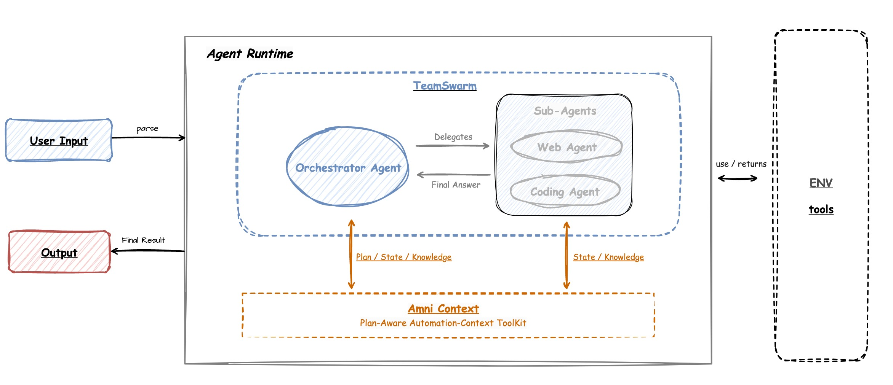

# XBench Multi-Agent System




This is an advanced Multi-Agent System built on **AWorld's TeamSwarm framework** and **Amni Context**, specifically designed to tackle complex Web Search tasks through intelligent agent coordination. The system leverages the Orchestrator Pattern to coordinate multiple specialized agents, achieving competitive performance on the XBench dataset through sophisticated task decomposition and collaborative problem-solving.

## 🏆 Key Achievements

- **High Performance on XBench（Pass@1: 51/Pass@3:61）**: Achieved competitive scores on complex web search and coding tasks
- **Advanced Architecture**: Built on TeamSwarm multi-agent coordination with Amni Context for plan-aware automation
- **Intelligent Task Decomposition**: Orchestrator agent delegates specialized tasks to domain-specific sub-agents
- **Robust Knowledge Management**: Leverages Amni Context for shared planning, state management, and knowledge persistence


## Tech Stack

- **Core Framework**: AWorld
- **Context Management**: AmniContext
- **Agent Architecture**: TeamSwarm
- **Tool Protocol**: MCP (Model Context Protocol)
- **Data Storage**: SQLite, ChromaDB
- **Evaluation Framework**: AWorld EvaluateRunner


## Quick Start

1. **Environment Setup**:

   **Option 1: Using uv (Recommended)** 🚀
   ```bash
   cd AWorld/examples/xbench

   # 1. Create virtual environment
   uv venv .venv
   source .venv/bin/activate  # Linux/macOS
   # or .venv\Scripts\activate  # Windows

   # 2. Install project dependencies
   uv pip install -r requirements.txt

   # 3. Install AWorld framework
   cd ../../
   uv pip install -e .
   cd examples/xbench
   ```

   **Option 2: Using conda** 🐍
   ```bash
   cd AWorld/examples/xbench

   # 1. Create conda environment
   conda create -n xbench python=3.11 -y
   conda activate xbench

   # 2. Install project dependencies
   pip install -r requirements.txt

   # 3. Install AWorld framework
   cd ../../
   pip install -e .
   cd examples/xbench
   ```

   **Option 3: Using traditional pip** 📦
   ```bash
   cd AWorld/examples/xbench

   # 1. Create virtual environment
   python -m venv .venv
   source .venv/bin/activate  # Linux/macOS
   # or .venv\Scripts\activate  # Windows

   # 2. Install project dependencies
   pip install -r requirements.txt

   # 3. Install AWorld framework
   cd ../../
   pip install -e .
   cd examples/xbench
   ```

2. **Download and Decrypt XBench Dataset**:
   
   The XBench evaluation framework provides official benchmark datasets. The data is encrypted to prevent search engine crawling and contamination.
   
   **One-Command Setup** (Recommended):
   ```bash
   # Run the automated download and decrypt script
   cd benchmark
   ./download_xbench_data.sh
   cd ..
   ```
   
   This script will automatically:
   - Clone the official [xbench-evals](https://github.com/xbench-ai/xbench-evals/) repository
   - Install required dependencies
   - Decrypt the datasets
   - Copy the decrypted files to the benchmark directory
   - Clean up temporary files
   
   **Dataset**:
   - `DeepSearch.csv`: Evaluates tool usage capabilities in search and information retrieval scenarios
   
   **⚠️ Important Security Notice**: 
   - The benchmark data is encrypted to prevent training data contamination
   - After decryption, **DO NOT** upload the plain text data online
   - **DO NOT** commit decrypted data to public repositories
   - Keep the decrypted datasets local only
   
   For more information, visit:
   - 🌐 Official Website: [xbench.org](https://xbench.org)
   - 📄 GitHub Repository: [xbench-ai/xbench-evals](https://github.com/xbench-ai/xbench-evals/)
   - 🤗 Dataset: Available in the repository (encrypted)

3. **Configure Environment Variables**:
   ```bash
   # Copy the example environment file
   cp .env_example .env
   
   # Edit .env and fill in your API Keys and configurations
   # Required fields:
   #   LLM_MODEL_NAME - Your model name (e.g., "gpt-4")
   #   LLM_API_KEY - Your API key
   #   LLM_BASE_URL - Your API base URL
   ```

4. **Run the Program**:
   ```bash
   python eval.py
   ```
5. **Evaluation Metrics**

The evaluation system provides comprehensive metrics to assess agent performance:

- **answer_accuracy**: Measures the correctness of agent responses using LLM-based scoring
- **eval_status**: Binary outcome indicator (PASS/FAIL) for each evaluation case

6. **Output Files**

   The system generates structured output files to track execution and evaluation results.

   **6.1 Log Files**
   
   All logs are stored in the `logs/` directory:
   
   | Log File           | Description                   |
   |--------------------|-------------------------------|
   | `eval_digest.log`  | Evaluation process summary    |

   **6.2 Result Files**
   
   Results are organized in the `results/` directory with hierarchical structure:
   
   **Directory Structure**:
   ```
   results/
   ├── {batch_id}/
   │   └── {task_id}_{timestamp}_{eval_case_id}.txt  # Individual task output
   └── {eval_run_id}/
       └── results.txt                                # Aggregated summary
   ```
   
   **Result File Format Example**:
   ```text
   eval_20241020120000
   START: 20241020 120000
   END: 20241020 123000
   
   ---------- SUMMARY --------------
   Pass: 8/10 (80.0%)
   
   ---------- DETAIL -------------
   1|task001|PASS|120
   2|task002|FAIL|180
   ...
   ```
   
   > **Format**: Each detail line follows `<sequence>|<task_id>|<status>|<execution_time_seconds>`

## Extended Development

### Adding a New Agent

1. Create a new agent folder in the `agents/` directory
2. Implement the agent class inheriting from the base agent class
3. Configure the agent's config and prompt
4. Register the new agent in `swarm.py`

### Adding a New Tool

1. Create a tool file in the `mcp_tools/` directory
2. Implement the tool's functionality functions
3. Register the tool in the corresponding agent
4. Update the MCP configuration (if it's an MCP tool)

### Custom Evaluation Metrics

1. Add new evaluation criteria in `eval.py`
2. Implement the corresponding scorer
3. Configure the new metric in `eval_criterias`

## Contributing Guidelines

Contributions and improvement suggestions are welcome! Please follow these principles:
1. Solve problems based on first principles
2. Keep code hierarchical and easy to extend
3. Add sufficient comments and documentation
4. Consider concurrency and performance optimization
5. Add usage examples for utility methods

## Acknowledgements

The XBench TeamSwarm is built on the AWorld framework. Thanks to all contributors for their support.

### About XBench

[XBench](https://github.com/xbench-ai/xbench-evals/) is an evergreen, contamination-free, real-world, domain-specific AI evaluation framework. 

### About ChromaDB

[ChromaDB](https://www.trychroma.com/) is an open-source embedding database designed for AI applications. We use ChromaDB for efficient vector storage and retrieval in our memory management system. Thanks to the ChromaDB team for providing such an excellent tool.

## License

Please refer to the LICENSE file in the project root directory.
