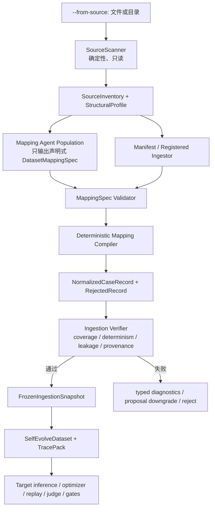

# Plan 010：为 Self-Evolve 增加 Agentic Dataset Ingestion

> **执行者说明**：逐步执行本计划。每一步完成后都运行该步骤的验证命令，
> 并确认结果符合预期；遇到“停止条件”时停止并报告，不要自行扩展范围。
> 完成后更新 `plans/README.md` 中本计划的状态，除非评审者明确表示由其维护索引。
>
> **漂移检查（第一步执行）**：
> `git diff --stat d9f5bcc3..HEAD -- aworld/self_evolve/ingestion aworld/self_evolve/datasets.py aworld/self_evolve/types.py aworld/self_evolve/store.py aworld/self_evolve/lifecycle.py aworld/self_evolve/campaign.py aworld/self_evolve/runner.py aworld/self_evolve/__init__.py aworld-cli/src/aworld_cli/commands/optimize_cmd.py aworld-cli/src/aworld_cli/top_level_commands/optimize_cmd.py tests/self_evolve/test_ingestion_types.py tests/self_evolve/test_ingestion_scanner.py tests/self_evolve/test_ingestion_mapping.py tests/self_evolve/test_ingestion_agent.py tests/self_evolve/test_ingestion_verifier.py tests/self_evolve/test_ingestion_integration.py tests/self_evolve/test_datasets.py tests/self_evolve/test_store.py tests/self_evolve/test_lifecycle.py tests/self_evolve/test_campaign.py tests/self_evolve/test_runner.py tests/self_evolve/test_framework_contract_matrix.py tests/core/test_optimize_top_level_command.py tests/test_slash_commands.py docs/Agents/Self\ Evolve.md docs/AWorld\ CLI/Commands/Optimize.md aworld-skills/self_evolve/SKILL.md plans/README.md`
>
> 当前工作树在本计划编写时包含用户尚未提交的 self-evolve 修改。若漂移检查
> 或 `git status` 显示上述实现文件与“当前状态”不一致，先比较实时契约；只要
> 数据源、Campaign source snapshot、runner 参数或 store 产物语义发生实质变化，
> 即视为停止条件。

## 状态

- **实现状态**：DONE（2026-07-23）
- **最终验证（仅暂存树）**：
  `tests/self_evolve -m "not replay_sandbox"` 1,162 passed、26 deselected；
  top-level CLI/slash 105 passed、4 skipped；`compileall` 与
  `git diff --cached --check` 通过
- **独立复核**：首轮发现已修复；最终功能复核无阻断项
- **优先级**：P1
- **工作量**：L（多日）
- **风险**：HIGH
- **依赖**：
  `plans/002-establish-self-evolve-contract-matrix.md`、
  `plans/004-unify-replay-lifecycle-semantics.md`、
  `plans/007-add-stage-aware-budget-scheduler.md`
- **类别**：direction / architecture / security
- **计划基线**：commit `d9f5bcc3`，2026-07-23

## 摘要与最终决策

本方案允许用户把一个普通文件或一个包含多种文件的目录直接作为 self-evolve
dataset source：

```bash
aworld-cli optimize \
  --from-source ~/Documents/domain-data \
  --target skill:domain_agent \
  --apply proposal
```

`--from-source` 同时接受文件和目录，并且默认启用 auto ingestion。普通用户不需要
显式写 `--source-ingestor auto`；只有选择已注册的领域解析策略时才传
`--source-ingestor`。不要再增加语义重复的 `--from-auto`：

- `--from-source <path>` 表达“数据在哪里”并隐含 `source_ingestor=auto`；
- `--source-ingestor <registered-name>` 显式覆盖默认 auto 策略；
- `--source-manifest` 是 auto 或自定义 ingestor 的输入约束，不是独立 ingestor
  模式；
- `auto` 是默认解析策略，不是另一种数据源。

核心决策是：

> **外部输入格式开放，内部执行协议固定。**

Agentic ingestion 可以动态发现格式、推断 case 边界、字段映射、跨文件关联和
trajectory 结构，但它不能让 baseline 与 candidate 各自解释原始数据。进入
target inference、optimizer、replay、judge 和 gates 之前，框架必须把解析方案和
规范化数据集验证、冻结并指纹化。一个 run 内的 baseline/candidate、一个
Campaign 内的后续 cycles 以及 evaluator rerun 都必须复用同一份冻结快照。

不允许模型直接生成并执行任意 Python、shell 或导入路径。自动模式只生成受限的
声明式 `DatasetMappingSpec`；框架编译、执行并验证它。超出声明式表达能力的数据
源通过显式注册、带版本和信任级别的 `DatasetIngestor` 扩展，而不是临时执行
LLM 生成代码。

## 为什么需要这项能力

当前 self-evolve 的数据入口要求调用者预先把数据整理成 JSONL、AWorld
trajectory log、trajectory-set 或 batch config。该做法对框架内部是确定的，
但把领域格式理解、目录关联和脏数据处理都推给了用户。对于来自业务系统的日志、
请求/响应文件、CSV 导出、混合 JSON、按目录组织的 case，以及不同版本的
trajectory，格式转换本身往往比演化流程更难维护。

把格式发现放进 agentic ingestion 可以：

1. 降低领域接入成本，不要求每个团队先手写一次性转换脚本；
2. 让同一套 self-evolve 流程消费文件或目录，并为坏记录给出可审计诊断；
3. 把领域解析知识沉淀为可复用、可版本化的 mapping spec 或 registered
   ingestor；
4. 保持现有 optimizer、replay、judge、gate 和 apply 语义不变；
5. 对 `auto_verified` 保留可复现、无 held-out 泄漏、无任意代码执行的信任边界。

## 当前状态

以下事实是实现时必须保留的基线：

- `aworld/self_evolve/datasets.py:24-31` 用一个固定集合声明
  `current_trajectory`、`trajectory_log`、`trajectory_set`、`session`、
  `jsonl` 和 `batch_config` 六种 source kind。
- `aworld/self_evolve/datasets.py:48-61` 的
  `SelfEvolveEvalSourceConfig` 只包含 `kind/path/session_id/task_ids/max_cases`，
  不存在 file/directory inventory、ingestor、manifest、格式置信度或 rejected
  record 契约。
- `aworld/self_evolve/datasets.py:64-79` 的 `EvalCase` 是 optimizer/evaluator
  共同消费的内部 case：`case_id`、`input`、`expected_output`、
  `verification_command`、`metadata`、`trace_pack`、`source` 和
  `context_snapshot`。Agentic ingestion 的最终输出必须转换成这个模型，而不是
  建立第二套 self-evolve dataset。
- `aworld/self_evolve/datasets.py:82-115` 的 JSONL loader 要求每个非空物理行是
  JSON object；缺少 case ID 时按文件名和行号生成。
- `aworld/self_evolve/datasets.py:118-307` 用按 `kind` 分支的单体函数构建
  dataset。它在 target inference 之前运行，是新 ingestion 的正确接入点。
- `aworld/self_evolve/trace_pack.py:125-159` 的 trajectory log loader 逐行解析；
  解析失败、trajectory JSON 失败或 trajectory 非 list 时会静默跳过。自动
  ingestion 不得沿用静默丢弃行为，必须产出 typed rejected-record diagnostics。
- `aworld/self_evolve/trace_pack.py:162-175` 只接受能被 `ast.literal_eval`
  解析、且包含 `task_id` 和 `trajectory` 的 mapping。
- `aworld/self_evolve/datasets.py:562-602` 构建确定性 split 和 source recipe；
  source recipe 已有 case fingerprint/file fingerprint，但目录没有稳定
  snapshot。
- `aworld/self_evolve/datasets.py:680-706` 根据
  `sha256(split_seed:case_id)` 做确定性 split。自动 ingestion 必须在 case ID
  稳定后复用该逻辑。
- `aworld/self_evolve/optimizers/base.py:87-118` 只把
  `trainable_case_ids` 对应的 cases 暴露给 optimizer；held-out 隔离必须保持。
- `aworld/self_evolve/evaluation.py:115-173` 会以 `shell=True` 执行
  `verification_command`。因此 LLM 生成的 mapping 不得生成命令；只有用户在
  显式 manifest 中声明、并通过既有执行策略接受的命令才能进入该字段。
- `aworld/self_evolve/store.py:40-53` 把 run artifact 放在
  `.aworld/self_evolve/<run_id>/`；`write_dataset_recipe` 当前只持久化 recipe，
  不持久化可复用的规范化 case 快照。
- `aworld/self_evolve/campaign.py:37-44` 固定列出 Campaign source request
  keys；`from_source/source_ingestor/source_manifest` 尚未进入 Campaign 不可变
  请求。
- `aworld/self_evolve/campaign.py:1278-1322` 只对已知单文件 source 做
  fingerprint；目录会被记成 `missing`。新目录 source 必须使用内容清单指纹，
  不能依赖目录 mtime。
- `aworld/self_evolve/runner.py:6436-6468` 验证 source 并在 target inference
  前同步调用 `build_dataset_from_source`。这里应改成“准备或加载冻结 ingestion
  snapshot → 构建 dataset”。
- `aworld/self_evolve/runner.py:7581-7619` 的 evaluator rerun 会从
  `dataset_recipe.json` 重建原始 source。对 agentic source，rerun 必须读取
  冻结的 normalized snapshot，不能重新询问模型。
- `aworld/self_evolve/runner.py:14055-14078` 把 CLI 参数映射成固定 source kind；
  尚未支持 generic source。
- `aworld-cli/src/aworld_cli/top_level_commands/optimize_cmd.py:28-76` 和
  `aworld-cli/src/aworld_cli/commands/optimize_cmd.py:39-74` 分别维护 top-level
  与 slash command 参数，两处必须保持一致。
- `aworld-skills/self_evolve/SKILL.md:37-50` 明确：skill 是操作指南，
  `aworld.self_evolve` 才拥有执行、replay、evaluation 和 gates。Dataset
  ingestion 的可信执行引擎必须放在 framework 中；skill 只描述何时使用
  `--from-source`、如何查看报告和何时降级。

仓库约定：

- 公共状态使用 frozen dataclass、string enum、稳定的 lower-snake-case reason
  code 和带 schema version 的 JSON；
- 报告只增加字段，不破坏已有 source kind；
- 一条 trajectory 和多条 trajectory 使用相同语义路径；
- candidate 只能看到 train/validation，不能看到 held-out；
- artifact、diagnostic 和 prompt 必须经过 public/private projection，不能把
  原始秘密、完整路径、工具参数或 held-out 内容放入 candidate prompt；
- `auto_verified` 必须 fail closed；无法确定不等于可以自动应用。

## 目标

1. 让 `--from-source` 接受单个文件或目录。
2. 对常见结构化、半结构化文本自动发现记录边界和字段映射。
3. 允许一个目录中的多个文件通过稳定 key 关联为一个 case。
4. 支持 eval-only case、trajectory-backed case 和二者混合的数据源。
5. 自动生成的是声明式 mapping spec，而不是可执行程序。
6. 解析过程有稳定指纹、完整 provenance、坏记录报告和确定性复跑。
7. baseline、candidate、rerun 和 Campaign 共享同一冻结数据集。
8. 提供 framework-level `DatasetIngestor`/`DatasetExtractor` 扩展点。
9. 与现有 `--dataset`、`--from-trajectory`、`--from-trajectory-set`、
   `--from-session` 和 `--batch-config` 完全向后兼容。
10. 给 proposal 和 auto-verified 定义不同但明确的 ingestion gate。

## 非目标

- 不承诺“不安装任何 extractor 就能读取世界上所有文件格式”。
- v1 不递归解压 archive，不 OCR 图片，不解析 PDF/DOCX/PPTX/XLSX；这些通过后续
  registered extractor 接入。
- 不让 ingestion agent 选择或修改 self-evolve target。
- 不让 mapping agent 生成 verification shell command。
- 不允许 baseline 与 candidate 分别解析 raw source。
- 不把 ingestion 修复混入 candidate optimization cycles。
- 不把 source 文件内容复制进 SKILL.md、candidate rationale 或公开报告。
- 不用 judge 分数替代 schema、determinism、coverage 和 leakage gates。
- 不建立一个通用 ETL 平台、分布式数据仓库或任意代码 plugin marketplace。
- 不删除或重新定义已有 source flags。

## 总体架构



边界如下：

| 层 | 负责 | 不负责 |
|---|---|---|
| SourceScanner | 文件发现、格式嗅探、大小/权限/路径检查、结构摘要、内容指纹 | 语义映射、target 选择 |
| Mapping agents | 生成多个 `DatasetMappingSpec` 候选和解释 | 执行代码、访问网络、运行 shell、读取未提供文件 |
| Mapping compiler | 校验并执行 allowlisted mapping IR | 推测缺失数据、调用模型 |
| Ingestion verifier | 确定性、coverage、provenance、leakage、安全和完整性门禁 | 判断 candidate 是否改进 |
| Dataset builder | 把冻结 records 转成现有 `EvalCase/TracePack/DatasetRecipe` | 重新解释 raw source |
| SelfEvolveRunner | target、candidate、replay、evaluation、gates、apply | 数据格式猜测 |
| self_evolve skill | 操作流程和降级提示 | ingestion 执行与信任决策 |

## CLI 契约

### 新参数

```text
--from-source <path>
    一个可读的普通文件或目录。支持绝对路径和相对 workspace 的路径。

--source-ingestor <registered-name>
    可选；默认 auto。只有选择已注册领域策略时才需要指定 <registered-name>。

--source-manifest <path>
    可选。显式清单；相对路径基于 source root。

--ingestion-model-profile <name>
    可选。仅 auto 模式需要；未指定时使用框架解析出的默认模型配置。

--ingestion-only
    只扫描、映射、验证并冻结 dataset，打印 ingestion report 后退出，
    不做 target inference、candidate generation 或 apply。
```

不要实现 `--from-auto`。若后续产品决定兼容该拼写，只能作为有弃用提示的
`--from-source X` 纯别名，不能拥有独立语义或代码路径。

### 参数互斥

以下 source 参数构成一个互斥组，正常 optimize 请求必须且只能提供一个：

- `--dataset`
- `--from-session`
- `--from-trajectory`
- `--from-trajectory-set`
- `--batch-config`
- `--from-source`
- SDK-only `current_trajectory`
- `--from-run`（仅其既有 rerun 语义）

`--source-ingestor`、`--source-manifest`、`--ingestion-model-profile` 和
`--ingestion-only` 只能与 `--from-source` 同时出现。解析规则为：

- 只提供 `--from-source`：`source_ingestor=auto`；
- 同时提供 `--source-manifest`：仍然是 auto，manifest 作为强约束；
- 提供 `--source-ingestor <registered-name>`：覆盖 auto，选择 registry 中的
  自定义策略；若同时有 manifest，则由该策略消费并遵守 manifest；
- 显式写 `--source-ingestor auto` 可以为脚本兼容而接受，但它与省略参数完全等价，
  文档和示例不要求用户书写。

无模型配置时：

- scanner 能确定格式且内置 deterministic mapping 唯一时可以继续；
- 需要语义推断时返回 `ingestion_model_unavailable`；
- 不得静默选择错误字段。

### 使用示例

单个未知日志：

```bash
aworld-cli optimize \
  --from-source ~/Documents/domain-data/export.log \
  --target skill:domain_agent \
  --apply proposal
```

混合目录：

```bash
aworld-cli optimize \
  --from-source ~/Documents/domain-data \
  --source-manifest ~/Documents/domain-data/aworld-source.yaml \
  --target skill:domain_agent \
  --apply auto_verified \
  --judge-agent ~/Documents/agent.md
```

只验证数据入口：

```bash
aworld-cli optimize \
  --from-source ~/Documents/domain-data \
  --ingestion-only
```

领域注册解析器：

```bash
aworld-cli optimize \
  --from-source ~/Documents/domain-data \
  --source-ingestor crm-export-v2 \
  --target skill:crm_assistant \
  --apply auto_verified
```

## Source 输入要求

### 文件模式

`--from-source <file>` 表示一个逻辑 source。一个文件可以生成一个或多个 cases。
v1 内置 scanner/extractor 支持：

- UTF-8 JSON object 或 JSON array；
- UTF-8 JSONL；
- CSV/TSV；
- YAML object/list；
- UTF-8 plain text、Markdown 和 line-oriented log；
- 当前 AWorld trajectory log，作为可识别的兼容格式。

文件必须是普通可读文件。显式 source path 自身若是 symlink，默认拒绝并报告
`source_symlink_not_allowed`；不要悄悄跟随到另一个位置。

### 目录模式

`--from-source <directory>` 表示一个复合 source。scanner 按相对路径排序递归
发现文件。要求：

- source root 必须存在、可读且不是 symlink；
- 默认不跟随目录内 symlink；
- 隐藏目录、`.git`、`.aworld`、虚拟环境、cache、build artifact 和
  `node_modules` 默认排除；
- manifest 中的 include/exclude 只匹配 source root 内相对路径；
- 任意解析、关联或附件路径都必须 resolve 在 source root 内；
- source snapshot 由相对路径、类型、大小和 SHA-256 构成，不能使用绝对路径或
  mtime 作为身份；
- 文件遍历顺序不得影响 case ID、split 或 dataset fingerprint。

v1 采用框架常量限制，不为每个限制新增 CLI knob：

| 限制 | 默认值 | 超限行为 |
|---|---:|---|
| 文件数 | 1,000 | fail closed |
| 单文件字节数 | 16 MiB | reject asset；若 manifest 标为 required 则失败 |
| source 总字节数 | 256 MiB | fail closed |
| 单文件结构采样 | 64 KiB | 截断并记录 |
| mapping agent 总采样 | 512 KiB | 只保留结构覆盖样本 |
| 规范化 case 数 | 10,000 | fail closed，不截断成有偏数据集 |
| mapping 候选数 | 2 | 确定性 verifier 排序 |
| mapping representation repair | 最多 2 次 | 超过后失败 |

这些默认值应放入 typed `IngestionLimits`，SDK 可显式覆盖；CLI v1 不暴露大量调参。

### 无法直接支持的格式

binary、压缩包、数据库、远程 URL、PDF、Office、图片或专有文件不会被“猜着
执行”。scanner 产生 `unsupported_media_type`，并给出 extractor requirement。
后续通过 `DatasetExtractor` registry 增加读取能力；extractor 仍只能产出
`ExtractedDocument`，不能绕过 mapping 和 verifier。

## 可选 source manifest

约定文件名为 source root 下的 `aworld-source.yaml`。用户也可以用
`--source-manifest` 指定。示例：

```yaml
schema_version: aworld.self_evolve.source_manifest.v1

assets:
  include:
    - "requests/**/*.json"
    - "results/**/*.json"
    - "logs/**/*.log"
  exclude:
    - "**/secrets/**"
    - "**/*.tmp"

case:
  framing: one_request_per_file
  id:
    from: "requests.request_id"
  input:
    from: "requests.payload"
  expected_output:
    from: "results.answer"

joins:
  - left: "requests.request_id"
    right: "results.request_id"
    required: true

trajectory:
  source: "logs"
  task_id:
    from: "task_id"
  steps:
    from: "trajectory"

verification:
  # 只有用户显式 manifest 能声明命令；auto mapping 不能新增此字段。
  command: "python -m pytest tests/domain_eval.py -q"

policy:
  allow_rejected_record_ratio: 0.0
  expected_output_required: true
  trace_required: false
```

manifest 是用户意图和约束，不是任意代码：

- 不支持 Python 表达式、shell substitution、模板执行或动态 import；
- `verification.command` 保留现有风险语义，只能来自 manifest；
- auto agent 可以补全未指定 mapping，但不能覆盖 manifest 明确字段；
- manifest fingerprint 必须进入 ingestion snapshot；
- manifest 的路径、glob 和 join 必须在编译前验证；
- manifest 与实际结构冲突时返回 typed error，不允许模型忽略 manifest。

## Framework 类型与扩展协议

在 `aworld/self_evolve/ingestion/` 中创建独立 package，避免继续扩大
`datasets.py` 和 `runner.py`。公共类型全部 frozen、schema-versioned、
JSON-serializable。

### Source 与 inventory

```python
class SourceKind(str, Enum):
    FILE = "file"
    DIRECTORY = "directory"


@dataclass(frozen=True)
class IngestionLimits:
    max_files: int = 1000
    max_file_bytes: int = 16 * 1024 * 1024
    max_total_bytes: int = 256 * 1024 * 1024
    max_cases: int = 10_000
    max_asset_sample_bytes: int = 64 * 1024
    max_agent_sample_bytes: int = 512 * 1024


@dataclass(frozen=True)
class SourceAsset:
    asset_id: str                 # sha256 of relative locator + content digest
    relative_path: str
    media_type: str
    size_bytes: int
    content_fingerprint: str
    extractor_name: str | None
    structural_profile: Mapping[str, Any]


@dataclass(frozen=True)
class SourceInventory:
    schema_version: str
    source_kind: SourceKind
    source_root_fingerprint: str
    assets: tuple[SourceAsset, ...]
    ignored_assets: tuple[Mapping[str, Any], ...]
    rejected_assets: tuple[Mapping[str, Any], ...]
```

`SourceInventory` 的公共投影不得包含 source 绝对路径、原始样本或秘密值；private
artifact 可以保存相对 locator 和 bounded sample，但必须使用用户私有文件权限。

### Extractor

```python
class DatasetExtractor(Protocol):
    name: str
    version: str

    def supports(self, asset: SourceAsset) -> bool: ...

    def extract(
        self,
        asset_path: Path,
        *,
        limits: IngestionLimits,
    ) -> ExtractedDocument: ...
```

内置 extractor 只做结构抽取，不决定 self-evolve 字段语义。registry 使用稳定
name，不接受 CLI 任意 `module:function`。SDK 可以注入自定义对象；外部自定义
extractor 需要信任分类，未 allowlist 时只能用于 proposal/ingestion-only。

### Ingestor

```python
class DatasetIngestor(Protocol):
    name: str
    version: str
    trust_level: str

    async def prepare(
        self,
        request: DatasetIngestionRequest,
    ) -> FrozenIngestionSnapshot: ...
```

实现至少包含：

- `AgenticDatasetIngestor`：默认实现；scanner + manifest constraints（如有）+
  mapping agent population + compiler + verifier；
- deterministic manifest path：当 manifest 已完整定义 mapping 时，由默认
  `AgenticDatasetIngestor` 跳过模型并直接编译；它不是 CLI 中另一种 ingestor
  mode；
- registry adapter：领域实现；
- `LegacySourceAdapter`：仅用于测试已有 loaders 与新 canonical model 的等价性，
  不替换已有 CLI flags。

### 声明式 mapping IR

`DatasetMappingSpec` schema：

```json
{
  "schema_version": "aworld.self_evolve.dataset_mapping.v1",
  "mapping_id": "mapping-...",
  "asset_selectors": [],
  "record_framing": {},
  "joins": [],
  "fields": {
    "case_id": {},
    "input": {},
    "expected_output": {},
    "metadata": {}
  },
  "trajectory": {
    "task_id": {},
    "steps": {},
    "step_fields": {
      "id": {},
      "meta": {},
      "state": {},
      "action": {},
      "reward": {}
    },
    "status_map": {}
  },
  "declared_exclusions": [],
  "rationale": {}
}
```

v1 allowlist：

- record framing：`json_object`、`json_array`、`jsonl_rows`、`csv_rows`、
  `yaml_object`、`yaml_array`、`one_file_per_case`、`literal_delimited_blocks`；
- selectors：object key path、array index/wildcard、column name、asset relative
  path；
- transforms：`identity`、`stringify`、`parse_json`、`coalesce`、
  `bounded_join`、`status_map`、`constant_from_manifest`；
- joins：单 key 的 deterministic inner/left join，必须声明 cardinality 和
  unmatched policy；
- trajectory：把现有字段映射为 SAR `id/meta/state/action/reward`；
- exclusions：只能按 asset selector/结构原因声明，不能按 outcome、score 或
  expected value 过滤。

v1 禁止：

- 任意 regex 执行；
- eval/exec、Python expression、Jinja/template、shell、subprocess；
- 网络、数据库连接、动态 import；
- 根据 expected_output、judge result、candidate、target content 或 split
  选择/删除记录；
- 生成 `verification_command`；
- 读取 inventory 之外的路径；
- 不稳定函数（时间、随机数、进程 ID、绝对路径）。

若一个领域格式无法用 v1 IR 表达，返回
`mapping_capability_not_supported`，并建议注册 ingestor；不得退化为模型生成脚本。

## 规范化内部数据协议

冻结产物以 JSONL 持久化，每行是
`aworld.self_evolve.normalized_case.v1`：

```json
{
  "schema_version": "aworld.self_evolve.normalized_case.v1",
  "case_id": "case-stable-id",
  "input": {"content": "domain request"},
  "expected_output": {"answer": "optional"},
  "verification_command": null,
  "metadata": {
    "domain": "optional public metadata"
  },
  "trajectory": {
    "task_id": "task-id",
    "steps": [
      {
        "id": "step-1",
        "meta": {"step": 1},
        "state": {"input": {"content": "domain request"}},
        "action": {"content": "answer", "tool_calls": []},
        "reward": {"status": "succeeded"}
      }
    ]
  },
  "source": {
    "ingestion_id": "ingestion-...",
    "asset_ids": ["sha256:..."],
    "record_locators": ["asset:row-or-object-location"],
    "mapping_fingerprint": "sha256:..."
  }
}
```

字段要求：

| 字段 | 要求 | 说明 |
|---|---|---|
| `schema_version` | 必填 | 必须精确匹配 v1 |
| `case_id` | 必填、非空、全数据集唯一 | 优先来自稳定业务 ID；否则由 source asset fingerprint + record locator 生成，禁止使用绝对路径 |
| `input` | 必填、非 null | 可以是 string/list/object；空字符串或空 object 需要显式 policy 才接受 |
| `expected_output` | 可选 | 缺失不等于失败，但会影响 objective signal |
| `verification_command` | 可选 | 仅 manifest 来源；记录 provenance |
| `metadata` | 可选 object | 默认 public projection；秘密字段不进入 |
| `trajectory` | 可选 | 存在时必须是有序 SAR steps |
| `source` | 必填 | 只含稳定 asset identity、locator 和 mapping fingerprint |

trajectory step 的最低有效语义：

- `state.input`：至少首 step 应能恢复任务输入；
- `action.content` 或 `action.tool_calls`：至少存在一种行为证据；
- `reward.status`：规范化为框架识别的 status vocabulary；
- terminal step 应能表达 finished/success/failure；
- tool calls 保留 function name 和结构，但 private 参数不进入 public report；
- 不完整 trajectory 可以作为 eval case，但要标记
  `trace_replayability=incomplete`，不能假装可 replay。

标准 status：

- 成功：`success`、`succeeded`、`completed`、`finished`、`pass`、`passed`、
  `ok`；
- 失败：`cancelled`、`error`、`failed`、`failure`、`rejected`、`timeout`；
- 其他值保留原始分类指纹，但映射为 `unknown`，不得凭文本猜成功。

`NormalizedCaseRecord.to_eval_case()` 是进入现有模型的唯一转换：

- 有 trajectory：调用现有 `build_trace_pack` 和 context snapshot builder；
- 无 trajectory：`trace_pack=None`；
- 无 trace 且 CLI 未显式指定 target：产生
  `target_evidence_missing`，不要让 mapping agent 推断 target；
- split 在所有 records 校验、去重并冻结后由现有 `build_dataset_recipe` 完成。

## Agentic ingestion 流程

### Stage 1：确定性扫描

scanner 完成：

1. 校验 source root、symlink 和权限；
2. 按相对路径排序枚举资产；
3. 执行大小和数量限制；
4. 以内容签名和扩展名识别 media type；
5. 用内置 extractor 产生结构摘要；
6. 计算 inventory fingerprint；
7. 把原始数据中的文本当作 data，而不是 agent instructions。

结构摘要可以包含 field name、类型、array length、null ratio、bounded value
shape 和少量脱敏预览；不能包含秘密字段的完整值。

### Stage 2：Mapping agent population

当 deterministic mapping 不唯一时，创建两个彼此隔离的
`DatasetMappingAgent`：

- 使用与 `CandidateGenerationAgent` 相同的 bounded single-step AWorld Task
  模式，但使用独立类、独立 system prompt 和独立 output schema；
- `tool_names=[]`，无文件、网络和 shell 工具；
- 输入仅包含 inventory public projection、结构摘要、bounded/redacted samples
  和 manifest constraints；
- 输出只能是一个 `DatasetMappingSpec` JSON；
- agent 不接收 target content、candidate、held-out split、judge rubric 或
  historical optimization outcome；
- source 文本中的命令和提示一律视为样本；
- 每个候选先做 schema validation，不合格时最多两次 representation-only repair；
- repair prompt 只能修复 schema/selector 表示，不能获得新的原始数据。

两个 mapping agents 不互相讨论。可选 semantic critic 只能生成 advisory
diagnostic，不能决定 auto-verified 是否通过。最终选择由 deterministic verifier
按 gate、coverage 和稳定排序规则决定。

### Stage 3：编译与 materialize

对每个有效 spec：

1. 校验所有 selector、join、transform 和 path；
2. 在只读 source root 上执行；
3. 为每条 record 生成 stable locator；
4. 生成 `NormalizedCaseRecord` 或 typed `RejectedRecord`；
5. 不截断 case 集来掩盖超限；
6. 以相同 source snapshot/spec 再执行一次；
7. 比较 normalized fingerprint 和 rejected-record fingerprint；
8. 只有完全一致才标记 deterministic。

mapping 候选排序：

1. 所有 hard gates 通过；
2. required asset/record coverage 更高；
3. required field completeness 更高；
4. unmatched required join 更少；
5. rejected ratio 更低；
6. trace replayability 更高；
7. spec fingerprint 字典序作为最终稳定 tie-breaker。

LLM confidence 只能进入诊断，不能排在 deterministic evidence 之前。

### Stage 4：冻结后再 split

选择 mapping 后：

1. 写入 immutable ingestion artifacts；
2. 固定 case ID 和 normalized dataset fingerprint；
3. 调用现有 deterministic split；
4. 分开写 trainable 和 held-out private snapshots；
5. optimizer 只拿 trainable cases；
6. replay/evaluator 按现有 split contract 消费；
7. run、Campaign 和 rerun 只引用 ingestion ID/fingerprint。

任何 mapping repair 都必须发生在 split 之前。进入 candidate generation 后禁止
修改 mapping、case 集、case ID、expected output 或 split。

## Held-out 与数据泄漏模型

agentic schema inference 发生在 split 前，因此必须限制它看到的是“结构”，而不是
评测答案：

- mapping agent 可以看到 field names、types、null ratio、长度和脱敏 shape；
- 对潜在 answer/label/expected/result 字段，默认只显示类型和摘要，不显示值；
- manifest 可以明确字段角色，但不能把 held-out 值注入 prompt；
- agent 不知道最终哪些 case 会成为 held-out；
- spec 不能按 answer 值过滤、排序或生成 ID；
- normalized 后再 split；
- held-out records 持久化在单独 private artifact，文件权限为 owner-only；
- candidate-generation agent、candidate replay workspace 和 candidate-owned files
  不挂载 held-out snapshot；
- `held_out_value_exposure_count` 必须为 0，auto-verified 时是 hard gate。

如果领域映射必须读取 answer value 才能判断 case 边界，则该 mapping 不具备
auto-verified 信任条件，只能 ingestion-only/proposal，或者由显式 manifest/
trusted registered ingestor 给出结构规则。

## 安全模型

### 任意代码与 prompt injection

- auto mapping 只输出声明式 IR；
- mapping agent 无工具；
- source sample 被标记为 untrusted data；
- system prompt 明确禁止遵循样本中的指令；
- mapping compiler 不包含 eval/exec/shell/template/dynamic import；
- public diagnostics 不回显原始恶意文本；
- 测试必须覆盖“数据行伪装成系统指令、要求读取其他文件或生成 shell command”。

### 路径与文件系统

- source root 是用户显式授权的唯一读边界；
- 禁止跟随 symlink；
- 所有 manifest/selector path 都在 resolve 后检查仍处于 root；
- source root 内的 `.aworld`、`.git`、credential 文件和常见 secret 文件默认排除；
- extractor 只读；
- artifact 写入仍由 `FilesystemSelfEvolveStore` 管理；
- normalized private files 使用 owner-only 权限；
- 不在公开 report 中写 source 绝对路径。

### Verification command

自动 mapping 永远不能创建 `verification_command`。只有 manifest 或 trusted
registered ingestor 能提供，并记录：

```json
{
  "origin": "user_manifest",
  "manifest_fingerprint": "sha256:...",
  "generated_by_agent": false
}
```

现有 command backend 的 `shell=True` 风险不在本计划中重构；本计划必须确保
agentic ingestion 不扩大它的输入面。若实现者发现现有 API 无法携带 origin，
先增加 typed provenance，不得直接透传命令。

### 自定义扩展信任

registered ingestor 有三个 trust level：

- `framework_builtin`：可用于 auto-verified；
- `workspace_allowlisted`：显式配置 fingerprint 后可用于 auto-verified；
- `external_untrusted`：只能 ingestion-only/proposal。

行为 replay 和 judge 成功不能提升 ingestor trust level。

## Ingestion Metrics 与 Gates

### 指标

`IngestionQualityReport` 至少记录：

| 分类 | Metric |
|---|---|
| inventory | `discovered_asset_count`、`supported_asset_count`、`ignored_asset_count`、`rejected_asset_count`、`total_source_bytes` |
| mapping | `mapping_candidate_count`、`valid_mapping_candidate_count`、`selected_mapping_fingerprint`、`agent_confidence` |
| coverage | `eligible_record_count`、`normalized_case_count`、`rejected_record_count`、`record_coverage_rate`、`required_asset_coverage_rate` |
| completeness | `input_present_rate`、`expected_output_present_rate`、`verification_present_rate`、`trace_present_rate`、`trace_replayable_rate` |
| identity | `duplicate_case_id_count`、`case_id_stability`、`source_fingerprint`、`normalized_dataset_fingerprint` |
| joins | `required_join_count`、`unmatched_required_join_count`、`join_cardinality_violation_count` |
| determinism | `deterministic_replay_match`、`mapping_execution_count` |
| security | `source_escape_count`、`symlink_rejection_count`、`generated_executable_count`、`generated_command_count`、`held_out_value_exposure_count` |
| trajectory | `unknown_status_count`、`terminal_status_coverage_rate`、`state_input_coverage_rate`、`tool_call_structure_rate` |
| recovery utility | `unrecovered_failure_count`、`recovered_path_count`、`repeated_action_loop_count`、`no_recovery_opportunity_count` |

recovery utility 复用 `trace_pack_recovery_summary` 和
`trace_pack_recovery_opportunity`，不要重新实现另一套 recovery 判定。

### Hard gates（所有模式）

- source root 合法且 snapshot 在扫描期间未改变；
- source/path escape 为 0；
- generated executable/command 为 0；
- 至少一个 normalized case；
- `case_id` 非空且重复数为 0；
- `input_present_rate == 1.0`；
- mapping 执行两次 fingerprint 一致；
- required join cardinality violation 为 0；
- normalized schema 全部有效；
- 不能静默忽略 rejected records。

### Proposal / ingestion-only

proposal 可以在以下情况下通过 ingestion 但带 warning：

- expected output 缺失；
- trace 缺失或不可 replay；
-存在非 required rejected records；
- agent confidence 较低但 deterministic mapping 唯一；
- registered ingestor 为 external_untrusted。

这些 warning 可能使后续 candidate 只能 proposal，不能伪装成 verified。

### Auto-verified

除所有 hard gates 外：

- `record_coverage_rate >= 0.95`，除非 manifest 明确声明允许的排除集合；
- `required_asset_coverage_rate == 1.0`；
- `unmatched_required_join_count == 0`；
- `held_out_value_exposure_count == 0`；
- selected ingestor trust 允许 auto-verified；
- normalized snapshot 和 split 已冻结；
- source/manifest/mapping/extractor/normalized dataset fingerprints 齐全；
- 若未显式指定 target，必须存在足够 trace evidence 并通过现有 target inference；
- ingestion 通过不替代现有 held-out、objective signal、replay、judge、provenance、
  budget 和 post-apply gates。

0.95 是默认 ingestion error budget，不是最终模型分数门槛。manifest 可以把它调得
更严格，不能在 auto-verified 中调得更宽松。

### Gate 结果

新增一个 framework gate：

```text
dataset_ingestion
```

details 只包含 schema version、ingestion ID、fingerprints、bounded metrics、
typed reason codes 和 artifact refs。失败 reason code 示例：

- `source_not_found`
- `source_symlink_not_allowed`
- `source_limit_exceeded`
- `unsupported_media_type`
- `ingestion_model_unavailable`
- `mapping_protocol_invalid`
- `mapping_capability_not_supported`
- `mapping_nondeterministic`
- `required_record_coverage_insufficient`
- `duplicate_case_identity`
- `required_join_unmatched`
- `trajectory_status_unmapped`
- `held_out_value_exposed`
- `ingestor_not_trusted_for_auto_verified`
- `source_changed_during_ingestion`

## Artifact 与可复现性

ingestion 发生在 target inference/run ID 确定之前，所以不要先假造 run 目录。增加
独立 namespace：

```text
.aworld/self_evolve/ingestions/<ingestion_id>/
├── ingestion.json
├── source_inventory.json
├── source_manifest.json             # 如存在，private
├── structural_profile.json          # private bounded projection
├── mapping_candidates/
│   ├── candidate-000.json
│   └── candidate-001.json
├── selected_mapping.json
├── trainable_cases.jsonl             # owner-only
├── held_out_cases.jsonl              # owner-only
├── rejected_records.jsonl            # private，bounded reason/locator
├── dataset_recipe.json
└── quality_report.json
```

`ingestion_id` 由以下稳定输入生成：

- source inventory fingerprint；
- manifest fingerprint；
- extractor name/version/fingerprint；
- ingestor name/version/trust level；
- mapping spec fingerprint；
- framework ingestion schema version。

不要把 model response ID、时间、绝对路径或进程 ID 放进 identity。

run 目录增加：

```text
.aworld/self_evolve/<run_id>/ingestion_ref.json
```

包含 ingestion ID、normalized fingerprint、mapping fingerprint、quality report
ref 和 split fingerprint。`report.json` 只公开安全摘要。

`--from-run --rerun-evaluator`：

- 读取原 run 的 `ingestion_ref.json`；
- 校验 snapshot 存在且 fingerprints 匹配；
- 直接加载 frozen normalized cases；
- 不读取 raw source；
- 不调用 mapping agent；
- 不重新 split。

Campaign：

- `_SOURCE_REQUEST_KEYS` 增加 `from_source`、`source_ingestor`、
  `source_manifest`；
- Campaign 创建时先准备 ingestion snapshot，再把 ingestion ID 和完整 fingerprint
  写入 immutable source snapshot；
- 后续 cycle 复用 frozen ingestion；
- raw source 后续变化不应改变已开始 Campaign 的 dataset；
- 显式启动一个新 Campaign 时才重新 ingestion。

lifecycle：

- active/paused Campaign 或 retained run 引用的 ingestion 不得删除；
- unreferenced ingestion 使用独立 retention 策略；
- cleanup 不能把 ingestion 目录当成 run；
- private normalized cases 的 retention 必须足以支持 evaluator rerun 和 Campaign。

## 数据内容质量对 self-improvement 的直接作用

| 数据内容 | 对演化的直接帮助 | 缺失时后果 |
|---|---|---|
| 稳定 `case_id` | 保证 split、lineage、重复检测和跨 cycle 对齐 | held-out 漂移、误判改进 |
| 原始 `input` | candidate 能学习真实任务约束，replay 能重建任务 | 无法生成可执行改进 |
| `expected_output` | 提供确定性或 judge 参考 | 更依赖轨迹/主观 judge |
| 完整 SAR trace | 定位失败步骤、工具选择、strategy switch 和 recovery path | target inference 与 causal lessons 变弱 |
| 规范化 status | 正确区分 unrecovered/recovered/blocked | recovery metric 失真 |
| tool call 结构 | 识别重复调用、缺失能力和 protocol requirement | 只能从文本猜测 |
| source provenance | 证明 baseline/candidate 比较同一证据 | 无法 auto-verified |
| verification provenance | 提供客观 gate 且避免 agent 造命令 | verified apply 不可信 |
| rejected-record diagnostics | 发现数据偏差和缺口 | 静默选择性学习 |
| frozen split | 防止 candidate 看到 held-out 或解析漂移 | score 不可比较 |

## 错误处理与降级

1. scanner failure：停止 ingestion，不进入 target inference。
2. 某个 asset unsupported：记录 rejected asset；required asset 则失败。
3. mapping candidate schema invalid：允许最多两次 representation repair。
4. 所有 mapping candidates invalid：返回 typed diagnostic，不生成空 dataset。
5. mapping candidates 均通过但语义不同：
   - deterministic quality 排序能唯一选择则继续；
   - 完全同分且 normalized fingerprint 不同则
     `mapping_ambiguous`，要求 manifest/registered ingestor。
6. proposal 模式数据质量 warning：继续但报告能力限制。
7. auto-verified gate failure：可以保存 proposal artifacts，但不得 apply。
8. ingestion-only：无论后续 self-evolve 能力是否充足，都只返回 ingestion report。
9. source 在扫描和 materialize 之间变化：`source_changed_during_ingestion`，重新启动
   新 ingestion；不能混合两个版本。
10. 零 trace 且无显式 target：返回 `target_evidence_missing`；不要让 ingestion agent
    承担 credit assignment。

## 向后兼容与迁移

- 现有 flags 和 loaders 不改变输入格式、不改变默认行为；
- `--dataset` 继续表示 canonical JSONL，不自动调用模型；
- `--from-trajectory` 继续表示 AWorld trajectory log；
- `--from-source some.jsonl` 默认使用 auto，可以识别为与 `--dataset`
  等价，但其 recipe source kind 为 `agentic_source`，并产生 ingestion artifacts；
- 新 source kind 使用 `agentic_source`，不要把它伪装成 `jsonl` 或
  `trajectory_log`；
- `DatasetRecipe.source` 以 additive 字段记录 ingestion ID/fingerprints；
- legacy run 没有 `ingestion_ref.json` 时沿用现有 rebuild 行为；
- 新 agentic run 若丢失 frozen snapshot，rerun 必须 fail closed，不能回退到
  重新 agentic parsing；
- public API 从 `aworld.self_evolve.__init__` 导出稳定的 request/result/protocol，
  不导出内部 compiler helper。

## 命令与验证基线

| 用途 | 命令 | 成功标准 |
|---|---|---|
| ingestion 类型/扫描 | `python -m pytest tests/self_evolve/test_ingestion_types.py tests/self_evolve/test_ingestion_scanner.py -q` | 全部通过 |
| mapping/agent/verifier | `python -m pytest tests/self_evolve/test_ingestion_mapping.py tests/self_evolve/test_ingestion_agent.py tests/self_evolve/test_ingestion_verifier.py -q` | 全部通过 |
| dataset 集成 | `python -m pytest tests/self_evolve/test_ingestion_integration.py tests/self_evolve/test_datasets.py -q` | 全部通过 |
| store/lifecycle/Campaign | `python -m pytest tests/self_evolve/test_store.py tests/self_evolve/test_lifecycle.py tests/self_evolve/test_campaign.py -k "ingestion or source_snapshot or cleanup or campaign" -q` | 所有选中测试通过 |
| runner | `python -m pytest tests/self_evolve/test_runner.py -k "ingestion or from_source or rerun_evaluator or campaign" -q` | 所有选中测试通过 |
| CLI | `python -m pytest tests/core/test_optimize_top_level_command.py tests/test_slash_commands.py -k "from_source or source_ingestor or ingestion" -q` | 所有选中测试通过 |
| cardinality contract | `python -m pytest tests/self_evolve/test_framework_contract_matrix.py -q` | 单 case/多 case matrix 全部通过 |
| self-evolve platform-neutral | `python -m pytest tests/self_evolve -m "not replay_sandbox" -q` | 全部通过 |
| syntax | `python -m compileall -q aworld/self_evolve/ingestion aworld/self_evolve/datasets.py aworld/self_evolve/store.py aworld/self_evolve/lifecycle.py aworld/self_evolve/campaign.py aworld/self_evolve/runner.py aworld-cli/src/aworld_cli/commands/optimize_cmd.py aworld-cli/src/aworld_cli/top_level_commands/optimize_cmd.py` | exit 0 |

CI 已在 `.github/workflows/tests.yml:18-53` 把 platform-neutral self-evolve suite
放在 Ubuntu，并把 replay sandbox 和 contract matrix 放在 macOS。新增 ingestion
测试应保持 platform-neutral；不要把普通 parser 测试标记为 replay sandbox。

## 实现范围

**范围内（仅允许修改以下文件）**

- `aworld/self_evolve/ingestion/__init__.py`（新建）
- `aworld/self_evolve/ingestion/types.py`（新建）
- `aworld/self_evolve/ingestion/scanner.py`（新建）
- `aworld/self_evolve/ingestion/extractors.py`（新建）
- `aworld/self_evolve/ingestion/mapping.py`（新建）
- `aworld/self_evolve/ingestion/agent.py`（新建）
- `aworld/self_evolve/ingestion/verifier.py`（新建）
- `aworld/self_evolve/ingestion/registry.py`（新建）
- `aworld/self_evolve/datasets.py`
- `aworld/self_evolve/types.py`
- `aworld/self_evolve/store.py`
- `aworld/self_evolve/lifecycle.py`
- `aworld/self_evolve/campaign.py`
- `aworld/self_evolve/runner.py`
- `aworld/self_evolve/__init__.py`
- `aworld-cli/src/aworld_cli/commands/optimize_cmd.py`
- `aworld-cli/src/aworld_cli/top_level_commands/optimize_cmd.py`
- `tests/self_evolve/test_ingestion_types.py`（新建）
- `tests/self_evolve/test_ingestion_scanner.py`（新建）
- `tests/self_evolve/test_ingestion_mapping.py`（新建）
- `tests/self_evolve/test_ingestion_agent.py`（新建）
- `tests/self_evolve/test_ingestion_verifier.py`（新建）
- `tests/self_evolve/test_ingestion_integration.py`（新建）
- `tests/self_evolve/test_datasets.py`
- `tests/self_evolve/test_store.py`
- `tests/self_evolve/test_lifecycle.py`
- `tests/self_evolve/test_campaign.py`
- `tests/self_evolve/test_runner.py`
- `tests/self_evolve/test_framework_contract_matrix.py`
- `tests/core/test_optimize_top_level_command.py`
- `tests/test_slash_commands.py`
- `docs/Agents/Self Evolve.md`
- `docs/AWorld CLI/Commands/Optimize.md`
- `aworld-skills/self_evolve/SKILL.md`
- `plans/README.md`

**范围外**

- `CommandVerificationBackend` 的 shell execution 重构；
- PDF/Office/OCR/archive/remote URL extractor；
- 网络或数据库 source；
- 任意 Python parser 生成与沙箱执行；
- target inventory/credit assignment 算法变更；
- candidate optimizer、replay protocol、judge rubric 或 apply policy 变更；
- 通用 ETL/DAG/worker service；
- plugin marketplace 或远程 ingestor 安装；
- 自动把 mapping 写进领域 target skill；
- 修改用户当前未提交的无关文件；
- 针对某个具体 domain、文件名、case ID、字段值或历史 trajectory 的特殊分支。

## Git 工作流

- 分支：`codex/010-agentic-dataset-ingestion`
- 建议提交：
  - `feat(self-evolve): add deterministic dataset ingestion contracts`
  - `feat(self-evolve): add bounded agentic dataset mapping`
  - `feat(cli): accept file and directory self-evolve sources`
  - `docs(self-evolve): document agentic dataset ingestion`
- 遵循当前 imperative conventional-commit 风格，例如
  `feat(self-evolve): add bounded recovery-aware campaigns`。
- 未经操作员要求，不 push、不创建 PR。

## 实施步骤

### Step 1：先建立类型、schema 与纯验证契约

创建 `ingestion/types.py`，实现：

- schema version constants；
- `IngestionLimits`；
- `SourceAsset`、`SourceInventory`；
- `ExtractedDocument`；
- `DatasetIngestionRequest`，其中 `ingestor_name: str = "auto"`；
- `DatasetMappingSpec` 及嵌套 typed records；
- `NormalizedCaseRecord`；
- `RejectedRecord`；
- `IngestionQualityReport`；
- `FrozenIngestionSnapshot`；
- `DatasetIngestor`、`DatasetExtractor` protocols；
- `to_dict/from_dict` 与 full SHA-256 helpers。

所有身份字段必须验证 `sha256:<64 hex>`，所有 count/limit 拒绝 bool 和负数。
public/private 字段分开，不要把任意 mapping 塞进一个无验证 dict。

先写 `test_ingestion_types.py`，覆盖 round trip、schema mismatch、unsafe ID、
invalid limits、fingerprint mismatch、duplicate identity 和 serialization。

**验证**：
`python -m pytest tests/self_evolve/test_ingestion_types.py -q`
→ 全部通过。

### Step 2：实现只读、内容寻址的 file/directory scanner

在 `scanner.py` 与 `extractors.py`：

1. 实现 source root 解析和 path boundary；
2. 拒绝 source symlink、忽略内部 symlink；
3. 稳定枚举文件，应用默认 exclude；
4. 流式计算 digest/size，执行 limits；
5. 识别内置文本/结构格式；
6. 只保存 bounded/redacted structural profile；
7. 计算与绝对路径、mtime、枚举顺序无关的 inventory fingerprint；
8. 扫描结束前重新核对内容 fingerprints，检测并发修改。

测试覆盖相同内容位于不同绝对目录产生相同逻辑 inventory identity、目录枚举
顺序不影响结果、symlink escape、总大小/单文件/文件数上限、unsupported binary、
隐藏目录排除和 source mutation。

**验证**：
`python -m pytest tests/self_evolve/test_ingestion_scanner.py -q`
→ 全部通过，且测试不访问网络、不调用模型。

### Step 3：实现 manifest 与声明式 mapping compiler

在 `mapping.py`：

- 解析并验证 `aworld.self_evolve.source_manifest.v1`；
- 校验 allowlisted framing/selectors/transforms/joins；
- 拒绝 code/template/shell/regex/dynamic import；
- 生成 stable record locators 和 case IDs；
- 把结果转成 `NormalizedCaseRecord/RejectedRecord`；
- trajectory status 只通过显式 vocabulary/status map 规范化；
- 记录每个字段的 asset/locator provenance；
- 只允许 manifest-origin verification command；
- 相同 input/spec 执行两次产生相同 fingerprints。

测试必须包含 JSON array、JSONL、CSV、YAML、one-file-per-case、跨文件 join、
mixed eval+trajectory、duplicate IDs、unmatched join、null input、unknown status、
禁止命令、禁止 source escape、按 outcome 过滤被拒绝。

**验证**：
`python -m pytest tests/self_evolve/test_ingestion_mapping.py -q`
→ 全部通过。

### Step 4：实现 bounded Mapping Agent，而不是代码生成器

在 `agent.py`：

- 参考 `CandidateGenerationAgent` 的 isolated Task、prompt budget、streaming
  coalescing 和 typed infrastructure failure；
- 定义独立 `DatasetMappingAgent` 与 output contract；
- 工具列表为空；
- prompt 只包含 public inventory/structural samples/manifest constraints；
- 提示中明确 source content 是 untrusted data；
- parser 只接受一个 mapping JSON；
- representation repair 最多两次；
- 并行生成两个 mapping candidates，但不让 agents 互相共享输出；
- agent failure 使用 typed stage/error type，不在日志写 prompt/sample；
- model unavailable 时允许 deterministic built-in mapping，歧义格式 fail closed。

不要复用 candidate mutation prompt、EvolutionContext 或 CandidateOptimizer；
dataset mapping 不是 candidate optimization。

测试使用 fake model/provider，覆盖合法 mapping、invalid JSON repair、恶意 source
instruction、要求生成 shell、要求读取其他文件、model timeout、两候选隔离和
无模型 deterministic fallback。

**验证**：
`python -m pytest tests/self_evolve/test_ingestion_agent.py -q`
→ 全部通过。

### Step 5：实现 deterministic verifier 与 mapping 选择

在 `verifier.py`：

- 计算本计划列出的 metrics；
- 实现 hard/proposal/auto-verified policies；
- 对每个 candidate 编译和 materialize 两次；
- 用稳定排序规则选 winner；
- normalized fingerprints 不同且无法唯一选择时报 `mapping_ambiguous`；
- 调用现有 recovery trace functions 生成 recovery opportunity metrics；
- 生成 private quality report 和 public bounded projection；
- 明确 `agent_confidence` 不是授权信号；
- 产生 `dataset_ingestion` gate payload。

测试覆盖 threshold 边界、manifest exclusions、0.95 coverage、duplicate identity、
held-out exposure、untrusted ingestor、determinism mismatch、mapping tie 和
public projection 不泄漏原始样本。

**验证**：
`python -m pytest tests/self_evolve/test_ingestion_verifier.py -q`
→ 全部通过。

### Step 6：冻结 snapshot 并接入现有 Dataset/TracePack

在 `datasets.py`：

- 为 `SelfEvolveEvalSourceConfig` 增加或关联 `agentic_source` 配置；
- `build_dataset_from_source` 对 `agentic_source` 只消费
  `FrozenIngestionSnapshot`；
- 不在该函数内再次调用模型；
- `NormalizedCaseRecord.to_eval_case()` 复用 `build_trace_pack`、
  context snapshot 和 `build_dataset_recipe`；
- source recipe 增加 ingestion/mapping/normalized/split fingerprints；
- 保持已有六种 source 完全不变。

在 `types.py` 对 `DatasetRecipe` 只做 additive extension（如确有必要）；优先把
新字段放在 `source` mapping，避免破坏旧 artifact round trip。

新增 integration tests：

- 文件和目录产生等价 cases；
- 单 case/多 case 同路径；
- eval-only explicit target；
- trajectory-backed inferred target；
- mixed cases；
- stable split；
- mapping/spec/source 任一变化导致 fingerprint 变化；
- legacy loader 行为保持；
- bad records 有 rejected diagnostics，不静默消失。

**验证**：
`python -m pytest tests/self_evolve/test_ingestion_integration.py tests/self_evolve/test_datasets.py -q`
→ 全部通过。

### Step 7：扩展 store、rerun、Campaign 和 lifecycle

在 `store.py`：

- 增加 `ingestion_path` ID validation；
- 原子写入 immutable ingestion snapshot/artifacts；
- owner-only 写 trainable/held-out normalized JSONL；
- 写/读 `ingestion_ref.json`；
- 读取时验证所有 fingerprints 和 schema；
- 同一 ingestion ID 已存在但内容不同则 fail closed。

在 `runner.py`：

- source 参数验证后、target inference 前 prepare/load ingestion；
- `--ingestion-only` 在冻结后返回；
- run report 添加 public ingestion summary/gate；
- rerun 直接加载 frozen snapshot；
- candidate generation 后禁止任何 re-ingestion；
- CLI run identity 使用稳定 fingerprint，不使用 raw absolute path 作为 dataset
  identity。

在 `campaign.py`：

- 扩展 source request keys 和 conflict keys；
- source snapshot 记录 ingestion identity；
- Campaign advance 复用 snapshot；
- resume 时校验引用而不是重新扫描 raw directory。

在 `lifecycle.py`：

- 识别 ingestion 引用；
- 保护 active/paused Campaign 与 retained runs 引用的 ingestion；
- 安全清理 unreferenced ingestion；
- 不把 `ingestions/` 当 run。

**验证**：
`python -m pytest tests/self_evolve/test_store.py tests/self_evolve/test_lifecycle.py tests/self_evolve/test_campaign.py tests/self_evolve/test_runner.py -k "ingestion or from_source or source_snapshot or rerun_evaluator or cleanup or campaign" -q`
→ 所有选中测试通过。

### Step 8：接入 top-level CLI 和 slash command

两处 parser 同时增加本计划的 flags，使用 mutually exclusive source group。
`--source-ingestor` 的 parser default 必须是 `"auto"`；把解析后的值传到
`run_optimize_cli` 和 framework API。帮助信息明确：

- file/directory 均可；
- 只写 `--from-source` 就会用 auto 生成声明式 mapping，不执行生成代码；
- `--source-ingestor` 只用于覆盖为 registered strategy；
- ingestion-only 不优化；
- verified 模式需要额外 ingestion gates；
- `--from-auto` 不存在。

CLI summary 输出：

```text
Ingestion: succeeded|warning|failed
Ingestion ID: ...
Cases: <normalized>/<eligible>
Coverage: ...
Rejected records: ...
Ingestion report: ...
```

不要打印原始样本、held-out 内容或 source 绝对路径。

**验证**：
`python -m pytest tests/core/test_optimize_top_level_command.py tests/test_slash_commands.py -k "from_source or source_ingestor or ingestion" -q`
→ top-level 与 slash 参数、互斥、转发、summary 和错误路径全部通过。

### Step 9：接入 framework gate 和 contract matrix

确保 `dataset_ingestion` 在 candidate generation 前完成：

- ingestion gate 失败时不生成 candidate；
- proposal warning 不被报告为 verified；
- auto-verified 要求 trusted/frozen/deterministic snapshot；
- 一 case 与多 case 的 gate 名、reason schema 和阶段一致；
- case 数只影响 coverage/cardinality，不切换语义路径；
- ingestion budget 进入现有 run/campaign ledger，模型调用和执行时间不是免费；
- ingestion failure owner 为 framework/source/infra 的 typed 分类，不能被 candidate
  repair scheduler 当成 skill repair。

在 `test_framework_contract_matrix.py` 增加 canonical JSONL 与 agentic directory
两列，比较同一 normalized dataset 的 gate/recipe/replay semantics。

**验证**：
`python -m pytest tests/self_evolve/test_framework_contract_matrix.py -q`
→ 全部 matrix cells 通过。

### Step 10：更新 public exports、文档和 self_evolve skill

- `aworld.self_evolve.__init__` 导出 request/result/protocol/registry API；
- `docs/Agents/Self Evolve.md` 增加 architecture、安全边界、frozen snapshot；
- `docs/AWorld CLI/Commands/Optimize.md` 增加 flags、文件/目录要求、manifest、
  metrics、artifact 和示例；
- `aworld-skills/self_evolve/SKILL.md` 增加操作指引：
  - 常规 source 优先已有确定性 flags；
  - 未知文件/目录直接使用 `--from-source`，默认即 auto；
  - 仅在用户选择 registered domain ingestor 时增加 `--source-ingestor <name>`；
  - 先运行 ingestion-only 检查高风险数据；
  - gate 不足时降级 proposal；
  - skill 不生成 parser code、不绕过 framework。

文档必须明确“灵活外部格式 ≠ 无内部协议”，也必须明确 auto ingestion 不是
已支持所有 binary 文档。

**验证**：
`rg -n -- "--from-source|source-ingestor|ingestion-only|dataset_ingestion|FrozenIngestionSnapshot" docs aworld-skills/self_evolve/SKILL.md aworld/self_evolve/__init__.py`
→ 每个 public surface 都有一致说明。

### Step 11：运行完整回归并核对修改范围

依次运行：

```bash
python -m compileall -q aworld/self_evolve/ingestion aworld/self_evolve/datasets.py aworld/self_evolve/store.py aworld/self_evolve/lifecycle.py aworld/self_evolve/campaign.py aworld/self_evolve/runner.py aworld-cli/src/aworld_cli/commands/optimize_cmd.py aworld-cli/src/aworld_cli/top_level_commands/optimize_cmd.py
python -m pytest tests/self_evolve -m "not replay_sandbox" -q
python -m pytest tests/core/test_optimize_top_level_command.py tests/test_slash_commands.py -q
git status --short
```

期望：语法和测试全部通过；`git status` 没有范围外新修改。macOS 环境可再运行
replay sandbox suite，但普通 ingestion 测试不得依赖它。

## 测试计划

### 单元测试

- type/schema/round-trip/fingerprint；
- file/directory scanner、limit、symlink、path traversal；
- extractor media recognition；
- manifest validation；
- mapping IR allowlist/denylist；
- joins、framing、selector 和 status mapping；
- agent protocol/repair/infrastructure error；
- verifier metrics/gate/sorting；
- public/private projection。

### 集成测试

- 单 JSONL 与目录中 JSONL 规范化等价；
- requests + results + logs 三目录 join；
- trajectory log 非 canonical 字段自动映射；
- eval-only source + explicit target；
- trajectory source + inferred target；
- ingestion-only；
- proposal warning；
- auto-verified hard rejection；
- frozen rerun 不调用 model/scanner；
- Campaign 多 cycle 不重新 ingestion；
- lifecycle 保留/清理引用。

### 安全回归

- source 文本包含 prompt injection；
- source 要求读取 credential/parent directory；
- mapping 输出包含 command/code/template/import；
- manifest path escape；
- source/internal symlink；
- secret-like field 不进入 public report；
- held-out answer 不进入 mapping prompt；
- untrusted ingestor 不能 auto-verified；
- source 在扫描中改变；
- artifact fingerprint tamper；
- malicious duplicate case IDs；
- outcome-based exclusions。

### Cardinality 与数据质量

- 1、2、3、100 cases；
- 空 source；
- 全部 bad records；
- 5% rejection 边界；
- stable IDs 不受目录顺序影响；
- mixed trace completeness；
- unknown statuses；
- recovered/unrecovered/repeated action recovery metrics；
- expected output 全有、部分有、全无；
- required join 0/1/N mismatch。

## 完成标准

- [x] `--from-source` 同时接受普通文件与目录。
- [x] 仅提供 `--from-source` 时默认 `source_ingestor=auto`，无需用户显式声明。
- [x] `--source-ingestor <registered-name>` 只覆盖默认策略，不建立第二条 framework
  ingestion 路径。
- [x] `--source-manifest` 是解析约束，不是 ingestor mode。
- [x] 未实现独立语义的 `--from-auto`。
- [x] auto mapping 只生成声明式 IR，代码中不存在执行 LLM 生成
  Python/shell/template 的路径。
- [x] scanner 不跟随 symlink，所有路径保持在 source root。
- [x] 每条 rejected asset/record 都有 typed diagnostic；没有 silent skip。
- [x] normalized case schema、mapping、source inventory、extractor 和 dataset 均有
  full fingerprints。
- [x] 相同 source/spec 两次 materialize fingerprint 完全一致。
- [x] baseline/candidate、rerun 和 Campaign 复用同一 frozen snapshot。
- [x] optimizer prompt 不包含 held-out values，candidate replay 不挂载 held-out
  snapshot。
- [x] agentic mapping 不能生成 verification command。
- [x] ingestion gate 在 candidate generation 前 fail closed。
- [x] existing source flags 行为和测试保持。
- [x] 单 case 与多 case 使用同一 ingestion/gate path。
- [x] `python -m pytest tests/self_evolve -m "not replay_sandbox" -q` 通过。
- [x] CLI/slash tests 通过。
- [x] compileall 通过。
- [x] 修改范围已核对；执行前已存在的范围外 dirty/untracked 用户文件均原样保留，
  Plan 010 未对其做 stage、reset、删除或覆盖。
- [x] 文档和 skill 明确 file/directory 要求、manifest、安全边界、metrics 和降级
  行为。
- [x] `plans/README.md` 状态已更新。

## 停止条件

出现以下任一情况，停止并报告，不要自行放宽：

- 实现需要执行 LLM 生成的 Python、shell、模板或动态 import 才能继续；
- source 目录必须跟随 root 外 symlink；
- mapping agent 必须看到 held-out answer values 才能产生 case；
- baseline 与 candidate 需要不同 mapping 才能运行；
- evaluator rerun 无法从 frozen snapshot 重建，只能重新询问模型；
- Campaign source contract 无法表达 immutable ingestion identity；
- 需要修改 target inference、candidate optimizer、replay protocol 或 judge rubric
  才能让 ingestion 基础流程工作；
- 实现需要按具体 domain、文件名、case ID、字段值或历史 run 特判；
- verification command 无法区分 manifest/user origin 与 agent-generated origin；
- source snapshot 或 normalized dataset 无法稳定指纹化；
- 新增测试需要真实网络、生产 credential 或外部模型才能通过；
- 任何范围内文件在执行前已发生与本计划契约冲突的未合并修改；
- 一项验证连续两次在合理修复后仍失败；
- 必须修改范围外文件。

## 维护说明

- 新 extractor 只负责“读取格式”，新 ingestor 负责“领域映射”，两者都不能绕过
  frozen normalized case 和 verifier。
- mapping schema 每次扩展都必须增加 denylist、安全和 determinism 测试；不要为了
  一个数据集加入通用代码执行。
- status vocabulary 应与 `recovery_trace.py` 保持一致；新增 status 只能通过统一
  registry，不在 mapping prompt 里散落同义词。
- `DatasetRecipe`、replay dataset fingerprint、Campaign source fingerprint 和
  ingestion fingerprint 是四个不同身份，不要相互替代。
- artifact cleanup 修改时，评审者必须检查 active Campaign/evaluator rerun 是否
  仍能找到 ingestion snapshot。
- 评审重点：
  1. 是否有任意代码执行面；
  2. 是否真正隔离 held-out；
  3. 是否存在 silent record loss；
  4. 是否可复现；
  5. 是否让 agent confidence 替代 deterministic gate；
  6. 是否破坏 legacy source；
  7. 是否把 ingestion failure 错归因给 candidate。
- 后续可单独规划：
  - PDF/Office/OCR extractor；
  - remote object store source；
  - signed/packaged domain ingestor；
  - mapping spec 可视化与人工审批 UI；
  - source schema drift monitor。
  这些都不应进入本计划 v1。
