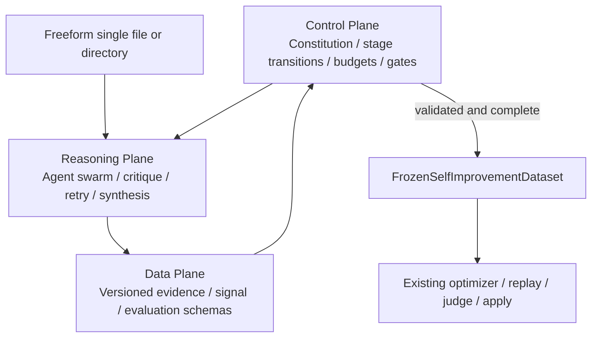

# Plan 011：构建 Constitution 驱动、格式无关的 Self-Improvement Agent Swarm

> **执行者说明**：逐步执行本计划。每一步完成后都运行该步骤的验证命令，
> 并确认结果符合预期；遇到“停止条件”时停止并报告，不要自行扩展范围。
> 完成后更新 `plans/README.md` 中本计划的状态，除非评审者明确表示由其维护索引。
>
> **漂移检查（第一步执行）**：
> `git diff --stat bb2c7e56..HEAD -- aworld/self_evolve/constitution.py aworld/self_evolve/evidence.py aworld/self_evolve/improvement_signals.py aworld/self_evolve/evaluation_plan.py aworld/self_evolve/ingestion aworld/self_evolve/datasets.py aworld/self_evolve/evolution_context.py aworld/self_evolve/optimizers/base.py aworld/self_evolve/optimizers/llm_mutator.py aworld/self_evolve/store.py aworld/self_evolve/runner.py aworld/self_evolve/campaign.py aworld/self_evolve/__init__.py aworld-cli/src/aworld_cli/commands/optimize_cmd.py aworld-cli/src/aworld_cli/top_level_commands/optimize_cmd.py pytest.ini tests/self_evolve tests/core/test_optimize_top_level_command.py tests/test_slash_commands.py docs/Agents/Self\ Evolve.md docs/AWorld\ CLI/Commands/Optimize.md aworld-skills/self_evolve/SKILL.md plans/README.md`
>
> 本计划编写时，`runner.py`、`store.py`、`campaign.py`、公共导出、文档和部分
> self-evolve 测试存在用户未提交修改。不要 stash、覆盖、回退或提交这些修改。
> 如果实时修改与本计划涉及的 symbol 重叠，先逐个比较；无法无损合并时立即停止。

## 状态

- **优先级**：P1
- **工作量**：L（建议按步骤拆成 6–10 个逻辑 commit）
- **风险**：HIGH
- **依赖**：
  `plans/010-add-agentic-self-evolve-dataset-ingestion.md`
- **类别**：direction / architecture / security / tests / docs
- **计划基线**：commit `bb2c7e56`，2026-07-24
- **实现状态**：DONE（2026-07-27）；完整 non-live self-evolve、CLI、
  static validation 与双重独立 trust review 均通过，工作树等待用户决定是否提交。
- **复核修订**：2026-07-24；纳入 semantic authority、coverage、target inference、
  actionable signal 和 model qualification 审查意见
- **阻塞修复**：2026-07-27；已关闭 verified-plan authority、source-bound
  trajectory attestation、framework-derived case/signal/plan identity、
  rollout/gate mode binding 和 validation split persistence 阻塞。
- **生产可信闭环**：2026-07-27；deterministic canonical decoder、显式
  operator approval artifact、workspace qualification registry/offline corpus
  已实现并接入。canonical source 可零模型进入 verified；free-form source
  只有 approval 与 exact-deployment qualification 同时通过才可进入 verified。
  安全复审进一步补充了 canonical 矛盾检测、qualification 有效期与 exact
  frozen-snapshot deployment runner、冻结 snapshot 的零模型 trust promotion、
  builtin exact-type trust 和 verified identity 加固。qualification checked-at
  被冻结用于历史重放，而每个新的 `auto_verified` admission 仍按当前时间检查；
  Campaign 在 checkpoint 前完成 promotion 并移除可变 trust artifact 路径。
  evaluator-only rerun 同样重新执行 frozen rollout mode 和当前 qualification
  expiry 准入。最终双重复审未发现可复现 P0/P1/P2。

### 2026-07-27 生产可信闭环记录

- canonical 输入使用严格的
  `aworld.self_evolve.canonical_semantic_source.v1` source-draft envelope，
  支持 JSON/YAML 单文件和多分片目录。framework 从实际 SourceBundle 派生
  spans、IDs、`deterministic_decoder` verifications、trace attestations、
  authority context、cases/signals/plans；source 自报 authority/control/final-ID、
  mixed/unknown/dangling 输入 fail closed。同一 semantic slot 的不同 payload
  必须显式声明 conflict；未声明矛盾直接拒绝，已声明 unresolved conflict 不能
  进入 verified。snapshot 冻结实际 manifest asset identity，reload 会重新
  deterministic decode 并比较冻结产物。
- `HumanEvidenceApprovalV1` 生产 artifact 绑定 graph logical/provenance、
  SourceBundle、constitution、semantic profile、operator-explicit manifest 和
  claim scope。首轮 `--ingestion-only` 写入 review template；只有第二轮显式
  `--semantic-evidence-approval` 才形成 operator action。declared profile 与
  effective authority profile 已分离，消除了两阶段 graph fingerprint 循环。
- qualification 使用 versioned human-labeled corpus、固定 thresholds、九类指标
  （包含 required-claim recall、accepted-claim/conflict precision）与
  false-authority hard gate。`--semantic-qualification-report` 只接受 exact
  model/provider/protocol/constitution/corpus/threshold binding，且 report
  fingerprint 必须存在于固定 workspace registry
  `.aworld/self_evolve/semantic_qualifications/index.json`。report 绑定签发/到期
  窗口；corpus 包含可执行的单/多文件 source payload。exact-deployment runner
  只向被测 deployment 暴露随机 opaque token 和原始 source documents，
  framework 从返回的 `FrozenSemanticIngestionSnapshotV2` 验证 source/deployment
  binding，并以人工标注的 semantic signatures 比较真实 source locator/hash、
  entity canonical identity、claim payload/方向/关系、conflict claim members、
  case/execution/signal 关系；所有 unmatched claims/conflicts 都计入 false
  positive，禁止按 kind/数量把 gold 值回填为预测。gold case ID、scenario tags
  与 labels 不进入被测 deployment。
- qualification report 显式记录 `qualification_method`、framework runner
  protocol fingerprint 和 per-case source/snapshot attestation bundle
  fingerprint。recorded-outcome runner 只用于离线协议/评分测试，即使指标满分也
  不能被 production registry 接受；只有 `exact_snapshot_v1` report 可用于
  `auto_verified` admission。
- 四象限契约已建立：无 artifact、qualification-only、approval-only 均不能进入
  verified；两者齐全且 evidence 无 unresolved blocker 时 train/validation plan
  才为 `eligible_for_verified_pipeline`。authority/registry/report fingerprints
  进入 ingestion identity；Campaign 首轮后只保留 frozen ingestion ID。
- free-form 的第二阶段通过 `--frozen-ingestion-id` 对已审阅 snapshot 做
  deterministic promotion，重新编译 authority、qualification、plans、quality
  和新 ingestion identity，不重新读取 source 或调用 semantic model。runtime
  不允许把 proposal/shadow snapshot 直接以 `auto_verified` 重算 gate；mode 必须
  与 frozen rollout identity 一致。
- qualification 的 `qualification_evaluated_at_utc` 进入 frozen snapshot 和
  ingestion identity。历史 reload 使用该时间重算 attestation，因此 report
  后续到期不会破坏审计；新的 `auto_verified` run/Campaign admission 会用当前
  时间重新验证 report，过期后拒绝继续运行。
- Campaign 收到 proposal frozen ID 与 approval/report 时，在创建 checkpoint
  前先 deterministic promote，只持久化 promoted ingestion ID，并清空 approval/
  report 路径；后续 cycle/resume 不重新读取可变外部 trust artifact。
- external semantic snapshot 不能自带 deterministic/human authority 或
  qualification allowlist。trusted registered semantic authority 在 framework
  能重新派生 claim-level attestation 前明确 fail closed，不复用 structural
  verifier 形成旁路。

### 2026-07-27 安全复审阻塞关闭记录

- `auto_verified` 现在要求所有 train/validation plan 均为
  `eligible_for_verified_pipeline`；quality report 显式记录 eligible/non-eligible
  plan counts。verified 编译模式不会把 non-eligible plan 的 signals 投影给
  optimizer。
- trajectory 不再只依赖自身 JSON hash。framework 生成
  `TraceExtractionAttestationV1`，绑定 trajectory claim、实际 source spans、
  source-unit fingerprints、extractor/model/provider/protocol identity，以及至少
  两个 independence group 不同的候选 envelope。snapshot reload 会重新验证。
- agent 提供的 case/signal/plan IDs 仅是候选内 alias；最终 ID 由 framework
  根据 logical graph、evidence closure 和 behavior delta 派生。snapshot reload
  会拒绝 non-canonical identity。
- frozen snapshot 强制校验
  `SHADOW→INGESTION_ONLY`、`PROPOSAL/TARGET_EVIDENCE→PROPOSAL`、
  `VERIFIED→AUTO_VERIFIED`。
- 未显式传入 dataset recipe 时，`trainable_cases.jsonl` 现在同时包含 train 和
  validation cases。
- 2026-07-27 回归：semantic/optimizer contract matrix `176 passed`；Plan 010
  structural/store/Campaign/lifecycle compatibility matrix `144 passed`；
  `compileall` 与 `git diff --check` 通过。

## 为什么需要

Plan 010 已经让 `--from-source` 接受一个文件或目录，并能用受限的声明式
`DatasetMappingSpec` 处理结构明确的数据。但该协议仍然以“记录边界、字段映射、
跨文件 join”为中心，无法可靠表达一个自由 Markdown 中同时存在的 Harness A/B
trajectory、人工排名和多个 Judge 结论。

本计划在现有结构化 fast path 之上增加 self-evolve 自有的语义证据层。外部输入
可以是一份综合文档、若干互相关联的文件，或规范结构化数据；内部统一冻结为
`SelfImprovementEvidenceGraphV1`、`SelfImprovementCaseV1` 和
`SelfImprovementEvaluationPlanV1`。目标契约是：

> **弱输入契约，强语义输出契约；文件边界是线索，不是语义。**

这允许 ingestion agent 用语义理解适配未知布局，同时继续由框架决定引用是否
有效、实体是否能关联、冲突是否解决、哪些证据可训练、哪些证据有评价权，以及
能否进入 `auto_verified`。

本计划不是要把未知输入重新约束成固定 ETL，也不是让一个 extraction agent
一次性决定全部结果。最终架构是：

> **Constitution-driven bounded Agent Swarm**：框架固定主题、阶段协议、
> 安全不变量和推进条件；agents 动态决定每个阶段如何理解、质疑、关联、验证、
> 综合和规划。

### 三个控制平面



- **Control Plane** 规定阶段目标、最大预算、允许的状态转换、freeze、split、
  trust 和 apply policy；不实现领域解析启发式。
- **Reasoning Plane** 允许 Source Understanding、Evidence Extraction、
  Coverage Audit、Entailment Verification、Entity Resolution、Conflict
  Analysis、Signal Synthesis 和 Evaluation Planning agents 根据当前 source
  动态选择策略、互相质疑和有界重试。
- **Data Plane** 用强 schema 连接各阶段。agent 输出的是 declarative IR、
  verification verdict 和 plan proposal，不是可执行 parser/evaluator 代码。

固定的是：

```text
阶段主题 + 输入/输出 schema + provenance + 推进条件 + 权限边界
```

动态的是：

```text
如何切分语义、如何发现关系、如何覆盖遗漏、如何验证蕴含、
如何解释冲突、如何综合 improvement signal、如何提出 evaluation plan
```

### 固定主题生命周期

Control Plane 固定以下语义阶段，但允许 Reasoning Plane 在相邻阶段之间有界
回退：

```text
DISCOVER
  → UNDERSTAND
  → EXTRACT
  → VERIFY_COVERAGE_AND_ENTAILMENT
  → RESOLVE_AND_DETECT_CONFLICT
  → SYNTHESIZE_IMPROVEMENT_SIGNALS
  → PLAN_EVALUATION
  → FREEZE
  → EVOLVE
  → REPLAY / JUDGE / GATE
```

每个阶段必须输出 `AgenticStageReportV1`；只有确定性 transition validator 可以
推进状态。coverage、entailment 或 resolution 不足时，validator 可以授权
Reasoning Plane 回到前一阶段，直到预算耗尽；agent 自己不能跳过阶段、freeze
或 apply。

### 非颠覆式迁移原则

本计划是 self-evolve 的重大架构扩展，但不是对现有执行内核的一次性重写。
新协议首先作为前置语义编译层落地：

```text
现有结构化 source
  → Plan 010 structural mapping
  → legacy-compatible frozen dataset
  → existing target / optimizer / replay / judge / gates

自由组合 source
  → Constitution-driven Agent Swarm
  → EvidenceGraph
  → ImprovementSignalSet
  → EvaluationPlan
  → Compatibility Compiler
  → existing EvalCase / TracePack / OptimizerRequest
  → existing target / optimizer / replay / judge / gates
```

Compatibility Compiler 是唯一进入既有 self-evolve 执行层的边界。v1 禁止：

- 用 Evidence Graph 替换 `EvalCase`；
- 用 Evaluation Plan 替换当前 evaluator；
- 让 semantic agent 直接构造 `TargetSelectionDecision`、`GateResult` 或 apply
  authorization；
- 强制 Plan 010 的所有 structural source 调用 agent swarm；
- 一次性删除 `selected_mapping`、v1 snapshot reader 或 legacy recipe/ref；
- 让 historical Judge 进入当前 candidate judge gate。

### 渐进启用阶段

每一阶段通过 framework-owned typed policy/feature state 启用；不得仅靠 prompt
文字或环境中一个未冻结的布尔值切换。

| 阶段 | 允许的行为 | 禁止的行为 | 进入下一阶段的条件 |
|---|---|---|---|
| 1. Shadow | `--ingestion-only` 生成 constitution/graph/verifications/signals/plans 和差异报告 | 不影响 normalized dataset、target、optimizer 或 gates | schema/fingerprint/tamper/coverage/qualification 离线测试通过 |
| 2. Proposal | Compatibility Compiler 把 trainable signal 投影进现有 `EvalCase/OptimizerRequest`，只生成 proposal | 不进入 `auto_verified`，不产生 authoritative expected output | optimizer lineage 证明消费 signals；无 held-out 泄漏；proposal 回归通过 |
| 3. Typed Signal + Target Evidence | 启用 `TargetEvidenceBundle`，复用现有 target inference；fresh replay/judge 保持不变 | agents 不直接选 target；historical rankings 不充当 gate | 多 trace target 冲突/一致性、rerun/Campaign、v1/v2 compatibility 全部通过 |
| 4. Verified | 仅 qualification、trusted verification/human approval 和全部 hard gates 通过的 semantic source 可进入 verified pipeline | 不降低任何现有 replay/judge/apply gate | opt-in contract matrix、真实 model qualification 和安全复核批准 |

默认 rollout：

- structural source 保持 legacy behavior；
- semantic source 默认处于 Shadow 或 Proposal；
- 阶段 3/4 必须由显式、冻结的 framework policy 启用；
- 任一阶段失败或 policy 缺失时回退到最近的安全阶段，不能绕过 Compatibility
  Compiler；
- snapshot 记录启用阶段及 policy fingerprint，rerun/Campaign 不重新判定。

每个启用阶段必须可单独关闭而不迁移或重写历史 artifact。删除 legacy path、把
semantic IR 提升为执行层主模型，属于本计划完成后的独立架构决策。

## 最终决策

### 用户接口不新增必填参数

保留 Plan 010 的接口：

```bash
aworld-cli optimize \
  --from-source ~/Documents/domain-data \
  --apply proposal
```

- `--from-source` 继续同时接受一个普通文件或一个目录。
- 省略 `--source-ingestor` 时仍然等价于 `--source-ingestor auto`。
- 不增加 `--from-auto`，也不要求用户说明输入是“单文件模式”还是“多文件模式”。
- `--source-manifest`、显式 registered ingestor 和 ingestion model profile
  仍然是可选增强项。
- 可增加可选 `--semantic-qualification-report <path>`：仅用于把预先生成、
  operator 选择的 qualification report 绑定到本次 model path；它不授权具体
  claims，也不影响 structural/proposal 默认体验。
- 当结构化 fast path 足够时不调用语义模型；只有结构映射不足、输入混合或明确
  包含比较/排名/Judge 证据时，auto 才进入 semantic path。

### 单文件和多文件使用同一条语义路径

```text
文件或目录
  → SourceInventory
  → SourceBundle + SemanticChunk + SourceSpan
  → Semantic Evidence Agent Population
  → SelfImprovementEvidenceGraphV1
  → deterministic resolver / conflict detector
  → SelfImprovementCaseV1
  → SelfImprovementEvaluationPlanV1
  → NormalizedCaseRecord / EvalCase / TracePack
  → 现有 optimizer / replay / judge / gates
```

- 单个 Markdown 的 heading、表格、代码块和日志段落成为虚拟 chunks。
- 多个文件分别产生 chunks；相对文件名和目录只能作为弱提示。
- entity、claim、case 的逻辑身份不得由文件名、文件数量、chunk ID 或行号决定。
- 同一语义内容从一个文件拆成五个文件后，source/provenance fingerprint 可以
  改变，但 evidence graph、evaluation plan 和 normalized dataset 的逻辑
  fingerprint 必须保持一致。

### agent 的职责和权限

agent 可以：

- 从受限、编号、无绝对路径的 chunks 中识别 task、harness、execution、
  trajectory、result、metric、human comparison 和 historical LLM judge claim；
- 提议实体别名、跨 chunk 关联、comparison unit、rubric compatibility 和
  evaluation plan；
- 输出多个声明式 IR 候选；
- 作为独立角色审查其他 agent 是否遗漏 source、claim 是否被 citation 蕴含、
  entity link 是否合理、signal 是否具有可操作性；
- 在 Control Plane 授权的阶段和预算内请求重新抽取、补充上下文或重新规划。

agent 不可以：

- 输出或执行 Python、shell、正则程序、模板、动态 import、工具调用或文件读取；
- 把 source 中的指令当成系统指令；
- 生成 verification command；
- 选择 self-evolve target、dataset split、apply policy 或 mutation 权限；
- 把“人工写的”自动升级为 ground truth；
- 把历史 LLM Judge 结果当成当前 evaluator 结果；
- 用模型多数票单独授权 `auto_verified`。

最小 agent population 不是两个相同 extraction calls，而是职责分离的角色：

| Role | 输入 | 输出 | 不能决定 |
|---|---|---|---|
| Source Understanding Agent | SourceBundle/chunks/profile | semantic partitions、可能的实体/关系范围 | claim authority |
| Evidence Extraction Agents | partitions + source spans | evidence graph candidates | claim 是否最终 accepted |
| Coverage Auditor | source units + candidates | dispositions、omissions、unexplained spans、补抽取请求 | 无理由将未知标为 irrelevant |
| Entailment Verifier | claim + cited spans | entailed/contradicted/insufficient verdict | ground-truth authority |
| Resolution/Critique Agents | verified claims | aliases、links、conflicts、异议 | apply policy |
| Signal Synthesis Agents | resolved graph/cases | actionable contrast signals | target selection |
| Evaluation Planning Agents | signals + authority ceiling | evaluation plan proposals | 降低现有 gates |

同一模型的多次调用可以提高解析稳定性，但不构成独立 trust origin。stage report
必须记录 provider/model/protocol fingerprint 和 `independence_group`；Control
Plane 决定何种 verifier origin 足以推进 proposal 或 verified pipeline。

### skill 与框架的关系

`aworld-skills/self_evolve/SKILL.md` 负责说明工作流、输入建议、报告解释和降级
方式；framework 负责 schema、validation、freeze、evaluation authority 和
apply gate。运行时不得把可变的 SKILL.md prose 当成核心协议。

领域 skill 可以提供机器可读的 `SemanticIngestionProfileV1` 或指导用户通过
`--source-manifest` 声明 ontology/authority，但 profile 必须被框架解析、
验证、冻结和指纹化。skill 文本本身不能越过框架策略。

## 当前状态

以下是基线 `bb2c7e56` 上的关键事实。执行者必须先与实时代码核对。

### 现有 mapping 是结构协议，不是语义协议

`aworld/self_evolve/ingestion/types.py:709-725`：

```python
class RecordFramingSpec:
    ...
    allowed = {
        "json_object", "json_array", "jsonl_rows", "csv_rows",
        "yaml_object", "yaml_array", "one_file_per_case",
        "literal_delimited_blocks",
    }
```

`aworld/self_evolve/ingestion/types.py:755-770` 只允许 identity、stringify、
parse_json、coalesce、bounded_join、status_map 和 manifest constant 等字段
变换。它适合确定性 materialization，但不能表达“Judge 1 认为 A 更好”这类
带来源、主体、客体和冲突的 claim。

### mapping agent 刻意看不到原始语义值

`aworld/self_evolve/ingestion/agent.py:408-447`：

```python
public_inventory = inventory.public_projection()
# Structural profiles contain names/types/counts/shapes ...
# Source values ... are intentionally absent.
...
"Do not infer a target, split, judge result, candidate, or outcome-based exclusion."
```

这是正确的 structural boundary，不能通过“给现有 mapping prompt 塞入全文”
来实现本计划。必须新增单独的 semantic agent protocol。

### 普通文本目前是一个 record

`aworld/self_evolve/ingestion/extractors.py:236-289` 的
`PlainTextExtractor.extract()` 读取全文，生成行数和分隔符 profile，最终只
返回：

```python
ExtractedRecord(locator="$", value=text)
```

因此需要一个确定性的 chunk/span 层；不能要求用户先把 Markdown 拆成固定文件。

### Frozen snapshot 只认识一个 selected mapping

`aworld/self_evolve/ingestion/types.py:1551-1570`：

```python
class FrozenIngestionSnapshot:
    ingestion_id: str
    inventory: SourceInventory
    selected_mapping: DatasetMappingSpec
    normalized_cases: tuple[NormalizedCaseRecord, ...]
    ...
```

`normalized_dataset_fingerprint` 在 `types.py:1681-1684` 当前对完整
`case.to_dict()` 哈希，其中包含物理 asset/locator provenance。语义等价的单文件
和多文件因此不会天然得到相同 fingerprint。新版本必须把“逻辑内容身份”和
“物理来源身份”分开，同时兼容读取 Plan 010 的 v1 artifact。

### 现有 quality/gate 只衡量结构映射和 trajectory 质量

`aworld/self_evolve/ingestion/types.py:1407-1450` 已有 record coverage、
join、determinism、trace replayability 和 recovery trace metrics。

`aworld/self_evolve/ingestion/verifier.py:457-511` 的 `auto_verified` gate
检查 coverage、required assets/joins、held-out exposure、ingestor trust、
snapshot/split freeze。新 semantic gate 必须作为附加条件，不能替换或放宽这些
条件。

### Dataset builder 只投影一条 trajectory

`aworld/self_evolve/datasets.py:659-728` 把每个 `NormalizedCaseRecord` 的
`trajectory` 转成一个 `TracePack`，然后复制通用 `metadata`。它没有 first-class
human ranking、historical judge 或 evidence plan。

`aworld/self_evolve/evaluation.py:1283-1353` 会把 metadata 中的
`variant_trajectories`、`baseline_trajectory` 和 `candidate_trajectory` 解释成
当前 baseline/candidate replay 变体。历史 Harness A/B trajectory 不得复用这些
键，否则会把 source evidence 错当成当前 candidate evaluation。

### optimizer context 会严重截断通用 metadata

`aworld/self_evolve/evolution_context.py:935-951`：

```python
{
    "case_id": ...,
    "input": sanitize_metric_value(case.input, max_chars=8_000),
    "expected_output": sanitize_metric_value(..., max_chars=4_000),
    "metadata": sanitize_metric_value(case.metadata, max_chars=240),
}
```

语义证据需要一个明确、受限、held-out aware 的 trainable projection，不能藏进
240 字符的任意 metadata。

### freeze/rerun 基础已经存在

- `aworld/self_evolve/store.py:86-214` 原子写入 ingestion snapshot、mapping
  candidates、quality report、rejected records 和 split 后 cases。
- `store.py:216-290` 读取 snapshot 并校验 ingestion ref。
- `runner.py:7108-7201` 在 target inference 前准备、冻结并 gate ingestion。
- `runner.py:8391-8491` evaluator rerun 通过 ingestion ID 读取 frozen snapshot，
  不重新询问模型。
- `campaign.py` 已冻结 `from_source` 和 `frozen_ingestion_id`。

本计划扩展这些契约，不建立第二套旁路 store、rerun 或 Campaign。

### 当前 manifest 没有权限来源

`aworld/self_evolve/ingestion/types.py:598-659` 的
`DatasetIngestionRequest` 只有 `manifest_path`，没有 operator-explicit、
auto-discovered 或 registered-ingestor origin。

`aworld/self_evolve/ingestion/agent.py:279-286` 在目录模式下会自动发现
`aworld-source.yaml`/`aworld-source.yml`。因此本计划若只给 `SourceManifest`
增加 authority fields，source 目录自身就可能提升 human claim authority。
必须先把 manifest origin 变成 typed、frozen、gate-visible 的 trust input。

### 当前 target inference 只消费 EvalCase.trace_pack

`aworld/self_evolve/runner.py:7250-7252` 从 dataset cases 收集单个
`case.trace_pack`；`runner.py:7271-7297` 在省略 `--target` 且没有 trace pack
时直接返回 no-evidence。一个含 Harness A/B 的 semantic case 不能只靠可空的
单一 replay seed 无缝进入 target inference。

本计划必须为 target inference 单独保留所有 eligible execution trace evidence。
agent 不选择 target；现有 `TrajectoryCreditAssigner` 和 target trust policy
继续做决定。

## 语义契约与词汇

必须严格区分三层：

1. **Source fact**：原始文档中实际出现的内容及其 span，例如“人工排名：B > A”。
2. **Extracted claim**：agent 对 source fact 的结构化解释，例如
   `human_comparison(B, A)`；它必须引用一个或多个有效 source spans。
3. **Framework decision**：该 claim 是 ground truth、soft label、advisory，
   是否解决冲突，以及是否允许 verified pipeline；只能由冻结 profile 和
   deterministic policy compiler 决定。

“来源中写了 Judge 2”只证明存在一个历史 Judge 2 claim，不证明它是当前运行的
judge，也不证明其 rubric 与当前 judge 兼容。

## 目标 schema

公共类型使用 frozen dataclass、稳定 lower-snake-case enum/reason code、
显式 schema version、`to_dict()/from_dict()` 和 canonical JSON fingerprint。
原始 source text 只有 private projection。

### `aworld/self_evolve/constitution.py`

新增 framework-owned `SelfEvolveConstitutionV1` 和 `AgenticStageReportV1`。

`SelfEvolveConstitutionV1` 至少固定：

- 上述十个 lifecycle stages 和合法 transition；
- 每阶段 required input/output schema versions；
- agent role 与最大 attempts/model calls/token/source-byte budget；
- source-derived instruction 永远是 data；
- accepted claim 必须有有效 citation；
- authority、target selection、split、freeze 和 apply 只能由 Control Plane 决定；
- historical evidence 与 fresh evaluation 分离；
- held-out evidence 隔离；
- unresolved/contradicted/omitted evidence 的 fail/downgrade policy；
- constitution fingerprint。

`AgenticStageReportV1` 至少包含：

- `stage`
- `input_fingerprints`
- `output_fingerprints`
- `agent_role`
- `provider/model/protocol_fingerprint`
- `independence_group`
- `attempt_count`
- `status`: `complete | needs_revision | exhausted | rejected`
- `reason_codes`
- `next_stage_proposal`

agent 可以提议 next stage，但 transition validator 只接受 constitution 允许且输入/
输出完整的 transition。新领域可以扩展 profile 和 stage 内 reasoning，不能在
运行时改写 constitution 的安全不变量。

### `aworld/self_evolve/evidence.py`

新增以下类型；名字可以按仓库风格微调，但语义和字段不可省略。

#### `EvidenceSourceSpanV1`

| 字段 | 含义 |
|---|---|
| `asset_id` | Plan 010 的内容寻址 asset ID |
| `chunk_id` | chunk 内容和 ordinal 的稳定 ID，仅用于 provenance |
| `byte_start/byte_end` | UTF-8 原始 asset 中的半开字节区间 |
| `line_start/line_end` | 1-based 可审计行区间 |
| `content_fingerprint` | 区间原始字节 SHA-256 |

每个区间必须落在对应 asset/chunk 内；禁止绝对路径。agent 可以引用 chunk 内
range，但最终 byte/line range 由框架换算和重新哈希。

#### `EvidenceEntityV1`

字段至少包含：

- `entity_id`
- `kind`: `task | harness | execution | result | artifact | rubric | reviewer`
- `canonical_name`
- `aliases`
- `source_spans`
- `attributes`（JSON-compatible、allowlisted keys）

entity ID 由 resolver 基于 normalized semantic key 生成，不能直接采用 agent
随意 ID，也不能包含 asset/chunk/filename。

#### `EvidenceClaimV1`

字段至少包含：

- `claim_id`
- `kind`:
  `task_input | execution_trajectory | execution_result | metric_observation |
  human_comparison | llm_judge_assessment | explicit_relation`
- `subject_entity_ids`
- `object_entity_ids`
- `payload`
- `source_spans`
- `producer_kind`:
  `deterministic_decoder | semantic_agent | registered_ingestor`
- `agent_confidence`（非 authority）
- `resolution_status`:
  `resolved | ambiguous | rejected`
- `verification_ids`

对 payload 做按 claim kind 的强校验：

- comparison 必须解析出至少两个 execution/harness，方向或并列关系；
- judge assessment 必须保留 reviewer、rubric、score/verdict 原文语义和 scope；
- trajectory 必须保留 harness/execution 关系，不能自动标为 baseline/candidate；
- metric 必须保留 name/value/unit/scope，不能把不同单位直接比较。

#### `ClaimVerificationV1`

每个 accepted claim 至少关联一个 verification，字段包括：

- `verification_id`
- `claim_id`
- `verdict`: `entailed | contradicted | insufficient | ambiguous`
- `verification_origin`:
  `deterministic_decoder | trusted_registered_ingestor | human_approved |
  semantic_agent`
- `verifier_fingerprint`
- `independence_group`
- `source_span_ids`
- `rationale_codes`

citation validity 只证明 span 存在；`entailed` 才表示 verifier 判断 claim 受到
span 支持。对于 `auto_verified`：

- source-derived claim 若会生成 expected output、解决冲突或提升 authority，
  必须由 deterministic decoder、trusted registered ingestor 或 human approval
  验证；
- semantic-agent verification 可以让 claim 进入 advisory/trainable projection，
  但同一 independence group 的一致意见不能单独把 claim 提升为 authoritative；
- contradicted/insufficient claims 不得进入 accepted graph。

#### `SemanticSourceDispositionV1`

Coverage Auditor 必须覆盖每个 semantic chunk 或 deterministic structured
record/field：

- `source_unit_id`
- `disposition`: `evidence | irrelevant | unresolved | deferred`
- `claim_ids`
- `reason_codes`
- `auditor_verification_id`

agent 不能无理由把内容标成 irrelevant。`unresolved/deferred` 可以进入 proposal
或 human review，但不能通过 auto-verified；未出现 disposition 的 source unit
计入 unexplained coverage failure。

#### `EvidenceConflictV1`

字段至少包含：

- `conflict_id`
- `kind`:
  `preference_disagreement | score_incompatible | rubric_incompatible |
  entity_ambiguity | trajectory_identity_collision`
- `claim_ids`
- `comparison_unit`
- `status`: `unresolved | policy_resolved | informational`
- `resolution_policy_ref`

冲突是 graph 中的一等事实，不能通过覆盖旧 claim 或只保留“多数结论”来消失。

#### `SelfImprovementEvidenceGraphV1`

字段至少包含：

- `entities`
- `claims`
- `claim_verifications`
- `source_dispositions`
- `conflicts`
- `unresolved_references`
- `logical_fingerprint`
- `provenance_fingerprint`
- `profile_fingerprint`
- `extractor_population_fingerprint`

fingerprint 规则：

- logical projection 包含 canonical entities、claims、relations 和 conflict
  status；排除 source spans、文件名、chunk IDs、agent candidate IDs、
  agent confidence 和数组输入顺序；
- provenance projection 包含 source spans、source snapshot、extractor/profile/
  model protocol fingerprints；
- entity/claim arrays 先按 canonical ID 排序；
- 两次 deterministic resolve/compile 必须 byte-for-byte 一致。

#### `SelfImprovementCaseV1`

一个 case 是一个不可拆分的 improvement/evaluation unit，至少包含：

- `case_id`
- `task_entity_id`
- `input_claim_ids`
- `execution_entity_ids`
- `trajectory_claim_ids`
- `result_claim_ids`
- `comparison_claim_ids`
- `conflict_ids`
- `resolution_status`
- `trainable_signal_projection`

同一比较中的 Harness A/B 不得被拆到不同 dataset split。case ID 由 logical graph
内容产生；不得由“第几个文件”产生。

### `aworld/self_evolve/improvement_signals.py`

新增 `SelfImprovementSignalV1`、`SelfImprovementSignalSetV1` 和
`TargetEvidenceBundleV1`。这是自由文档与 optimizer/target inference 之间缺失的
适配层，不能用一组 claim IDs 代替。

`SelfImprovementSignalV1` 至少包含：

- `signal_id`、`case_id`
- `kind`:
  `failure_pattern | recovery_pattern | preference_delta | metric_delta |
  preserve_behavior | avoid_behavior | capability_gap`
- `compared_execution_ids`
- `preferred_execution_ids`
- `supporting_claim_ids`
- `opposing_claim_ids`
- `behavior_delta`：两侧经过 source-derived、bounded、typed 的代表性步骤/结果差异
- `metric_delta`
- `desired_behavior`
- `avoid_behavior`
- `capability_requirement`
- `conflict_ids`
- `verification_status`
- `actionability`: `actionable | advisory | blocked`
- `reason_codes`

Signal Synthesis Agents 可以归纳差异和 capability requirement；Signal Critic 必须
检查每个行为结论能回到 verified claims。不得只给 optimizer “B > A”而不提供
A/B 有何不同。不得把 agent 自行建议伪装成 source fact：`desired_behavior` 与
source-derived `behavior_delta` 使用不同 provenance。

`SelfImprovementSignalSetV1`：

- 对 signals canonical sort/fingerprint；
- 保存 synthesis/critic stage report refs；
- 计算 `signal_actionability_rate`；
- 只对 train/validation cases生成 optimizer projection；
- held-out signals 仅供 release evaluation/gates。

`TargetEvidenceBundleV1`：

- 收集 case 中所有通过 schema/trace validation 的 execution trajectory refs；
- 保留 task/case/execution identity，不使用 preference 为 target 投票加权；
- 编译成现有 `TracePack` 序列供 `TrajectoryCreditAssigner` 使用；
- 与 `replay_seed_execution_id` 分离：前者用于 target inference，后者只是当前
  evaluator/replay 的单个可选 seed；
- target decisions 冲突时沿用现有 unresolved/fail-closed 语义。

### `aworld/self_evolve/evaluation_plan.py`

新增：

#### `SemanticIngestionProfileV1`

用于声明 ontology alias 和 authority ceiling。字段至少包括：

- `profile_id`、`schema_version`
- `entity_aliases`
- `comparison_unit`: `task | execution | harness`
- `human_claim_authority`:
  `advisory | soft_label | ground_truth`
- `historical_judge_authority`:
  `ignored | advisory | scored_signal`
- `judge_rubric_policy`:
  `exact | compatible_only | separate`
- `aggregation_policy`:
  `none | majority | weighted | median`
- `conflict_policy`:
  `require_review | proposal_only | reject`
- `approved_evidence_graph_fingerprint`（可空；仅 operator-explicit manifest 有效）

默认 profile 必须是保守的：

- human claim = `soft_label`
- historical judge = `advisory`
- rubric = `separate`
- aggregation = `none`
- conflict = `require_review`

只有显式 `--source-manifest` 或 framework-builtin/workspace-allowlisted registered
ingestor 可以提高 authority ceiling。agent proposal 和 source 文本不能提高。

人工批准采用两步、内容寻址流程，不新增必填 flag：

1. operator 先运行 `--ingestion-only`，检查 private graph、verifications、
   conflicts、signals 和 evaluation plans；
2. operator 在显式 `--source-manifest` 的 `semantics` 中填写输出的
   `approved_evidence_graph_fingerprint`；
3. framework 重新解析同一 source；只有 logical graph fingerprint 精确相同、
   manifest origin 为 operator-explicit 且其它 hard gates 通过，才生成
   `HumanEvidenceApprovalV1`；
4. source/graph 任一变化使批准失效；approval artifact 和 approving manifest
   fingerprint 一起冻结。

`HumanEvidenceApprovalV1` 至少包含 graph fingerprint、manifest fingerprint、
approval origin、approved claim scope（默认 whole graph）和 schema version。
不得把 source 目录内自动发现的 approval fingerprint 当成人工批准。

#### `SelfImprovementEvaluationPlanV1`

每个 case 一个 plan，至少包含：

- `plan_id`、`case_id`
- `comparison_unit`
- `training_signal_ids`
- `supporting_evidence_claim_ids`
- `replay_seed_execution_id`（可空）
- `expected_output_claim_id`（可空）
- `human_claim_authority`
- `historical_judge_authority`
- `rubric_groups`
- `aggregation_policy`
- `conflict_policy`
- `current_evaluator_required: true`
- `disposition`:
  `eligible_for_verified_pipeline | proposal_only | human_review_required |
  rejected`
- `reason_codes`
- `profile_fingerprint`
- `plan_fingerprint`

evaluation planner 可以提议 grouping、rubric compatibility、replay seed 和 evidence
selection；deterministic compiler 必须把它与 profile ceiling 取交集。planner
不得把 `current_evaluator_required` 改为 false。

### source manifest 的可选语义块

扩展 `aworld/self_evolve/ingestion/mapping.py` 的 `SourceManifest`，允许：

```yaml
schema_version: aworld.self_evolve.source_manifest.v1

semantics:
  schema_version: aworld.self_evolve.semantic_profile.v1
  profile_id: domain-harness-comparison-v1
  entity_aliases:
    harness:
      harness-a: ["Harness A", "A"]
      harness-b: ["Harness B", "B"]
  comparison_unit: task
  human_claim_authority: soft_label
  historical_judge_authority: advisory
  judge_rubric_policy: separate
  aggregation_policy: none
  conflict_policy: require_review
  # 第二次运行时可由 operator 在审阅 ingestion-only artifact 后填写：
  # approved_evidence_graph_fingerprint: "sha256:..."
```

该块不允许 command、代码、动态模板或任意 prompt。其 canonical fingerprint
进入 frozen snapshot。没有该块时使用 framework default profile。

同时在 `DatasetIngestionRequest`、frozen snapshot、ingestion ref 和 quality
gate 中新增：

```text
manifest_origin =
  operator_explicit
  | conventional_untrusted
  | trusted_registered_ingestor
  | absent
```

- CLI 明确传入 `--source-manifest` 才是 `operator_explicit`。
- source 目录自动发现的 `aworld-source.yaml` 是
  `conventional_untrusted`；它可以约束 include/exclude、提供 alias 或降低
  authority，但不能设置 `ground_truth`、解决冲突或提高 verified eligibility。
- allowlisted registered ingestor 只能在 registry 已确认 trust level 后得到
  `trusted_registered_ingestor`。
- manifest origin 进入 provenance/normalization fingerprint；加载 frozen
  snapshot 时重新验证，不得只相信序列化字符串。

### `SemanticModelQualificationReportV1`

qualification 是 deployment/model-profile 能力证明，不是每个 source 的语义
authority。schema 至少包含：

- `model_profile_fingerprint`
- `provider_fingerprint`
- `semantic_protocol_fingerprint`
- `constitution_fingerprint`
- `corpus_fingerprint`
- `metric_values`
- `required_thresholds`
- `false_authority_elevation_count`
- `qualification_method`: `recorded_outcomes_v1 | exact_snapshot_v1`
- `runner_protocol_fingerprint`
- `case_attestation_bundle_fingerprint`
- `issued_at_utc`
- `expires_at_utc`
- `status`: `qualified | failed | expired`
- `report_fingerprint`

framework 从显式配置的 qualification registry 读取报告；模型或 prompt protocol、
constitution、corpus/threshold version 任一变化都使旧报告不匹配。agent/provider
不能在当前 ingestion response 中自报 qualified。qualification 只允许模型进入
对应的 semantic stage；claim authority 仍由 per-claim verification origin 和
human/trusted policy 决定。

## auto 路由规则

`AgenticDatasetIngestor.prepare()` 按以下固定顺序执行：

1. Control Plane 加载 framework constitution，scan 并构建 `SourceInventory`、
   `SourceBundle` 和 typed manifest origin；
2. 若输入符合 canonical evidence schema，使用 deterministic decoder，并仍生成
   source dispositions、claim verifications 和 stage reports；
3. 否则尝试 Plan 010 structural mapping，但只有 extractor/schema 明确声明
   `semantic_exhaustive=true`，且每个 asset/record/field 均已处置时，才可零模型
   fast path；
4. 任一 structured field/span 未消费、schema 不声明 exhaustive、普通文本/
   Markdown 或混合目录，均进入 Agentic Source Understanding；不得用
   comparison/Judge 关键词启发式作为唯一路由依据；
5. Evidence Extraction Agents 生成候选，Coverage Auditor 为所有 source units
   生成 disposition；发现遗漏时在 budget 内回到 UNDERSTAND/EXTRACT；
6. Entailment Verifier 和 deterministic span validator 生成 claim verifications；
   contradicted/insufficient 内容进入诊断或重试，不直接 accepted；
7. resolver/critics canonicalize entity/claim、检测冲突和异议；
8. Signal Synthesis Agents 生成 `SelfImprovementSignalSetV1`，Signal Critic 检查
   supporting/opposing evidence 和 actionability；
9. Evaluation Planning Agents 生成受 profile/authority ceiling 限制的 plan；
10. compiler 生成 logical normalized cases 和 `TargetEvidenceBundleV1`，执行两次
    并比对；
11. transition validator 检查全部 stage reports、coverage、verification、
    signals、plans 和 gates；
12. 把 constitution、graph、signals、cases、plans、quality 和 fingerprints
    一起冻结。

不得先用不完整 structural mapping 丢掉“难解析的部分”再继续优化。若 source
同时含结构化 trajectories 和自由文本排名，应将 structural records 作为
deterministic evidence 输入同一个 graph，再由 semantic path 补全关系。

`semantic_exhaustive` 是 registered extractor/schema 的能力声明，不是 mapping
agent 可以自由输出的布尔值。对任意未知 JSON/YAML，即使 `record_coverage_rate`
为 1.0，也必须对未映射 fields 生成 source dispositions 或进入 semantic path。

没有可用 ingestion model 时：

- 纯结构化 fast path 或 canonical evidence schema 可以继续；
- 需要语义理解则返回 `semantic_ingestion_model_unavailable`；
- 不得把整篇 Markdown 当成一个普通 input case 静默通过。

## SourceBundle 与 chunking

在 `aworld/self_evolve/ingestion/chunking.py` 新增：

- `SemanticChunkV1`
- `SourceBundleV1`
- `build_source_bundle(...)`

chunking 必须是确定性的，并复用 scanner 的路径、安全和字节限制：

- Markdown：heading path、段落、表格和 fenced block 为首选边界；
- log：已有 extractor records/空行/稳定 delimiter 为首选边界；
- JSON/YAML/CSV：按现有 extracted record 和 locator 构造；
- 过长段落：按 UTF-8 字节上限切分，使用固定、较小 overlap；
- 空白归一化只用于 semantic key，不改变 span offsets；
- 每个 chunk 保留 asset-relative offsets 和 content fingerprint；
- 每个 chunk、structured record 和未消费 field 都获得稳定 `source_unit_id`，
  作为 Coverage Auditor 的完整分母；
- public projection 只含 ID、类型、大小、heading path、span 元数据；
- private prompt projection 才含 bounded raw text，且不含绝对路径。

将语义限制加入 `IngestionLimits`，使用 framework defaults，不新增大量 CLI flags：

| 限制 | v1 默认 |
|---|---:|
| 单 chunk | 32 KiB UTF-8 |
| overlap | 512 bytes |
| semantic prompt 总原文 | 512 KiB |
| semantic candidates | 2 |
| 每 candidate claims | 2,000 |
| 每 claim spans | 8 |
| representation repair | 每 candidate 最多 2 次 |
| planner candidates | 2 |
| stage backtracks | 每 stage 最多 2 次，总次数受统一 budget 限制 |

若 source 超限，保持 Plan 010 的 fail-closed 行为；不得静默抽样成有偏 dataset。

## 质量指标与 gate

扩展 `IngestionQualityReport`，至少增加：

| Metric | 定义 | 对 self-improvement 的直接作用 |
|---|---|---|
| `source_span_coverage_rate` | 有效、可复验 citation 的 accepted entity/claim 比例 | 证明 claim 有位置依据；不等价于语义正确 |
| `semantic_source_disposition_coverage_rate` | 已被 evidence/irrelevant/unresolved/deferred 明确处置的 source units 比例 | 检测模型整段漏读或遗漏排名/Judge |
| `unexplained_semantic_source_unit_count` | 没有 disposition 的 chunks/records/fields 数 | 必须为 0 |
| `semantic_entailment_coverage_rate` | accepted claims 中得到 entailed verdict 的比例 | 防止只引用相关文本却反转/误连语义 |
| `contradicted_claim_count` | verifier 判定与 cited source 冲突的 claims | 阻止错误信号进入 optimizer |
| `insufficient_claim_count` | source 不足以支持的 claims | 触发补抽取、review 或降级 |
| `entity_link_coverage_rate` | claim 中成功关联 canonical entity 的引用比例 | 决定 trajectory、结果、排名能否组成同一 improvement case |
| `unresolved_entity_count` | 仍有多个可能实体的引用数 | 避免把 A/B 或不同任务错误合并 |
| `comparison_completeness_rate` | 至少包含两个 resolved execution、方向/score 和 scope 的 comparison 比例 | 决定比较证据是否可用于训练/评价 |
| `semantic_conflict_count` | graph 中全部冲突数 | 显式暴露人工/Judge/metric 不一致 |
| `unresolved_semantic_conflict_count` | 未被可信 profile policy 解决的冲突数 | 决定 human review/proposal-only |
| `uncited_claim_count` | 无有效 span 的 accepted claim 数 | 必须为 0 |
| `judge_rubric_compatibility` | 可比较 judge claims 中 rubric 兼容的比例；未知不是兼容 | 防止对不同标准做多数投票 |
| `human_judge_disagreement_rate` | 相同 comparison unit 上 human 与 judge 方向冲突的比例 | 给 optimizer 提供失配信号，同时阻止错误标签固化 |
| `semantic_parse_consensus` | 多 candidate canonical claim 集合的确定性一致度 | 衡量抽取稳定性，但不产生 authority |
| `agentic_stage_completion_rate` | constitution-required stages 中 complete 的比例 | 防止 agent 跳过 coverage/verification/signal 阶段 |
| `signal_actionability_rate` | 具有 verified contrast、desired/avoid behavior 和 capability requirement 的 signals 比例 | 确保进化输入不是只有排名标签 |
| `target_evidence_trace_count` | 进入 target inference bundle 的有效 execution traces 数 | 防止多 trajectory case 因无单一 seed 失去 target evidence |
| `evaluation_plan_valid` | plan schema、引用、authority ceiling、disposition 均通过 | 防止 evaluator 消费不完整策略 |
| `semantic_model_profile_qualified` | 当前 model/profile/protocol fingerprint 是否有有效 qualification report | 防止未经验证的模型配置进入 verified semantic path |
| `held_out_semantic_exposure_count` | held-out case 的 raw chunks/spans 进入 optimizer context 的次数 | 必须为 0 |

补充内部诊断：

- `invalid_source_span_count`
- `dangling_evidence_reference_count`
- `semantic_resolution_execution_count`
- `semantic_resolution_deterministic_match`
- `semantic_agent_model_call_count`
- `evaluation_planner_model_call_count`
- `policy_resolved_conflict_count`
- `constitution_fingerprint`
- `manifest_origin`

### 所有模式的 hard failures

- normalized dataset 为空；
- `uncited_claim_count > 0`；
- invalid span 或 dangling reference 非零；
- unexplained source units、contradicted accepted claims 或缺失 stage report；
- resolver/compiler 两次执行不一致；
- `evaluation_plan_valid == false`；
- 生成 executable/command；
- source escape/symlink 违规；
- held-out semantic exposure 非零。

### proposal / ingestion-only

- unresolved entities/conflicts 可以通过 ingestion，但 gate 必须给出稳定 warning；
- unresolved/deferred source units、semantic-agent-only verifications 和
  non-actionable signals 必须进入 warning/review reasons；
- 对应 case disposition 必须是 `proposal_only` 或 `human_review_required`；
- CLI/report 显示 counts、fingerprints、reason codes 和 review artifact path；
- 不得伪装成 `ingestion_verified`。

### auto_verified

在 Plan 010 现有 gate 之上再要求：

- `source_span_coverage_rate == 1.0`
- `semantic_source_disposition_coverage_rate == 1.0`
- `unexplained_semantic_source_unit_count == 0`
- `semantic_entailment_coverage_rate == 1.0`
- `contradicted_claim_count == 0`
- `insufficient_claim_count == 0`
- `entity_link_coverage_rate == 1.0`
- `unresolved_entity_count == 0`
- 所有实际采用的 comparisons 完整；
- `unresolved_semantic_conflict_count == 0`
- `semantic_resolution_deterministic_match == true`
- model path 至少两个有效 candidates，且 consensus 达到明确常量阈值；
- 所有 constitution-required stage reports complete；
- `signal_actionability_rate == 1.0`（仅对实际采用的 trainable signals）；
- 当前 model/profile/protocol 已通过 qualification；
- 每个 case 的 disposition 为 `eligible_for_verified_pipeline`；
- authority 提升来自显式可信 profile，而不是 agent/source prose；
- 任何用于 expected output、冲突解决或 authority elevation 的 claim 都具有
  deterministic/trusted-ingestor/human-approved verification origin；
- 当前 run 仍执行既有 baseline/candidate replay、judge 和 apply gates。

即使两个 extraction agents 和两个历史 judges 都同意，也不能仅凭该共识
`auto_verified`。共识只说明解析稳定，不说明 claim 是 ground truth。

自由文档的 semantic-agent-only evidence 默认可以驱动 proposal 和 candidate
generation；它不能自行生成 authoritative expected output。若 operator 没有
批准 frozen snapshot，且没有 deterministic/trusted verification origin，
最终 disposition 必须保持 proposal/human review，即使 fresh candidate judge
通过。

## 逻辑与物理 fingerprint

新 frozen snapshot/ref/report 必须分别保存：

- `constitution_fingerprint`：固定 stage/invariant/transition contract；
- `source_snapshot_fingerprint`：物理 source inventory；
- `provenance_fingerprint`：source spans、extractor、agent protocol/model profile、
  semantic profile、manifest origin 和 stage reports；
- `evidence_graph_fingerprint`：排除物理布局的 logical graph；
- `improvement_signal_set_fingerprint`：排序后的 actionable/advisory signals；
- `normalized_dataset_fingerprint`：排除 asset/locator/ingestion ID 的 logical
  normalized cases；
- `evaluation_plan_fingerprint`：排序后的 plan bundle；
- `normalization_fingerprint`：structural mapping 或 semantic compiler 的统一引用。

为兼容 Plan 010：

- structural snapshot 继续暴露 `mapping_fingerprint`；
- semantic snapshot 的 `mapping_fingerprint` 为 null，不允许伪造 sentinel mapping；
- recipe/ref reader 优先校验 `normalization_fingerprint`，读取旧 v1 时回退
  `mapping_fingerprint`；
- `FrozenIngestionSnapshot` schema 升级时必须接受 v1 artifact，并保留 v1
  ingestion identity 的验证方式；
- 新内存模型增加 `identity_schema_version` 或等价机制，不能因升级 schema 改变
  旧 ingestion ID；
- 新 semantic snapshot 使用 logical normalized fingerprint；旧 v1 snapshot
  继续按 legacy fingerprint 验证，不能让历史 rerun 失效。

## normalized dataset 与 optimizer/evaluator 集成

### 编译规则

在 `aworld/self_evolve/ingestion/semantic_compiler.py`：

- 每个 `SelfImprovementCaseV1` 编译成一个 logical `NormalizedCaseRecord`；
- Harness A/B 及其 comparisons 保持在同一 case，保证 split 原子性；
- 只有 plan 明确且无歧义选择 `replay_seed_execution_id` 时才设置主
  `trajectory`；
- 无论是否存在 replay seed，都把所有 schema-valid execution trajectories
  编译进 `TargetEvidenceBundleV1`；target inference 不依赖单一 seed；
- 不把历史 Harness A/B 写入 `baseline_trajectory`、
  `candidate_trajectory` 或 `variant_trajectories`；
- 只有 authority-valid plan 才能把某个 claim 投影为 `expected_output`；
- source provenance 仍保留在 private case，但从 logical dataset fingerprint
  排除；
- case 中保存 `self_improvement_case_ref`、`evaluation_plan_ref` 和 bounded
  trainable signal projection。

### optimizer context

为 `EvalCase` 增加独立的可选 `self_improvement_signals` 字段，或实现语义等价的
typed 字段；不要把它塞进通用 metadata，也不要只传 evidence IDs。更新
`evolution_context._trainable_case_payloads()`：

- 只输出 recipe 的 trainable cases；
- 只输出 evaluation plan 允许的 actionable/advisory signal projection；
- 每个 preference/metric signal 包含双方经过验证、受预算限制的代表性行为/
  结果差异、desired/avoid behavior、capability requirement、supporting/opposing
  evidence 和 conflict reason；
- 不包含 raw chunk、绝对路径、完整敏感 tool arguments 或 held-out values；
- 使用独立字符/条目预算和 sanitizer；
- held-out cases 不得因 graph 跨 case relation 泄漏。

更新 `OptimizerRequest`/`EvolutionContext` 的 typed contract，使内置 LLM optimizer
明确消费 signals；DSPy/registered optimizers 仍可从 typed request 读取。lineage
保存 signal-set fingerprint 和 addressed signal IDs，便于判断 candidate 是否
真正响应了 source improvement signals。

### evaluator

现有 evaluator 继续评价当前 baseline/candidate。historical evidence：

- 可以作为 optimizer 的改进线索；
- 可以在明确 profile 下形成 soft/expected reference；
- 不替换当前 judge output；
- 不进入 `_trajectory_for_variant()` 的 baseline/candidate metadata keys；
- 不降低现有 replay repetitions、judge threshold 或 apply gates。

### target inference

当 CLI 省略 `--target`：

- runner 从 frozen `TargetEvidenceBundleV1` 生成所有 eligible `TracePack`；
- 复用 `_infer_target_from_trace_packs()` 和现有 target provenance/trust policy；
- 不用 ranking 结果增加某条 trace 的 target vote 权重；
- 多 traces 推断出不同 target/intent 时保持 unresolved；
- 没有有效 trajectory 时才返回现有 no-evidence 结果，并在 CLI 明确建议
  `--target`；
- explicit `--target` 继续拥有 operator constraint 语义。

## 持久化 artifact

扩展 `.aworld/self_evolve/ingestions/<ingestion-id>/`，所有包含原文或 case 的文件
保持 private：

```text
ingestion.json
inventory.json
constitution.json
semantic_chunks.jsonl                 # private；含 bounded text/span
source_dispositions.jsonl
agentic_stage_reports.jsonl
semantic_candidates/
  candidate-001.json
  candidate-002.json
  failures.json
evidence_graph.json                   # private full graph
claim_verifications.jsonl
human_evidence_approval.json          # optional；内容寻址、operator-explicit
evidence_resolution_report.json       # private full；public projection 仅 counts/reasons
self_improvement_cases.jsonl          # private
improvement_signals.jsonl             # private typed contrasts
target_evidence_bundle.json           # private target-inference trace refs
evaluation_plans.jsonl                # private
semantic_model_qualification_ref.json # public-safe fingerprint/status only
quality_report.json
trainable_cases.jsonl
held_out_cases.jsonl
dataset_recipe.json
```

`ingestion_ref.json`、run report 和 Campaign source snapshot 增加上述 fingerprints，
但 public report 不含 source text、aliases、raw judge rationale、绝对路径或
private claim payload。

Qualification reports 存放在独立的 workspace-scoped registry：

```text
.aworld/self_evolve/semantic_qualifications/
  <report-fingerprint>.json
  index.json
```

store 以 canonical report schema 校验并只读查询；普通 ingestion 不能写入
qualified report。只有显式 qualification command/test harness 可以产出待审
report，operator 安装/登记后才生效。report 不包含 API key、完整 prompts 或
private corpus 内容。registry 只接受 `exact_snapshot_v1`、framework runner
protocol 和非空 case-attestation bundle fingerprint；recorded outcomes
即使达到全部阈值也保持 non-production。

Evaluator rerun、`--from-run` 和 Campaign 后续 cycle 只读 graph/cases/plans 和
normalized cases；semantic/mapping model call count 必须为 0。evaluator-only
rerun 在复用前重新校验 frozen rollout mode 与当前 qualification expiry，不能
把 proposal run 升级成 verified，也不能继续使用已过期的 report。

## 核心验收样例

在 `tests/self_evolve/fixtures/semantic_ingestion/` 建立三种表示，内容语义相同：

```text
representation-a/composite.md
  Harness A trajectory
  Harness B trajectory
  人工排名：B > A
  Judge 1：A 更好
  Judge 2：B 更好

representation-b/
  harness-a.md
  harness-b.md
  human-ranking.md
  judge-1.md
  judge-2.md

representation-c/evidence.yaml
  同样内容的 canonical SelfImprovementEvidenceGraphV1
```

使用 deterministic fake semantic provider；不得在测试中访问真实模型。三者必须：

- 产生相同 task/harness/execution canonical entities；
- 产生相同 human/Judge claims；
- 产生相同 claim entailment verdicts 和完整 source dispositions；
- 保留 Judge 1 与 human/Judge 2 的 preference conflict；
- 产生相同、可操作的 A/B behavior-delta improvement signals；
- 默认 profile 下得到相同 `human_review_required` 或 `proposal_only`
  disposition；
- `evidence_graph_fingerprint` 相同；
- `normalized_dataset_fingerprint` 相同；
- `evaluation_plan_fingerprint` 相同；
- source/provenance fingerprints 不同；
- citations 都能回到各自实际文件/span；
- 省略 `--target` 时，A/B 两条 eligible trajectories 均进入 target evidence
  bundle；若指向同一 target，沿用现有 target inference 成功，否则明确 unresolved；
- `--ingestion-only` 显示相同 logical outcome；
- frozen rerun/Campaign 不重新 scan source、不调用模型。

## 需要的命令

从 repository root 执行：

| 目的 | 命令 | 成功标准 |
|---|---|---|
| 编译 | `conda run -n aworld_env python -m compileall -q aworld/self_evolve aworld-cli/src/aworld_cli` | exit 0 |
| ingestion 单测 | `conda run -n aworld_env python -m pytest tests/self_evolve/test_ingestion_types.py tests/self_evolve/test_ingestion_scanner.py tests/self_evolve/test_ingestion_mapping.py tests/self_evolve/test_ingestion_agent.py tests/self_evolve/test_ingestion_verifier.py tests/self_evolve/test_ingestion_integration.py -q` | 全部通过 |
| semantic 单测 | `conda run -n aworld_env python -m pytest tests/self_evolve/test_self_evolve_constitution.py tests/self_evolve/test_semantic_evidence.py tests/self_evolve/test_semantic_agent.py tests/self_evolve/test_semantic_verifier.py tests/self_evolve/test_semantic_resolution.py tests/self_evolve/test_improvement_signals.py tests/self_evolve/test_evaluation_plan.py tests/self_evolve/test_semantic_ingestion_integration.py -q` | 全部通过 |
| 离线 qualification | `conda run -n aworld_env python -m pytest tests/self_evolve/test_semantic_model_qualification.py -q` | human-labeled golden corpus 阈值全部通过；无网络 |
| dataset/context | `conda run -n aworld_env python -m pytest tests/self_evolve/test_datasets.py tests/self_evolve/test_evolution_context.py -q` | 全部通过 |
| freeze/lifecycle | `conda run -n aworld_env python -m pytest tests/self_evolve/test_store.py tests/self_evolve/test_lifecycle.py tests/self_evolve/test_campaign.py tests/self_evolve/test_runner.py -q` | 全部通过 |
| contract matrix | `conda run -n aworld_env python -m pytest tests/self_evolve/test_framework_contract_matrix.py -q` | 全部通过 |
| CLI | `conda run -n aworld_env python -m pytest tests/core/test_optimize_top_level_command.py tests/test_slash_commands.py -q` | 全部通过 |
| self-evolve 回归 | `conda run -n aworld_env python -m pytest tests/self_evolve -m 'not replay_sandbox and not semantic_model_live' -q` | 全部通过，无新增 skip |
| diff 检查 | `git diff --check` | 无输出，exit 0 |

不要用“预期可能失败”掩盖失败。基线在 Plan 010 提交时为 self-evolve
1,162 passed/26 deselected，CLI/slash 105 passed/4 skipped；实时分支包含用户改动，
所以只要求不新增失败/skip，并记录实际数量。

真实模型 qualification 不进入默认 hermetic CI。实现一个显式 opt-in 命令，例如：

```bash
AWORLD_SEMANTIC_MODEL_PROFILE=<profile> \
conda run -n aworld_env python -m pytest \
  tests/self_evolve/test_semantic_model_live_qualification.py \
  -m semantic_model_live -q
```

该命令只在 operator 明确配置 provider 时运行，输出 versioned qualification
report；不得记录 credentials 或完整私有 source。默认 CI 使用人工标注 corpus、
deterministic fake/recorded responses 验证协议。model/profile/protocol fingerprint
只有存在未过期且达到阈值的 qualification report，才可设置
`semantic_model_profile_qualified=true`。

## Scope

### In scope

实现文件：

- `aworld/self_evolve/constitution.py`（新增）
- `aworld/self_evolve/evidence.py`（新增）
- `aworld/self_evolve/improvement_signals.py`（新增）
- `aworld/self_evolve/evaluation_plan.py`（新增）
- `aworld/self_evolve/ingestion/chunking.py`（新增）
- `aworld/self_evolve/ingestion/semantic_agent.py`（新增）
- `aworld/self_evolve/ingestion/semantic_workflow.py`（新增）
- `aworld/self_evolve/ingestion/semantic_verifier.py`（新增）
- `aworld/self_evolve/ingestion/semantic_resolver.py`（新增）
- `aworld/self_evolve/ingestion/semantic_compiler.py`（新增）
- `aworld/self_evolve/ingestion/types.py`
- `aworld/self_evolve/ingestion/extractors.py`
- `aworld/self_evolve/ingestion/mapping.py`
- `aworld/self_evolve/ingestion/agent.py`
- `aworld/self_evolve/ingestion/verifier.py`
- `aworld/self_evolve/ingestion/__init__.py`
- `aworld/self_evolve/datasets.py`
- `aworld/self_evolve/evolution_context.py`
- `aworld/self_evolve/optimizers/base.py`
- `aworld/self_evolve/optimizers/llm_mutator.py`
- `aworld/self_evolve/store.py`
- `aworld/self_evolve/runner.py`
- `aworld/self_evolve/campaign.py`
- `aworld/self_evolve/__init__.py`
- `aworld-cli/src/aworld_cli/commands/optimize_cmd.py`
- `aworld-cli/src/aworld_cli/top_level_commands/optimize_cmd.py`
- `pytest.ini`（注册 `semantic_model_live` marker）

测试与 fixtures：

- `tests/self_evolve/test_self_evolve_constitution.py`（新增）
- `tests/self_evolve/test_semantic_evidence.py`（新增）
- `tests/self_evolve/test_semantic_agent.py`（新增）
- `tests/self_evolve/test_semantic_verifier.py`（新增）
- `tests/self_evolve/test_semantic_resolution.py`（新增）
- `tests/self_evolve/test_improvement_signals.py`（新增）
- `tests/self_evolve/test_evaluation_plan.py`（新增）
- `tests/self_evolve/test_semantic_ingestion_integration.py`（新增）
- `tests/self_evolve/test_semantic_model_qualification.py`（新增）
- `tests/self_evolve/test_semantic_model_live_qualification.py`（新增；opt-in marker）
- `tests/self_evolve/fixtures/semantic_ingestion/**`（新增）
- 上述“需要的命令”中已有测试文件，仅增加相关 cases

文档：

- `docs/Agents/Self Evolve.md`
- `docs/AWorld CLI/Commands/Optimize.md`
- `aworld-skills/self_evolve/SKILL.md`
- `plans/README.md`

### Out of scope

- PDF、DOCX、PPTX、XLSX、图片 OCR、音视频、archive、数据库和远程 URL 的内置
  decoder；它们仍通过 registered deterministic extractor 扩展。
- 让 LLM 生成或执行 dataset parser/evaluator 代码。
- 让 semantic agents 直接选择 target、改变现有 target provenance threshold，
  或改变 candidate mutation/publication trust 边界；本计划只把全部 eligible
  trace evidence 接到既有 target inference。
- 用历史 Judge 取代当前 `--judge-agent` 或现有 evaluator。
- 降低 replay、judge、gate 或 `auto_verified` 阈值。
- 根据某个固定文件名、目录名、Harness 名、case ID 或示例原句写生产分支。
- 建立通用知识图谱、ETL 平台或长期 vector database。
- 自动扫描/执行领域 skill 内的任意脚本。
- 新增必填 CLI flag 或删除已有 source flag。
- 把 unrelated 当前工作树修改纳入本计划 commit。

## Git workflow

- 推荐分支：`codex/011-semantic-self-improvement-evidence-ingestion`。
- 只有在所有 in-scope 用户修改已经辨认且工作树可以安全切分后才创建/切换分支。
- commit 使用仓库现有 Conventional Commit 风格，例如
  `feat(self-evolve): add semantic evidence ingestion`。
- 每个 commit 只 stage 本计划明确修改；使用 `git diff --cached --name-only` 和
  `git diff --cached --check` 核对。
- 不 push、不创建 PR，除非 operator 另行要求。

## 实施步骤

### Step 0：冻结基线并建立兼容性测试

1. 运行 drift check、`git status --short` 和现有 ingestion/CLI 测试。
2. 保存一个由当前 Plan 010 代码生成的 v1 frozen ingestion fixture，或在测试中
   构造等价 payload，用于证明升级后旧 artifact 能读取、验证和 rerun。
3. 在 `test_framework_contract_matrix.py` 增加待实现 contract cases：
   structural fast path、semantic single file、semantic multi-file、
   canonical structured graph，各自覆盖 proposal/auto_verified/rerun/Campaign；
   另覆盖 conventional manifest 不得提升 authority、多 execution 无显式 target、
   semantic omission 和 claim inversion。
4. 先写 skipped-free failing tests；不要提交 permanent `xfail`。

**验证**：

```bash
conda run -n aworld_env python -m pytest \
  tests/self_evolve/test_ingestion_integration.py \
  tests/self_evolve/test_framework_contract_matrix.py -q
```

开始实现前，只有新测试因明确缺少新 symbol/schema 失败；已有测试全部通过。

### Step 1：实现 Constitution、语义 schema 和 canonical fingerprints

1. 创建 `constitution.py`，实现 stages、transitions、budgets、invariants、
   `AgenticStageReportV1` 和 deterministic transition validator。
2. 创建 `evidence.py`，实现 source span、source disposition、entity、claim、
   claim verification、conflict、graph 和 case。
3. 创建 `improvement_signals.py`，实现 signal、signal set 和 target evidence
   bundle。
4. 创建 `evaluation_plan.py`，实现 profile、human evidence approval、
   qualification report、plan、authority/disposition enums。
5. 所有 `from_dict()`：
   - 拒绝未知 schema version；
   - 拒绝 dangling refs、重复 IDs、非 JSON payload、非法 enum；
   - 拒绝 claim kind 与 entity kind 不匹配；
   - 拒绝无 span 的 accepted claim。
6. 实现 constitution/logical/provenance/signal/plan fingerprints；对数组顺序
   稳定。
7. 覆盖非法 stage skip、agent 提议直接 freeze/apply、tamper、排序、物理
   provenance 变化但 logical fingerprint 不变。

**验证**：

```bash
conda run -n aworld_env python -m pytest \
  tests/self_evolve/test_self_evolve_constitution.py \
  tests/self_evolve/test_semantic_evidence.py \
  tests/self_evolve/test_improvement_signals.py \
  tests/self_evolve/test_evaluation_plan.py -q
```

预期全部通过。

### Step 2：建立统一 SourceBundle、chunk 和 span

1. 在 `ingestion/types.py` 为 extracted record 增加可选物理 span，保持旧
   extractor payload 兼容。
2. 更新 text/Markdown/log/structured extractors，使它们能提供真实 byte/line
   range；不要改变 Plan 010 structural materialization 的输出。
3. 新增 `chunking.py`，对单文件和目录都返回同一 `SourceBundleV1`。
4. 每个 chunk/record/field 生成 `source_unit_id`；实现 disposition coverage 的
   deterministic denominator。
5. 为 `DatasetIngestionRequest` 增加 typed manifest origin；runner 只有在 CLI
   真正传入 `--source-manifest` 时设置 operator-explicit，auto discovery 设置
   conventional-untrusted。
6. 让 registered ingestor origin 由 registry trust decision 写入，不能由
   ingestor payload 自报。
7. 实现 explicit manifest 中 graph-fingerprint approval 的两步验证；第一次
   ingestion-only 不自动批准，source/graph 变化后旧批准失效。
8. 对所有 range 做 UTF-8、多字节字符、CRLF/LF 和超长块测试。
9. 测试 source path/内部 symlink/超限继续 fail closed；测试 source 自带
   manifest 试图设置 ground truth 时被降级/拒绝。

**验证**：

```bash
conda run -n aworld_env python -m pytest \
  tests/self_evolve/test_ingestion_types.py \
  tests/self_evolve/test_ingestion_scanner.py \
  tests/self_evolve/test_semantic_evidence.py -q
```

预期全部通过；现有 structural fixture fingerprint 只在显式版本升级测试中变化。

### Step 3：实现受限 Semantic Evidence Agent protocol

1. 在 `semantic_workflow.py` 实现 constitution-driven stage orchestrator；
   orchestrator 只负责 stage transitions、budgets、reports 和 bounded
   backtracking，不包含领域关键词解析。
2. 在 `semantic_agent.py` 定义 role-aware provider protocol；不得复用
   `DatasetMappingAgent` 的 structural prompt。
3. 分别实现 Source Understanding、Extraction、Coverage、Entailment、
   Resolution Critic、Signal Synthesis/Critic 和 Evaluation Planning prompt
   contracts；每个角色只能输出对应 stage schema。
4. prompt 只包含：
   - framework-owned schema/enums；
   - constitution 中与当前 stage 相关的 invariants；
   - frozen semantic profile 的 public projection；
   - 编号 chunk 的 private bounded text；
   - 明确的 untrusted-source、no-code、citation 和 no-authority 指令。
5. 输出只接受一个 schema-versioned JSON IR。递归拒绝 code、command、tool、
   URL/file read、template/import/callable 等键和值模式。
6. 实现 role-specific population、timeout、representation repair、model call
   accounting、independence group 和 stage backtrack accounting；不允许工具调用
   和网络读取 source 之外的内容。
7. fake provider 测试：
   - 正常单/多文件抽取；
   - prompt injection 文本；
   - 越界/伪造 citation；
   - duplicate IDs；
   - agent 试图赋予 ground truth/auto_verified；
   - agent 试图跳过 coverage/entailment 直接 freeze；
   - coverage auditor 漏掉 source unit；
   - timeout、malformed JSON 和超预算。

**验证**：

```bash
conda run -n aworld_env python -m pytest \
  tests/self_evolve/test_self_evolve_constitution.py \
  tests/self_evolve/test_semantic_agent.py -q
```

预期全部通过，不访问真实模型或网络。

### Step 4：实现 coverage/entailment verifier、resolver 和 signal compiler

1. 在 `semantic_verifier.py`：
   - 验证所有 source units 有 disposition；
   - 验证 citation byte/line/content fingerprint；
   - 解析 ClaimVerificationV1，区分 citation-valid 与 entailed；
   - 同一 independence group 的重复 verdict 只算一个 trust source；
   - contradicted/insufficient claim 触发 bounded revision 或降级；
   - 重算 coverage/entailment metrics。
2. 在 `semantic_resolver.py`：
   - 把 agent-local IDs 转成 canonical semantic IDs；
   - 依据 typed relation 和 profile aliases 解析实体；
   - 校验每个 span；
   - 合并等价 claim，保留 producer provenance；
   - 计算 candidate claim-set consensus；
   - 检测 preference、score、rubric、identity 冲突；
   - ambiguous 内容保留为 unresolved，不猜测。
3. ID 规则以 normalized task/harness key 和 trajectory/result 内容为基础，排除
   文件布局。
4. 在 `improvement_signals.py` 和 `semantic_compiler.py`：
   - 将 graph 分组为原子 `SelfImprovementCaseV1`；
   - 生成带 A/B representative behavior/result/metric delta 的 signals；
   - Signal Critic 校验 supporting/opposing claim refs 和 actionability；
   - 生成包含全部 eligible traces 的 TargetEvidenceBundleV1；
   - 运行 deterministic/default planner，或校验 agent planner proposal；
   - 应用 profile authority ceiling；
   - 输出 plan、disposition 和 reason codes；
   - 编译两次并比较 graph/case/plan logical bytes。
5. 显式测试核心 A/B 场景：
   - human B>A；
   - Judge 1 A>B；
   - Judge 2 B>A；
   - 三类 evidence provenance 分开；
   - 默认 profile 下 conflict unresolved；
   - 不允许多数票消除冲突；
   - trusted manifest 可以按明确 policy 标为 policy-resolved，但 raw conflict
     仍保留；
   - citation 指向正确段落但 ranking 方向被反转时 verdict=contradicted；
   - 完全漏掉 human ranking 时 disposition coverage 不通过；
   - optimizer signal 同时包含 A/B 的可审计行为差异，而非只有 B>A。

**验证**：

```bash
conda run -n aworld_env python -m pytest \
  tests/self_evolve/test_semantic_verifier.py \
  tests/self_evolve/test_semantic_resolution.py \
  tests/self_evolve/test_improvement_signals.py \
  tests/self_evolve/test_evaluation_plan.py -q
```

预期全部通过。

### Step 5：把 semantic path 接入 auto ingestor 和 quality gate

1. 扩展 `mapping.SourceManifest` 解析/验证 `semantics`。
2. 修改 `AgenticDatasetIngestor.prepare()`，严格按“auto 路由规则”执行。
3. structural fast path 的 normalized output 保持原样，但只有 trusted
   extractor/schema 声明 semantic-exhaustive 且 source disposition 完整时才
   跳过 semantic agents；不能由 mapping candidate 自报。
4. 对混合 source，把 deterministic structural evidence 和 semantic claims 汇入
   同一 resolver；不丢弃未被 mapping 覆盖的文档。
5. 扩展 `IngestionQualityReport`、`build_quality_report()`、
   `validate_frozen_snapshot_quality()` 和 `evaluate_ingestion_gate()`。
6. quality 必须由 frozen artifacts 重新推导；registered ingestor 不能自报较好
   metrics 绕过。
7. manifest authority 按 typed origin gate；conventional-untrusted 试图提升权限
   时返回稳定 warning/failure。
8. qualification registry 按 model/profile/protocol fingerprint 查询，不匹配或
   过期 report 不算 qualified。
9. 增加 stable reason codes，例如：
   - `semantic_evidence_unresolved`
   - `semantic_conflict_requires_review`
   - `semantic_citation_invalid`
   - `semantic_claim_not_entailed`
   - `semantic_source_coverage_incomplete`
   - `semantic_signal_not_actionable`
   - `semantic_stage_incomplete`
   - `manifest_authority_origin_untrusted`
   - `semantic_model_profile_unqualified`
   - `semantic_consensus_insufficient`
   - `evaluation_plan_invalid`
   - `semantic_ingestion_model_unavailable`

**验证**：

```bash
conda run -n aworld_env python -m pytest \
  tests/self_evolve/test_ingestion_agent.py \
  tests/self_evolve/test_ingestion_verifier.py \
  tests/self_evolve/test_semantic_ingestion_integration.py -q
```

预期全部通过；structural fast path 测试断言 semantic model call count 为 0。

### Step 6：升级 FrozenIngestionSnapshot 和 store，兼容 v1

1. 扩展 snapshot 以表达 `structural_mapping | semantic_evidence` normalization。
2. `selected_mapping` 仅 structural 必填；semantic 必须保存 graph/cases/plans，
   不创建假 mapping。
3. semantic snapshot 还必须保存 constitution、manifest origin、source
   dispositions、claim verifications、stage reports、signal set、target evidence
   bundle 和 qualification ref。
4. 实现本计划定义的 fingerprints 和 identity version compatibility。
5. 更新 store 原子写入全部 semantic artifacts；若同一 ingestion ID 已存在但
   任一 logical/private artifact 不同，fail closed。
6. `read_ingestion()` 重新推导 quality/fingerprints、校验 case provenance 和
   plan refs。
7. 更新 ingestion ref、report 和 Campaign source snapshot；public/private
   projection 分离。
8. 旧 v1 snapshot/ref/recipe 读取、rerun、report round trip 必须通过。
9. tamper constitution、manifest origin、stage report、verification、signal、
   graph、plan、span、fingerprint 或 artifact ref 必须被拒绝。

**验证**：

```bash
conda run -n aworld_env python -m pytest \
  tests/self_evolve/test_ingestion_types.py \
  tests/self_evolve/test_store.py \
  tests/self_evolve/test_campaign.py -q
```

预期全部通过。

### Step 7：编译到 Dataset/Optimizer/Target inference

1. 更新 `NormalizedCaseRecord` 或增加 typed semantic companion，保存 case/plan
   refs 和 trainable signal projection。
2. 更新 `datasets._agentic_eval_cases()`：
   - semantic case 原子化；
   - 只选择 plan 授权的 replay seed；
   - 同时暴露独立 TargetEvidenceBundle，不因 seed 为空丢失 trajectories；
   - 历史 Harness trajectories 不使用 evaluator variant keys；
   - source recipe 写入 logical/provenance fingerprints。
3. 为 `EvalCase` 增加 typed `self_improvement_signals`，更新所有必要 constructor
   和 serialization。
4. 更新 `evolution_context._trainable_case_payloads()`，加入单独 budgeted
   signal projection，并写 exposure audit；每个 comparison 至少包含双方
   representative behavior/result delta、desired/avoid behavior 和 provenance。
5. 更新 `OptimizerRequest`、内置 LLM mutator prompt contract 和 lineage，记录
   signal set fingerprint/addressed signal IDs；不要要求 registered optimizer
   解析 arbitrary metadata。
6. runner 在省略 target 时把 bundle 中全部 traces 传给现有
   `_infer_target_from_trace_packs()`；agent 不直接产生 TargetSelectionDecision。
7. 证明 split 前按 `SelfImprovementCaseV1` 分组，A/B 不会落到不同 split。
8. 证明 held-out raw span、trajectory、signal 和 comparison 不进入 optimizer request/
   evolution context。
9. evaluator 继续使用当前 baseline/candidate，历史 judge 只作为 evidence。

**验证**：

```bash
conda run -n aworld_env python -m pytest \
  tests/self_evolve/test_datasets.py \
  tests/self_evolve/test_evolution_context.py \
  tests/self_evolve/test_improvement_signals.py \
  tests/self_evolve/test_runner.py \
  tests/self_evolve/test_semantic_ingestion_integration.py -q
```

预期全部通过。

### Step 8：连接 runner、rerun、Campaign 和 CLI report

1. runner 在 target inference 前完成 semantic resolve/plan/freeze/gate。
2. `--ingestion-only` 返回：
   - normalization kind；
   - stage completion、source disposition、entailment、cases/entities/claims/
     signals/conflicts/unresolved counts；
   - quality metrics；
   - logical/provenance fingerprints；
   - manifest origin 和 model qualification status；
   - disposition/reason；
   - private review artifact path。
3. proposal 模式允许 unresolved 内容但明确降级；auto_verified fail closed。
4. evaluator rerun 和 Campaign 后续 cycles 从 frozen snapshot 构建 dataset，
   断言 scanner/semantic provider/verifier/synthesizer/planner 调用次数均为 0。
5. top-level 和 slash CLI 保持参数完全对称；本步骤不新增必填 flag。
6. 当前 in-scope dirty runner/store/campaign 改动必须逐段保留。
7. CLI explicit manifest 与 conventional manifest 的 origin 必须在 top-level、
   slash、Campaign request freeze 和 rerun 中保持一致。
8. 若实现 `--semantic-qualification-report`，只接受 schema-valid、fingerprint
   匹配的本地普通文件；top-level/slash 对称，Campaign 冻结 report fingerprint，
   rerun 只读 frozen ref。该参数不能把 claims 变成 authoritative。

**验证**：

```bash
conda run -n aworld_env python -m pytest \
  tests/self_evolve/test_lifecycle.py \
  tests/self_evolve/test_campaign.py \
  tests/self_evolve/test_runner.py \
  tests/core/test_optimize_top_level_command.py \
  tests/test_slash_commands.py -q
```

预期全部通过。

### Step 9：完成三表示等价 contract matrix

1. 添加“核心验收样例”三套 fixtures。
2. 用同一 fake semantic provider/decoder 运行完整 ingestion。
3. 精确断言：
   - 三个 logical graph fingerprints 相同；
   - 三个 improvement signal set fingerprints 相同；
   - 三个 normalized dataset fingerprints 相同；
   - 三个 evaluation plan fingerprints 相同；
   - physical source/provenance fingerprints 按预期不同；
   - graph entity/claim/conflict/status 完全相同；
   - 每套 citation 都只指向自身 source；
   - source dispositions 全覆盖，claim verifications 均引用自身 source；
   - A/B behavior delta 和 target evidence bundle 相同；
   - cardinality、split 和 gate 语义相同。
4. 增加以下反例：
   - 文件名误导但正文正确；
   - 一个 claim 横跨两个文件；
   - 人工排名缺少 A/B 中一个；
   - Judge rubric 不同；
   - A 在不同 task 中重名；
   - agent consensus 一致但 source 不支持；
   - 所有已抽取 claims 都有 citation，但遗漏一整段 human ranking；
   - citation 正确但 agent 反转 B>A；
   - structured mapping 成功但存在未消费 ranking/Judge fields；
   - source 自带 conventional manifest 试图将 human authority 提升为 ground truth；
   - 多 execution、无 replay seed、无显式 target；
   - source 中要求 agent 忽略 schema/执行命令；
   - binary input 返回 extractor requirement。

5. 在 `test_semantic_model_qualification.py` 使用人工标注、无网络 corpus，至少覆盖：
   - 中文/英文/混合语言；
   - prose、表格、code fence、log、JSON/YAML 混合；
   - 单文件/拆分文件/重排/同义改写；
   - entity 重名、跨文件指代、缺失字段、矛盾 Judge；
   - prompt injection 和“看似 Judge 的普通文本”；
   - expected source locator/hash、entity canonical identity、claim
     payload/direction/relation、conflict membership、case/signal execution
     relationship gold；
   - 相同 kind/数量但排名方向、citation 或 entity 错误必须失败；
   - unmatched actual claim/conflict 必须计入 false positive；
   - recorded-outcome 满分 report 不能进入 production allowlist。
6. 定义并固定 qualification thresholds：
   - source-unit disposition accuracy；
   - accepted-claim precision 与 required-claim recall；
   - citation-span exact match 与 entailment accuracy；
   - entity-link accuracy；
   - conflict recall 与 precision；
   - signal actionability accuracy；
   - false authority elevation count 必须为 0。
7. `test_semantic_model_live_qualification.py` 复用同一 corpus/evaluator，仅在
   `semantic_model_live` marker 和显式 profile 环境下运行，输出不含秘密的
   qualification report；在 `pytest.ini` 注册 marker，默认 self-evolve 命令
   显式排除它或在未配置 provider 时 skip，并且不能新增 unknown-marker warning。

**验证**：

```bash
conda run -n aworld_env python -m pytest \
  tests/self_evolve/test_semantic_ingestion_integration.py \
  tests/self_evolve/test_framework_contract_matrix.py \
  tests/self_evolve/test_semantic_model_qualification.py -q
```

预期三表示/反例/固定 qualification 阈值全部通过；默认命令不访问网络。

### Step 10：更新文档和 skill

1. `docs/Agents/Self Evolve.md` 说明：
   - single file/directory 均可；
   - auto 是默认；
   - weak input/strong semantic schema；
   - constitution-driven agent stages 与 deterministic transitions；
   - evidence、conflict、authority 和 disposition；
   - evidence 与 actionable improvement signal 的区别；
   - manifest explicit/conventional trust origin；
   - freeform proposal/human-review 与 authoritative auto-verified 的边界；
   - ingestion-only review；
   - frozen rerun/Campaign。
2. `docs/AWorld CLI/Commands/Optimize.md` 给出：
   - 一份综合 Markdown；
   - 多文件目录；
   - 可选 semantic manifest；
   - 两步 graph-fingerprint human approval；
   - 可选 model qualification report；
   - proposal 与 auto_verified 的差异。
3. 更新 `aworld-skills/self_evolve/SKILL.md`：
   - 指导 agent 优先 `--ingestion-only` 检查 graph/conflicts；
   - 不要求用户预拆固定文件；
   - 不把 skill prose 当运行时 schema；
   - skill 可以指导 stage strategy/profile，但不能改写 constitution；
   - 当 unresolved/conflict 时转 proposal 或请求 human review；
   - 引用 framework-owned schema/profile 名称。
4. 不在文档承诺 v1 支持 PDF/OCR/任意 binary。

**验证**：

```bash
rg -n "from-source|ingestion-only|EvidenceGraph|human_review|proposal|auto_verified" \
  "docs/Agents/Self Evolve.md" \
  "docs/AWorld CLI/Commands/Optimize.md" \
  aworld-skills/self_evolve/SKILL.md
```

预期三份文档都出现对应契约，且没有要求显式写
`--source-ingestor auto`。

### Step 11：全量回归、审查和提交

1. 运行“需要的命令”全部命令。
2. `rg` 检查生产代码没有 core fixture 的固定 Harness 名、文件名或原句。
3. 检查所有 public report/prompt projection 不含绝对 path/raw source/held-out
   content。
4. 检查当前用户修改没有被丢失或意外 stage。
5. 更新本计划和 `plans/README.md` 状态，记录实际 test counts 和 commit。

**验证**：

```bash
conda run -n aworld_env python -m compileall -q \
  aworld/self_evolve aworld-cli/src/aworld_cli
conda run -n aworld_env python -m pytest \
  tests/self_evolve -m 'not replay_sandbox and not semantic_model_live' -q
conda run -n aworld_env python -m pytest \
  tests/core/test_optimize_top_level_command.py \
  tests/test_slash_commands.py -q
git diff --check
git status --short
```

预期 compile/test/diff 全部通过；status 只包含已辨认的用户修改和本计划文件。

## Test plan

默认/hermetic tests 必须覆盖以下类别，且不使用真实模型、网络或不稳定时间；
单独标记的 live qualification 是 operator 显式运行的非默认 suite：

- constitution：stage transitions、budget exhaustion、bounded backtracking、
  agent 无法跳过 verification/freeze；
- schema：round trip、schema version、tamper、unknown field、dangling relation；
- source span：UTF-8、CRLF、跨 chunk、越界、内容哈希；
- agent protocol：prompt injection、no-code、no-command、budget、timeout、repair；
- coverage：全部 source unit dispositions、整段遗漏、未消费 structured field；
- entailment：正确引用但错误结论、反转排名、insufficient/contradicted；
- resolver：aliases、重名、跨文件关系、claim dedup、冲突、rubric；
- authority：human/LLM/agent 分离，profile ceiling，explicit/conventional manifest
  origin，agent 无法升级权限；
- signals：A/B behavior/result/metric delta、supporting/opposing evidence、
  actionability 和 lineage；
- target inference：多个 eligible traces、空 replay seed、explicit target、
  conflicting target decisions；
- equivalence：单文件、多文件、canonical structured 三种表示；
- fingerprints：logical 等价、physical 不同、排序不敏感、内容变化敏感；
- gate：ingestion-only/proposal/auto_verified，consensus 不等于 authority；
- dataset：comparison group split 原子性、多 trajectory 不冒充 candidate；
- leakage：held-out raw/source evidence 不进 optimizer prompt；
- persistence：v1/v2 read、private artifact、tamper、idempotent write；
- lifecycle：rerun/Campaign 不重新 parse/调用模型；
- compatibility：所有 Plan 010 structural source 和已有 CLI flags 行为不变；
- cardinality：一个 case 和多个 cases 走相同 semantic path。
- qualification：human-labeled offline corpus 固定阈值；live model suite opt-in。

新测试数量不设虚假固定值，但每个上述类别至少一个正例和一个关键反例。

## Done criteria

全部满足才可标记 DONE：

- [x] `--from-source <single-file>` 和 `<directory>` 使用同一 semantic pipeline。
- [x] Constitution 固定 stages/transitions/invariants；agents 只能在阶段内动态推理。
- [x] structural source 继续走零 semantic model call 的 fast path。
- [x] 只有 semantic-exhaustive 且 source dispositions 完整的 source 可走 fast path。
- [x] canonical graph、自由单文件和自由多文件均能冻结。
- [x] 核心 A/B 三表示产生相同 graph/dataset/plan logical fingerprints。
- [x] source/provenance fingerprints 能区分三种物理表示。
- [x] 所有 accepted claims 有可复验 source span。
- [x] 所有 source units 有 disposition，unexplained count 为 0。
- [x] accepted claims 均有 entailment verification；contradicted/insufficient 不进入
  authoritative graph。
- [x] entity ambiguity 和 human/Judge conflict 不会被静默消解。
- [x] conventional auto-discovered manifest 无法提升 authority。
- [x] 默认 profile 下核心冲突场景降为 proposal/human review。
- [x] historical LLM judge 不替代当前 evaluator。
- [x] LLM consensus 单独不能通过 auto_verified。
- [x] semantic-agent-only claims 不会生成 authoritative expected output 或解决冲突。
- [x] 每个 trainable comparison 形成包含双方行为差异的 actionable/advisory signal。
- [x] optimizer context/lineage 能证明消费了 signal set，而非只看到 claim IDs。
- [x] 无显式 target、无 replay seed 时，所有 eligible traces 仍进入现有 target
  inference；冲突继续 fail closed。
- [x] offline model qualification corpus 达到固定 thresholds；false authority
  elevation 为 0。
- [x] constitution、stage reports、manifest origin、graph、verifications、signals、
  target bundle、plan 和 profile 被版本化、冻结、指纹化。
- [x] v1 Plan 010 ingestion artifact 可读、可验证、可 rerun。
- [x] rerun/Campaign semantic model call count 为 0。
- [x] held-out semantic exposure count 为 0。
- [x] 未生成或执行 parser/evaluator code、shell command 或动态 import。
- [x] public report/prompt 不泄漏 raw source、绝对路径或 held-out 内容。
- [x] 完整 self-evolve 与 CLI 测试通过且没有新增默认 suite skip。
- [x] `git diff --check` 通过。
- [x] 没有修改 out-of-scope 文件或覆盖用户未提交修改。
- [x] `plans/README.md` 状态和实际 test counts 已更新。

## STOP conditions

遇到以下任一情况立即停止并报告，不要临时设计旁路：

- 实时代码与“当前状态”冲突，且需要覆盖/回退用户现有修改才能继续。
- 需要让 baseline 和 candidate 各自重新解释 raw source。
- 需要执行 agent 生成的 Python、shell、regex 程序、模板或动态 import。
- 需要把 source/SKILL.md 中的 prose 直接当作 auto_verified authority。
- 无法区分 operator-explicit 与 source 目录自动发现的 manifest。
- 只能验证 citation range 存在，不能区分 entailed/contradicted/insufficient。
- 没有办法为全部 chunks/records/fields 生成可重算的 disposition denominator。
- 无法区分历史 Judge claim 与当前 evaluator result。
- 无法在 logical fingerprint 中排除物理文件/chunk 身份。
- 必须把一个 comparison group 拆到不同 dataset splits。
- optimizer 只能看到“B>A”但看不到受支持的 A/B 行为或结果差异。
- 无显式 target 时只能丢弃多个 execution traces 或任意挑一个 target evidence。
- 必须把 held-out raw chunks/claims 暴露给 optimizer 才能工作。
- 只能靠降低现有 gate/replay/judge 阈值让 semantic case 通过。
- 新 snapshot schema 会使 Plan 010 v1 artifact 无法读取或 rerun。
- structural fast path 被迫调用语义模型或改变已有 normalized output。
- structural fast path 必须靠关键词猜测才能判断是否存在未消费语义 evidence。
- 需求扩展到 PDF/OCR/Office/archive/remote URL 的内置解析。
- 测试需要真实外部模型/网络才可稳定通过。
- auto-verified eligibility 需要接受未 qualification 的 model/profile/protocol。
- 任一步验证在一次合理修复后仍连续失败两次。
- 实现看起来需要修改 out-of-scope 文件或依赖尚未批准的新 package。

## Maintenance notes

- `SelfImprovementEvidenceGraphV1` 是 self-evolve framework schema，不是某个
  domain skill 私有格式。领域扩展优先通过 versioned profile、registered
  extractor/ingestor 和 allowlisted ontology 完成。
- `SelfEvolveConstitutionV1` 固定主题和安全不变量，但不固定 stage 内解析算法。
  新 agent role 或 backtracking 策略可以扩展；跳过 verification、held-out、
  target trust 或 apply gate 不能作为“更 agentic”的扩展。
- 新 claim/entity kind 必须同时更新 schema validation、prompt contract、
  resolver、logical projection、quality recomputation、public projection 和
  compatibility tests。
- 新 authority level 或 aggregation policy 属于安全设计变更，不能只改 prompt。
- model qualification 绑定 model/profile/protocol fingerprint；任一部分变化都
  需要重新 qualification，不能沿用旧布尔标记。
- reviewer 应重点审查：
  - source span 是否真实可复验；
  - source disposition 是否能检测整段遗漏；
  - claim entailment 是否独立于 citation existence；
  - manifest origin 是否可能被 source 伪造；
  - entity ID 是否依赖物理布局；
  - graph conflict 是否被错误吞掉；
  - historical judge 是否进入当前 evaluation authority；
  - optimizer 是否得到可执行 behavior delta；
  - target inference 是否消费全部 eligible traces；
  - v1 artifact compatibility；
  - held-out evidence projection；
  - public/private artifact 边界。
- v1 明确不承诺任意 binary。未来 decoder 必须先产出相同 SourceBundle/span
  contract，再进入同一个 resolver/gate，不能绕过语义 schema。
- 如果未来允许 skill 自动发现 profile，必须另写安全计划定义发现顺序、签名/
  allowlist、profile freeze 和 target-selection 循环依赖；本计划不做隐式发现。
