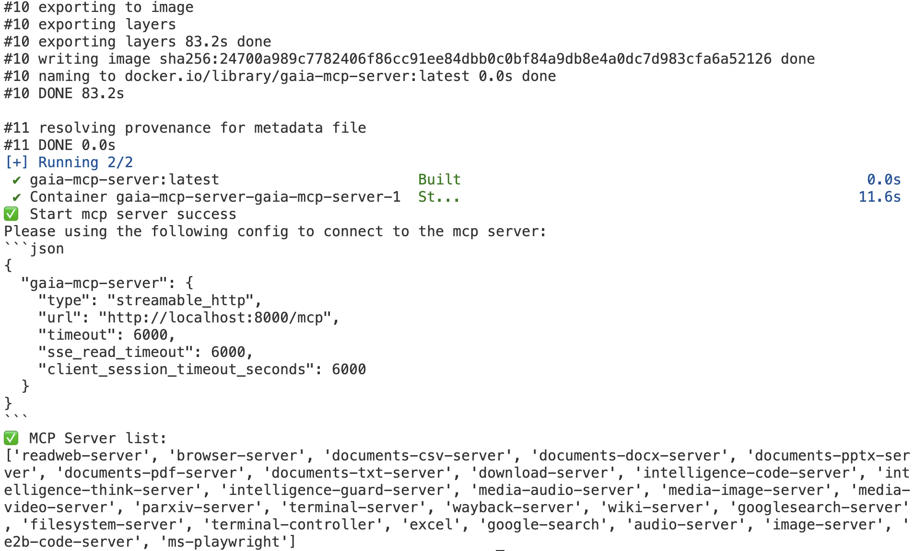

<div align="center">

# AWorld Train

*为使用 AWorld 构建的智能体，提供与外部 RL/训练框架对接的、与框架无关的适配层、可运行示例与通用工具*

[![License: MIT][license-image]][license-url]

</div>

---

AWorld Training 旨在将 AWorld Agent 与外部训练框架（如强化学习库）进行连接。它采用与框架无关的设计，让您可以将 AWorld Agent 或 Swarm（智能体集群）集成到您偏好的训练环境中。

该工作流包含以下四个关键步骤：

1.  **环境设置 (`env`):** 搭建并配置环境，定义状态/动作空间以及交互机制。
2.  **Agent 构建 (`agent`):** 构建 Agent 的核心逻辑、策略和决策能力。
3.  **框架适配 (`adapter`):** 利用适配器（Adapter）对 Agent 接口进行标准化，以确保其与任何强化学习（RL）训练框架（如 Verl）的兼容性。
4.  **训练执行 (`verl`):** 配置奖励函数和超参数，然后通过运行脚本提交训练任务。


## 安装训练所需依赖 (以结合Verl为例)
**前置条件：** 在安装 Verl 之前，请确保系统中已正确安装了与硬件兼容的 **NVIDIA 驱动**和 **CUDA 工具包**。此外，需要根据 CUDA 版本**手动安装 PyTorch**。

**自动安装：** Verl 的其他依赖项（如 `transformers`、`deepspeed`、`vllm` 等）将通过 `pip` 在安装 Verl 时自动处理。请注意，`deepspeed` 和 `vllm` 等库的安装过程会依赖于您已装好的 CUDA 和 PyTorch 环境，具体请参考 Verl 的 `setup.py` 文件。

```bash
# recommend Python>=3.10

# install AWorld
pip install aworld

# install train framework (VeRL example)
# Note: verl version 0.5.0.dev0 is required for agent training support.
git clone https://github.com/volcengine/verl.git
cd verl && pip install -e.
```

## 准备远程环境

请遵循以下步骤准备您的远程服务器并启动环境。

### 系统要求

#### 操作系统

-   兼容 Windows、macOS 和 Linux。
-   为获得最佳性能，强烈推荐使用 **Linux** 系统。
-   **注意**：建议使用新加坡或北美等地区的服务器以减少延迟。

#### 硬件要求

-   **最低配置**：4 CPU 核心 和 8GB 内存。

#### 软件要求

-   **Docker**：您的机器上必须安装 Docker。
    -   **Mac 用户注意**：如果您使用的是配备 Apple Silicon（M系列）的 Mac，必须启用 Rosetta 以进行 x86/64 仿真。请遵循官方指南：[Docker for Mac 安装](https://docs.docker.com/desktop/setup/install/mac-install/)。

### 登录并安装环境

登录到您的服务器并按以下步骤操作。

**a. Clone AWorld 代码到服务器目录。**

```bash
git clone https://github.com/inclusionAI/AWorld ~/AWorld
```

**b. 配置环境参数并下载 Gaia 数据集。**

-   **配置参数**：编辑 `~/AWorld/env/gaia-mcp-server/mcp_servers/.env` 文件并填入您的具体配置值。

    ```bash
    cd ~/AWorld/env/gaia-mcp-server/mcp_servers
    cp .env_template .env
    ```

-   **下载数据集**：从 Hugging Face 下载 [gaia_dataset](https://huggingface.co/datasets/gaia-benchmark/GAIA) 并放置到 `~/AWorld/env/gaia-mcp-server/docker/gaia_dataset`。

**c. 启动 Gaia Environment。**

运行下面的命令，在 Docker 环境中启动 Gaia Environment 实例。实例将提供：
-   一个位于 `8000` 端口的 MCP 服务（端点：`http://localhost:8000/mcp`）。
-   一个位于 `5901` 端口的 VNC 服务。您可以通过 `http://localhost:5901/vnc.html?autoconnect=true` 查看实时界面。

```bash
cd ~/AWorld/env
# 构建 Docker 镜像并启动容器实例。此过程大约需要 5 分钟。
# 成功后，将显示以下日志消息：Start mcp server success。
sh run-local.sh
```



**d. 连接并测试 Gaia Environment。**

Gaia Environment 的 MCP 服务 URL 已自动配置为环境变量，无需手动设置端点。

```bash
export MCP_SERVER_URL=http://localhost:8080/mcp
```

在构建 Agent 时，您可以使用 `get_agent_tool_env_and_servers` 函数来配置 MCP 请求参数并提供 MCP 服务器列表。如果无参数调用此函数，它将自动使用默认值。

```python
gaia_env_config, gaia_env_servers = get_agent_tool_env_and_servers()
print(f"gaia_env_config: {gaia_env_config}\ngaia_env_servers: {gaia_env_servers}")

# output
# gaia_env_config: {
#   "mcpServers": {
#     "aworld-mcp": {
#       "type": "streamable-http",
#       "url": "http://localhost:8080/mcp",
#       "headers": {
#         "MCP_SERVERS": "readweb-server,browseruse-server,documents-csv-server,documents-docx-server,documents-pptx-server,documents-pdf-server,documents-txt-server,download-server,intelligence-code-server,intelligence-think-server,intelligence-guard-server,media-audio-server,media-image-server,media-video-server,parxiv-server,terminal-server,wayback-server,wiki-server,googlesearch-server",
#       },
#       "timeout": 600,
#       "sse_read_timeout": 600,
#       "client_session_timeout_seconds": 600,
#     }
#   }
# }
# gaia_env_servers: ['readweb-server', 'browser-server', ...]
```
## 自定义 Agent
AWorld 框架提供了 adapter 模块，用于实现 Agent 与外部强化学习（RL）训练框架的集成。

具体而言，adapter 模块通过向 AWorld 框架提供 LLM 模型的服务地址（`llm_base_url`）和模型名称（`llm_model_name`）建立关联。在实现上，这些值由以下方法动态获取：

```python
llm_base_url=self.get_llm_server_address(),
llm_model_name=self.get_llm_server_model_name(),
```

若要训练一个 Agent 模型，核心步骤是继承 `AWorldAgentLoop` 类以实现一个自定义的 `CustomAgentLoop`。以下示例以 Verl 框架为例，展示了一个针对 single-agent 的自定义 `AgentLoop` 实现 (`[custom_agent_loop.py](https://github.com/inclusionAI/AWorld/blob/main/train/examples/train_gaia_with_aworld_verl/custom_agent_loop.py)`)，该示例中的环境配置了5个可用工具。

```python
from aworld.agents.llm_agent import Agent
from aworld.config import AgentConfig
from train.adapter.verl.aworld_agent_loop import AworldAgentLoop
from train.adapter.verl.common import get_agent_tool_env_and_servers
class GaiaAgentLoop(AworldAgentLoop):
    def build_agents(self):
        # Get the environment configuration and server details.
        # Note: The MCP server must be running (Step 1) and the
        # MCP_SERVER_URL/MCP_SERVER_TOKEN environment variables must be set.
        gaia_env_config, gaia_env_servers = get_agent_tool_env_and_servers()

        return Agent(
            conf=AgentConfig(
                # Get the dynamic llm server address from the server manager. 
                # The llm server is launched within VeRL.
                llm_base_url=self.get_llm_server_address(),
                llm_model_name=self.get_llm_server_model_name(),
                llm_api_key="dummy",
            ),
            name="gaia_super_agent",
            system_prompt="<your_system_prompt>",

            # MCP tool configuration for the agent, including ms-playwright,google-search,e2b-code-server,image-server and audio-server
            mcp_config=gaia_env_config,
            mcp_servers=gaia_env_servers,
        )
```

完成自定义 `AgentLoop` 的实现后，需要修改 `agent.yaml` 配置文件，并将其路径更新到训练启动脚本 `run.sh` 中：

```yaml
- name: gaia_agent
  _target_: train.examples.train_gaia_with_aworld_verl.custom_agent_loop.GaiaAgentLoop
```

```python
# Agent config
agent_loop_config_path=${path_to_train}/examples/train_gaia_with_aworld_verl/agent.yaml
```

对于更复杂的场景，AWorld 也支持训练复杂的单智能体或多智能体系统：

+ Agent构建：关于如何构建单智能体和多智能体，请分别参考 [构建与运行Agent](https://inclusionai.github.io/AWorld/Quickstart/agent_construction/#)，[构建与运行Multi-agent](https://inclusionai.github.io/AWorld/Quickstart/multi-agent_system_construction/)。
+ MCP 工具配置：若 Agent 需要使用 MCP 工具，则必须配置相应的 `mcp_config` 文件。具体方法请参考 [构建与运行Agent](https://inclusionai.github.io/AWorld/Quickstart/agent_construction/#configuring-tools)。


## 准备训练
在完成环境（`env`）和智能体（`agent`）的构建之后，即可通过 `run.sh` 脚本启动 Verl 训练流程。在启动之前，还需要完成以下两个关键配置步骤：

1. 配置奖励函数 (Reward Function)：根据具体的任务目标，定义或调整用于评估智能体行为的奖励函数。
2. 修改启动脚本 (run.sh)：更新 `run.sh` 脚本中的相关参数，例如配置文件路径、超参数等，以匹配当前的训练任务。

### 配置奖励函数
以训练 gaia 为例，以下代码实现了 gaia 所需要的 reward function 逻辑，具体代码位置：`[gaia_reward_function.py](https://github.com/inclusionAI/AWorld/blob/main/train/examples/train_gaia_with_aworld_verl/metrics/gaia_reward_function.py)`。

```python
import re
import string
from aworld.logs.util import logger


def normalize_number_str(number_str: str) -> float:
    # we replace these common units and commas to allow
    # conversion to float
    for char in ["$", "%", ","]:
        number_str = number_str.replace(char, "")
    try:
        return float(number_str)
    except ValueError:
        # print(f"String {number_str} cannot be normalized to number str.")
        return float("inf")

def split_string(
    s: str,
    char_list: list[str] = [",", ";"],
) -> list[str]:
    pattern = f"[{''.join(char_list)}]"
    return re.split(pattern, s)

def normalize_str(input_str, remove_punct=True) -> str:
    """
    Normalize a string by:
    - Removing all white spaces
    - Optionally removing punctuation (if remove_punct is True)
    - Converting to lowercase
    Parameters:
    - input_str: str, the string to normalize
    - remove_punct: bool, whether to remove punctuation (default: True)
    Returns:
    - str, the normalized string
    """
    # Remove all white spaces. Required e.g for seagull vs. sea gull
    no_spaces = re.sub(r"\s", "", input_str)

    # Remove punctuation, if specified.
    if remove_punct:
        translator = str.maketrans("", "", string.punctuation)
        return no_spaces.lower().translate(translator)
    else:
        return no_spaces.lower()

def question_scorer(
    model_answer: str,
    ground_truth: str,
) -> bool:
    def is_float(element: any) -> bool:
        try:
            float(element)
            return True
        except ValueError:
            return False
        
    if model_answer is None:
        model_answer = "None"

    # if gt is a number
    if is_float(ground_truth):
        # print(f"Evaluating {model_answer} as a number.")
        normalized_answer = normalize_number_str(model_answer)
        return normalized_answer == float(ground_truth)

    # if gt is a list
    elif any(char in ground_truth for char in [",", ";"]):
        # print(f"Evaluating {model_answer} as a comma separated list.")
        # question with the fish: normalization removes punct

        gt_elems = split_string(ground_truth)
        ma_elems = split_string(model_answer)

        # check length is the same
        if len(gt_elems) != len(ma_elems):
            # warnings.warn(
            #     "Answer lists have different lengths, returning False.", UserWarning
            # )
            return False

        # compare each element as float or str
        comparisons = []
        for ma_elem, gt_elem in zip(ma_elems, gt_elems):
            if is_float(gt_elem):
                normalized_ma_elem = normalize_number_str(ma_elem)
                comparisons.append(normalized_ma_elem == float(gt_elem))
            else:
                # we do not remove punct since comparisons can include punct
                comparisons.append(
                    normalize_str(ma_elem, remove_punct=False)
                    == normalize_str(gt_elem, remove_punct=False)
                )
        return all(comparisons)

    # if gt is a str
    else:
        # print(f"Evaluating {model_answer} as a string.")
        return normalize_str(model_answer) == normalize_str(ground_truth)


def gaia_reward_func(data_source, solution_str, ground_truth, extra_info=None):
  pattern = r'<answer>(.*?)</answer>'
  comp_match = re.search(pattern, solution_str, re.DOTALL | re.MULTILINE)

  if not comp_match:
      return 0.0
  else:
      comp_answer = comp_match.group(1).strip()
      logger.info(f"comp_answer: {comp_answer}, ground_truth: {ground_truth}")
      if question_scorer(comp_answer, ground_truth):
          return 1.0
      else:
          return 0.0
```

完成自定义 `Reward` 的实现后，需要将其路径更新到训练启动脚本 `run.sh` 中：

```yaml
reward_fn_name=gaia_reward_func
reward_fn_file_path=${path_to_train}/examples/train_gaia_with_aworld_verl/metrics/gaia_reward_function.py
```

### 修改启动脚本
以下是在 AWorld 环境下训练 GaiaAgent 的 `run.sh` 脚本示例。

在该示例中，请特别关注以下几个核心配置项，它们是连接 AWorld 与训练框架的关键：

+ `agent_loop_config_path` (位于第 3 节): 用于指定自定义 AgentLoop 的配置文件。
+ `reward_fn_file_path` (位于第 4.1 节): 定义了奖励函数所在的文件路径。
+ `reward_fn_name` (位于第 4.1 节): 指定了要使用的奖励函数名称。

所有参数的详细解释，均可在 [VeRL 官方文档](https://verl.readthedocs.io/en/latest/examples/config.html)中查阅。

<details>
<summary>点击查看完整 <code>run.sh</code> 脚本</summary>

```shell
#!/usr/bin/env bash

set -xeuo pipefail

# ================= cluster topology =================
export GPUS_PER_NODE=${SLURM_GPUS_ON_NODE:-${GPUS_PER_NODE:-1}}  # GPUs on this node
NNODES=${SLURM_JOB_NUM_NODES:-${NNODES:-1}}
export NNODES
export RAY_NUM_NODES=$NNODES

echo "Using $NNODES nodes and $GPUS_PER_NODE GPUs per node..."

# ================= data/model/tool =================
HDFS_ROOT=${HDFS_ROOT:-$PWD}
DATA_ROOT=${DATA_ROOT:-$PWD}

# Prefer local model if present, otherwise fall back to HF hub path
model_path=${model_path:-$DATA_ROOT/Qwen/Qwen3-4B}
if [ ! -d "$model_path" ]; then
  model_path=Qwen/Qwen3-4B
fi

# Use the default output directory produced by create_dataset.py
train_files=$DATA_ROOT/datasets/train.parquet
test_files=$DATA_ROOT/datasets/test.parquet

# =================== custom ===================
path_to_train="/your/path/to/train"
reward_fn_name=gaia_reward_func
reward_fn_file_path=${path_to_train}/examples/train_gaia_with_aworld_verl/metrics/gaia_reward_function.py

# Agent config
agent_loop_config_path=${path_to_train}/examples/train_gaia_with_aworld_verl/agent.yaml

# set dummy_tool_config_path to enable auto_tool_choice
dummy_tool_config_path=${path_to_train}/examples/verl/configs/dummy_tool_config.yaml

# =================== wandb ===================
project_name=gaia
experiment_name=qwe3
default_local_dir=$DATA_ROOT/checkpoint/$experiment_name

# ================= algorithm =================
adv_estimator=grpo

use_kl_in_reward=false
kl_coef=0.0
use_kl_loss=false
kl_loss_coef=0.0

clip_ratio_low=0.2
clip_ratio_high=0.28

max_turns=8
max_prompt_length=1024
max_response_length=2048
actor_lr=1e-6

train_batch_size=1
ppo_mini_batch_size=1
n_resp_per_prompt=1
n_resp_per_prompt_val=1

# =================== logging ===================
export RAY_LOGGING_LEVEL=DEBUG
export HYDRA_FULL_ERROR=1

# ================= performance =================
export NCCL_IBEXT_DISABLE=1
export NCCL_NVLS_ENABLE=1
export NCCL_IB_HCA=mlx5
export UCX_NET_DEVICES=mlx5_0:1,mlx5_1:1,mlx5_2:1,mlx5_3:1,mlx5_4:1,mlx5_5:1,mlx5_6:1,mlx5_7:1
export VLLM_USE_V1=1
export VLLM_ATTENTION_BACKEND=FLASH_ATTN

infer_tp=1  # vLLM tensor parallel size
train_sp=1  # Ulysses sequence parallel size for actor
offload=true

actor_max_token_len_per_gpu=$(( (max_prompt_length + max_response_length) * 4 ))
log_prob_max_token_len_per_gpu=$(( actor_max_token_len_per_gpu * 2 ))

train_files="['$train_files']"
test_files="['$test_files']"

python3 -m verl.trainer.main_ppo \
    algorithm.adv_estimator=$adv_estimator \
    algorithm.use_kl_in_reward=$use_kl_in_reward \
    algorithm.kl_ctrl.kl_coef=$kl_coef \
    data.train_files="$train_files" \
    data.val_files="$test_files" \
    data.return_raw_chat=true \
    data.train_batch_size=$train_batch_size \
    data.max_prompt_length=$max_prompt_length \
    data.max_response_length=$max_response_length \
    data.filter_overlong_prompts=true \
    data.truncation='error' \
    actor_rollout_ref.model.path="$model_path" \
    actor_rollout_ref.model.use_remove_padding=true \
    actor_rollout_ref.model.enable_gradient_checkpointing=true \
    actor_rollout_ref.actor.use_kl_loss=$use_kl_loss \
    actor_rollout_ref.actor.kl_loss_coef=$kl_loss_coef \
    actor_rollout_ref.actor.clip_ratio_low=$clip_ratio_low \
    actor_rollout_ref.actor.clip_ratio_high=$clip_ratio_high \
    actor_rollout_ref.actor.clip_ratio_c=10.0 \
    actor_rollout_ref.actor.optim.lr=$actor_lr \
    actor_rollout_ref.actor.use_dynamic_bsz=true \
    actor_rollout_ref.actor.ppo_mini_batch_size=$ppo_mini_batch_size \
    actor_rollout_ref.actor.ppo_max_token_len_per_gpu=$actor_max_token_len_per_gpu \
    actor_rollout_ref.actor.ulysses_sequence_parallel_size=$train_sp \
    actor_rollout_ref.actor.fsdp_config.param_offload=$offload \
    actor_rollout_ref.actor.fsdp_config.optimizer_offload=$offload \
    actor_rollout_ref.ref.log_prob_max_token_len_per_gpu=$log_prob_max_token_len_per_gpu \
    actor_rollout_ref.rollout.name=vllm \
    actor_rollout_ref.rollout.mode=async \
    actor_rollout_ref.rollout.tensor_model_parallel_size=$infer_tp \
    actor_rollout_ref.rollout.multi_turn.max_user_turns=$max_turns \
    actor_rollout_ref.rollout.multi_turn.max_assistant_turns=$max_turns \
    actor_rollout_ref.rollout.multi_turn.format=hermes \
    actor_rollout_ref.rollout.agent.agent_loop_config_path=$agent_loop_config_path \
    actor_rollout_ref.rollout.gpu_memory_utilization=0.75 \
    actor_rollout_ref.rollout.n=$n_resp_per_prompt \
    actor_rollout_ref.rollout.val_kwargs.top_p=0.6 \
    actor_rollout_ref.rollout.val_kwargs.temperature=1.0 \
    actor_rollout_ref.rollout.val_kwargs.n=$n_resp_per_prompt_val \
    actor_rollout_ref.rollout.multi_turn.tool_config_path=$dummy_tool_config_path \
    custom_reward_function.path="${reward_fn_file_path}"\
    custom_reward_function.name="${reward_fn_name}"\
    trainer.logger=console \
    trainer.project_name=$project_name \
    trainer.experiment_name=$experiment_name \
    trainer.n_gpus_per_node="$GPUS_PER_NODE" \
    trainer.val_before_train=true \
    trainer.log_val_generations=50 \
    trainer.nnodes="$NNODES" \
    trainer.save_freq=-1 \
    trainer.default_local_dir="$default_local_dir" \
    trainer.test_freq=5 \
    trainer.total_epochs=1 "$@"
```

</details>
### 启动训练
完成所有配置后，即可通过`run.sh` 脚本启动训练：

```bash
bash run.sh
```

---

<div align="center">

**AWorld Train** — 让你的 AWorld 智能体快速接入主流训练框架

[license-image]: https://img.shields.io/badge/License-MIT-yellow.svg
[license-url]: https://opensource.org/licenses/MIT

</div>


